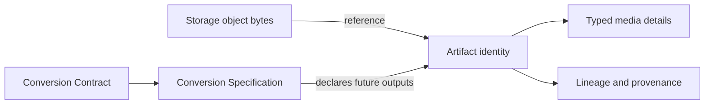

# ADR: Artifact is the sole media identity

Date: 2026-09-25
Status: accepted for this candidate

`Artifact.id` is the only platform artifact identity. Tenant and workspace scope,
kind, schema version, digest, size, storage reference, lifecycle, provenance,
lineage, conversion specification and idempotency facts are Artifact facts.
Media is represented by `artifact_media_details`, keyed one-to-one by
`artifact_id`. Storage owns bytes and object placement only; it never allocates
artifact identity.

The former `MediaAsset` root, repositories, lifecycle and authorization paths are
retired. Migration V18 copies source rows into Artifact and typed details, then
renames the legacy tables to read-only historical relations. Existing public
MediaAsset routes are removed; clients use `GET /artifacts/{artifactId}`.

Conversion Specification remains declarative and immutable. A Conversion
Contract is platform-owned and provider-neutral; providers can implement a
contract but cannot add public platform types. This task does not execute a
conversion or write Storage objects.

