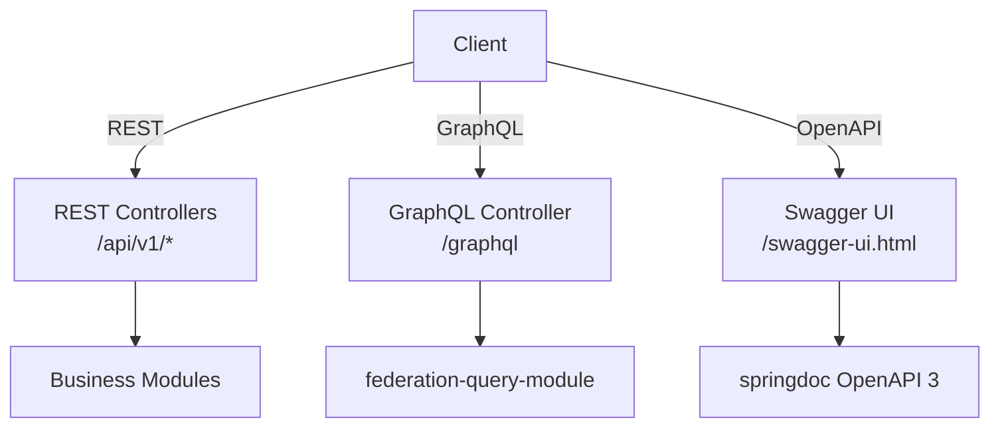

# API Strategy

> **Module:** All modules with API endpoints
> **Last Updated:** 2026-05-18

## Multi-Protocol API Architecture



## REST API Conventions

| Convention | Rule |
|------------|------|
| Base path | `/api/v1/*` |
| Versioning | URL path versioning |
| Error format | `ProblemDetail` with `errorCode`, `message`, `details` |
| Pagination | `page`, `size`, `sort` parameters |
| Filtering | Query parameters |
| Response format | JSON |

## API Versioning Strategy

| Approach | Usage |
|----------|-------|
| URL path | `/api/v1/`, `/api/v2/` (primary) |
| Header | `Accept: application/vnd.platform.v1+json` (optional) |
| Deprecation | `@Deprecated` annotation + response header |

## Error Response Format

```json
{
  "errorCode": "RENDER-409-001",
  "message": "Quota exceeded for tenant tenant-123",
  "details": {
    "tenantId": "tenant-123",
    "featureCode": "render.1080p",
    "limit": 60,
    "used": 60
  },
  "timestamp": "2026-05-18T10:00:00Z"
}
```

## Rate Limiting

| Tier | Requests/min | Burst |
|------|-------------|-------|
| FREE | 30 | 10 |
| PRO | 120 | 30 |
| TEAM | 600 | 100 |
| ENTERPRISE | Unlimited | Unlimited |

## CORS Configuration

| Environment | Allowed Origins |
|-------------|-----------------|
| Development | `*` |
| Production | Configurable whitelist |

## API Key Authentication

| Header | Purpose |
|--------|---------|
| `X-API-Key` | API key for service-to-service auth |
| `X-Tenant-ID` | Tenant identification |
| `X-User-ID` | User identification |
| `X-Request-Id` | Request correlation ID |
