# GraphQL Query Aggregation

> **Module:** `federation-query-module`
> **Last Updated:** 2026-05-18

## Overview

The GraphQL module provides a read-only query aggregation layer that unifies data from multiple backend modules behind a single GraphQL endpoint.

## Architecture

```mermaid
graph TB
    CLIENT["Apollo Client"] -->|"POST /graphql"| GC["GraphQLController"]
    GC -->|"execute"| GS["GraphQLService"]
    GS -->|"batch"| DL["DataLoader"]
    DL -->|"query"| RES1["ProjectResolver"]
    DL -->|"query"| RES2["RenderJobResolver"]
    DL -->|"query"| RES3["EntitlementResolver"]
    DL -->|"query"| RES4["UsageResolver"]

    RES1 -->|"fetch"| MOD1["identity-access-module"]
    RES2 -->|"fetch"| MOD2["render-module"]
    RES3 -->|"fetch"| MOD3["entitlement-module"]
    RES4 -->|"fetch"| MOD4["quota-billing-module"]
```



## Schema Overview

### Queries

| Query | Returns | Source Module |
|-------|---------|---------------|
| `project(id)` | Project | identity-access-module |
| `projects(tenantId)` | [Project] | identity-access-module |
| `renderJob(id)` | RenderJob | render-module |
| `renderJobs(projectId)` | [RenderJob] | render-module |
| `entitlement(subjectId)` | Entitlement | entitlement-module |
| `capabilities(userId)` | Capabilities | entitlement-module |
| `usage(tenantId, feature)` | Usage | quota-billing-module |
| `featureFlag(key)` | FeatureFlag | policy-governance-module |
| `featureFlags` | [FeatureFlag] | policy-governance-module |
| `prompt(id)` | PromptTemplate | prompt-module |
| `prompts(tenantId)` | [PromptTemplate] | prompt-module |
| `analytics(query)` | AnalyticsResult | federation-query-module |

## DataLoader Batching

DataLoader is used to batch N+1 queries:

```typescript
// Without DataLoader: N+1 queries
for (const job of jobs) {
  await fetchProject(job.projectId); // N queries
}

// With DataLoader: 1 batch query
const projectLoader = new DataLoader(async (ids) => {
  return await fetchProjectsByIds(ids); // 1 query
});
```

## Query Limits

| Limit | Value | Description |
|-------|-------|-------------|
| Max depth | 5 | Prevents deeply nested queries |
| Max complexity | 1000 | Prevents expensive queries |
| Max page size | 100 | Default pagination limit |
| Timeout | 30s | Query execution timeout |

## Security

- All queries are read-only (no mutations)
- Tenant scope is automatically injected
- Sensitive fields are redacted
- All queries are audited
- Query depth and complexity limits enforced

## REST Fallback

Every GraphQL query has a REST fallback endpoint for clients that prefer REST.

## Future Evolution

| Stage | Features | Status |
|-------|----------|--------|
| Stage 1 | Read-only queries, DataLoader | ✅ |
| Stage 2 | Persisted queries | 📋 |
| Stage 3 | Code generation | 📋 |
| Stage 4 | Mutations | 📋 |
| Stage 5 | Federation | 📋 |
