# System Architecture Overview

> **Module:** All
> **Last Updated:** 2026-05-18

## High-Level Architecture

Media Platform is a **modular monolith** built with Spring Boot 4.0.4 and Spring Modulith 2.0.4. All 30 modules run in a single JVM process, with module boundaries enforced by Spring Modulith's `ApplicationModules.verify()`.

```mermaid
graph TB
    subgraph Client["Client Layer"]
        FE["Frontend (Vue 3)"]
        EXT["External Clients"]
    end

    subgraph API["API Gateway Layer"]
        REST["REST API (/api/v1/*)"]
        GQL["GraphQL (/graphql)"]
        OAS["OpenAPI / Swagger UI"]
    end

    subgraph App["Application Layer"]
        subgraph Core["Core Modules"]
            SK["shared-kernel"]
            PA["platform-app"]
            CFG["config-module"]
            SEC["secrets-config-module"]
            DS["datasource-module"]
        end

        subgraph Media["Media Processing"]
            RM["render-module"]
            WF["workflow-module"]
            AI["ai-module"]
            RRW["remote-render-worker"]
            AC["artifact-catalog-module"]
            STO["storage-module"]
        end

        subgraph Business["Commerce & Access"]
            COM["commerce-module"]
            PAY["payment-module"]
            BILL["billing-module"]
            ENT["entitlement-module"]
            QUOTA["quota-billing-module"]
            PG["policy-governance-module"]
        end

        subgraph Platform["Platform Services"]
            PM["prompt-module"]
            EXT_MOD["extension-module"]
            SANDBOX["sandbox-runtime-module"]
            FQ["federation-query-module"]
            IAM["identity-access-module"]
            SCHED["scheduler-module"]
            NOTIF["notification-module"]
            OBS["observability-module"]
            AUDIT["audit-compliance-module"]
            OUTBOX["outbox-event-module"]
            UA["user-analytics-module"]
            CLOUD["cloud-resource-module"]
            MIG["compatibility-migration-module"]
        end
    end

    subgraph Infra["Infrastructure Layer"]
        DB[(PostgreSQL)]
        TEMP["Temporal Server"]
        S3["Object Storage"]
        SENTRY["Sentry"]
        OR["OpenReplay"]
    end

    FE --> REST
    FE --> GQL
    EXT --> REST
    EXT --> OAS

    REST --> Core
    REST --> Media
    REST --> Business
    REST --> Platform
    GQL --> FQ

    RM --> AI
    RM --> STO
    RM --> AC
    WF --> PG
    WF --> TEMP

    COM --> PAY
    PAY --> BILL
    BILL --> ENT

    PA --> DB
    PA --> S3
    PA --> SENTRY
    PA --> OR
```

## Architecture Principles

1. **Modular Monolith** — 30 Gradle modules in a single deployable unit, boundaries enforced by Spring Modulith
2. **Shared Kernel** — `shared-kernel` is the only `OPEN` module; all others are `CLOSED`
3. **Event-Driven Decoupling** — Cross-module communication via Spring `ApplicationEventPublisher` + Outbox
4. **Port & Adapter** — Each module exposes named interfaces (`api`, `domain`) for cross-module access
5. **API Versioning** — REST APIs use `/api/v1/*` prefix; backward-compatible evolution
6. **Feature Flags** — OpenFeature-based gating for gradual rollouts

## Technology Decisions

| Decision | Choice | Rationale |
|----------|--------|-----------|
| Modularity | Spring Modulith | Enforced boundaries in a monolith; easy to split later |
| Workflow | Temporal + LiteFlow | Temporal for durable orchestration; LiteFlow for local rules |
| AI | Spring AI BOM | Unified AI client abstraction; multi-provider |
| API Docs | springdoc OpenAPI 3 | Boot 4 compatible; Swagger UI |
| Plugin System | PF4J | JVM plugin extension with classloader isolation |
| Database | PostgreSQL + Flyway | Reliable schema migration; jOOQ for type-safe SQL |
| Frontend | Vue 3 + Vite | Modern reactive framework; fast build |
| Monitoring | Sentry + OpenReplay | Error tracking + session replay + user feedback |

## Module Dependency Rules

- `shared-kernel` → no dependencies (root of graph)
- `platform-app` → depends on all 30 modules (flat aggregator)
- Cross-module dependencies must go through named interfaces
- Event-based communication for decoupled flows (render → audit, render → notification)
- Forbidden: any module → `platform-app`, `shared-kernel` → any module

See `01-architecture/03-module-architecture.md` for full dependency graph.
