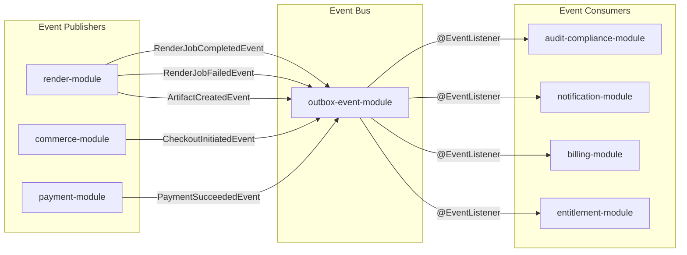
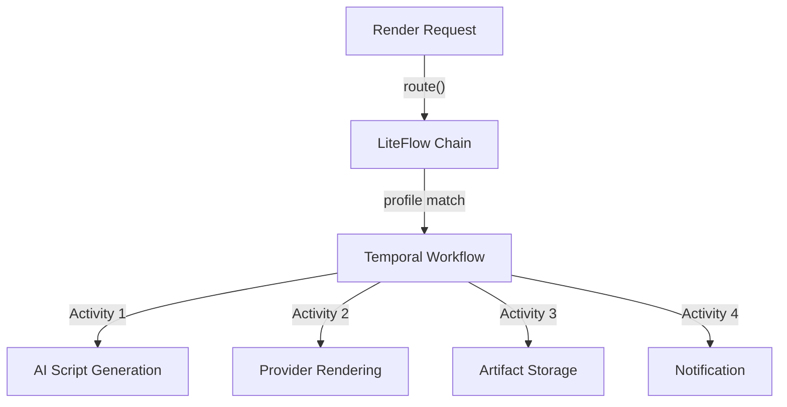

# Backend Architecture & Tech Stack

> **Module:** All backend modules
> **Last Updated:** 2026-05-18

## Technology Stack

| Component | Version | Role |
|-----------|---------|------|
| Java | 25 (toolchain) | Language runtime |
| Spring Boot | 4.0.4 (BOM) | Core framework |
| Spring Modulith | 2.0.4 | Module boundary enforcement |
| Spring AI | 2.0.0-M3 (Milestone) | AI client abstraction |
| Temporal SDK | 1.33.0 | Durable workflow orchestration |
| LiteFlow | 2.15.3.2 | Local rule chain / routing |
| jOOQ | 3.19.18 | Type-safe SQL |
| Flyway | BOM-managed | Schema migration |
| H2 | runtimeOnly | Dev/test in-memory database |
| PostgreSQL | 16 | Production database |
| springdoc OpenAPI | 3.0.2 | API documentation |
| PF4J | 3.15.0 | Plugin system |

## Module Internal Layering

Each business module follows a consistent package structure:

| Package | Responsibility | Typical Contents |
|---------|---------------|------------------|
| `*.api` | Public boundary | Controllers, DTOs, request/response types |
| `*.app` | Application services | Use case orchestration, transaction boundaries |
| `*.domain` | Domain model | Entities, value objects, domain events |
| `*.spi` | Port interfaces | Interfaces for pluggable adapters |
| `*.infrastructure` | Adapters | External system integrations, Noop implementations |

## Spring Modulith Configuration

```java
// Root application class
@Modulith
@SpringBootApplication
public class PlatformApplication { }

// Module declaration (example: render-module)
@ApplicationModule(
    displayName = "Render",
    allowedDependencies = {"ai", "ai :: API", "ai :: domain", "shared", "storage", "storage :: API", "storage :: domain"}
)
package com.example.platform.render;
```

## Shared Kernel (`shared-kernel`)

The only `ApplicationModule.Type.OPEN` module. Contains:

| Category | Types |
|----------|-------|
| Error codes | `CommonErrorCode`, `ErrorCode`, `ErrorCodeRegistry` |
| Value objects | `Ids` (UUID generation), `Jsons` (Jackson wrapper) |
| Log context | `TraceKeys` (traceId, requestId, tenantId, projectId) |
| Base exceptions | `PlatformException` (with ErrorCode + details) |
| Domain events | `RenderJobCreatedEvent`, `RenderJobStatusChangedEvent`, `ArtifactCreatedEvent`, `RenderJobCompletedEvent`, `RenderJobFailedEvent` |
| Cross-module SPI | `NotificationEventPublisher` |

**Forbidden in shared-kernel:** Business services, repositories, workflow definitions, provider adapters, module-specific DTOs, business policy, scheduled jobs.

## Event-Driven Architecture



## Temporal + LiteFlow Orchestration

| Tool | Use Case |
|------|----------|
| **Temporal** | Long-running, durable workflows (render job lifecycle, billing cycles) |
| **LiteFlow** | Local, stateless rule chains (provider selection, routing decisions) |



## Multi-Datasource Architecture

Named DataSources and named jOOQ `DSLContext`s are managed via `datasource-module`:

```yaml
spring:
  datasource:
    primary:
      url: jdbc:postgresql://db:5432/platform
    analytics:
      url: jdbc:postgresql://analytics-db:5432/analytics
```

## Build Configuration

```kotlin
// Root build.gradle.kts
plugins {
    id("io.spring.dependency-management") version "1.1.7" apply false
    id("org.springframework.boot") version "4.0.4" apply false
    id("org.jooq.jooq-codegen-gradle") version "3.19.18" apply false
}

subprojects {
    apply(plugin = "java")
    apply(plugin = "io.spring.dependency-management")
    java { toolchain { languageVersion.set(JavaLanguageVersion.of(25)) } }
    dependencies {
        add("compileOnly", "org.springframework.modulith:spring-modulith-api:2.0.4")
    }
}
```
