# Module Architecture & Boundaries

> **Module:** All
> **Last Updated:** 2026-05-18

## Module Dependency Graph

```mermaid
graph TD
    PA["platform-app<br/>(aggregator, depends on all 30)"]
    SK["shared-kernel<br/>(OPEN)"]

    subgraph Media["Media Processing"]
        RM["render-module"]
        AI_MOD["ai-module"]
        STO["storage-module"]
        WF["workflow-module"]
        RRW["remote-render-worker"]
        AC["artifact-catalog-module"]
    end

    subgraph Commerce["Commerce & Access"]
        COM["commerce-module"]
        PAY["payment-module"]
        BILL["billing-module"]
        ENT["entitlement-module"]
        QUOTA["quota-billing-module"]
        PG["policy-governance-module"]
    end

    subgraph Platform["Platform Services"]
        PM["prompt-module"]
        EXT_MOD["extension-module"]
        SANDBOX["sandbox-runtime-module"]
        FQ["federation-query-module"]
        IAM["identity-access-module"]
        SCHED["scheduler-module"]
        NOTIF["notification-module"]
        OBS["observability-module"]
        AUDIT["audit-compliance-module"]
        OUTBOX["outbox-event-module"]
        UA["user-analytics-module"]
        CLOUD["cloud-resource-module"]
        MIG["compatibility-migration-module"]
        CFG["config-module"]
        SEC["secrets-config-module"]
        DS["datasource-module"]
    end

    %% Shared kernel dependencies
    RM --> SK
    AI_MOD --> SK
    STO --> SK
    WF --> SK
    COM --> SK
    PAY --> SK
    BILL --> SK
    ENT --> SK
    PM --> SK
    EXT_MOD --> SK
    IAM --> SK
    NOTIF --> SK
    OBS --> SK
    AUDIT --> SK
    OUTBOX --> SK
    UA --> SK
    CLOUD --> SK
    QUOTA --> SK
    CFG --> SK
    SEC --> SK
    DS --> SK
    RRW --> SK
    AC --> SK
    FQ --> SK
    MIG --> SK

    %% Cross-module dependencies
    RM -->|"api"| AI_MOD
    RM -->|"api, domain"| STO
    WF -->|"feature-flags"| PG
    COM --> PAY
    PAY --> BILL
    BILL --> ENT
```



## Module Classification

### By Spring Modulith Type

| Type | Module | Justification |
|------|--------|---------------|
| `OPEN` | `shared-kernel` | Cross-module shared types |
| `CLOSED` | All other 29 modules | Boundary-enforced access |

### By Named Interfaces

| Module | Named Interface | Exposed Package |
|--------|----------------|-----------------|
| `ai-module` | `API` | `ai.api` (AiGatewayPort, AiController) |
| `ai-module` | `domain` | `ai.domain` (ChatResult, ChatRequest, ChatProvider) |
| `storage-module` | `API` | `storage.api` (StorageCatalogPort) |
| `storage-module` | `domain` | `storage.domain` (BlobStorage, StorageObjectRef) |
| `policy-governance-module` | `feature-flags` | `policy.api` (FeatureFlagEvaluator) |

## Cross-Module Dependencies (non-shared-kernel)

| Source | Target | Named Interfaces | Justification |
|--------|--------|------------------|---------------|
| `render-module` | `ai-module` | `API`, `domain` | AI script generation via port |
| `render-module` | `storage-module` | `API`, `domain` | Artifact storage via port |
| `workflow-module` | `policy-governance-module` | `feature-flags` | Feature flag evaluation in activities |

## Event-Based Decoupled Dependencies

| Source | Target | Events | Mechanism |
|--------|--------|--------|-----------|
| `render-module` | `audit-compliance-module` | `RenderJobCompletedEvent`, `RenderJobFailedEvent` | `@EventListener` |
| `render-module` | `notification-module` | `RenderJobCreatedEvent`, `RenderJobStatusChangedEvent`, `ArtifactCreatedEvent` | `@EventListener` |
| `commerce-module` | `payment-module` | `CheckoutInitiatedEvent` | `@EventListener` |
| `payment-module` | `billing-module` | `PaymentSucceededEvent` | `@EventListener` |
| `billing-module` | `entitlement-module` | `BillingStateChangedEvent` | `@EventListener` |

## Forbidden Dependencies

| # | Forbidden | Reason |
|---|-----------|--------|
| 1 | Any → `platform-app` | Aggregator only |
| 2 | `shared-kernel` → any | Root of graph |
| 3 | `observability-module` → business | Infrastructure independence |
| 4 | `audit-compliance-module` → business | Infrastructure independence |
| 5 | `outbox-event-module` → `notification-module` | Use events |
| 6 | `outbox-event-module` → `audit-compliance-module` | Use events |
| 7 | `entitlement-module` → `payment-module` | Consumes billing, not payment |
| 8 | `entitlement-module` → `commerce-module` | No direct dependency |
| 9 | `billing-module` → `entitlement-module` | Billing feeds entitlement |
| 10 | `quota-billing-module` → `entitlement-module` | Quota is input to entitlement |
| 11 | `sandbox-runtime-module` → any business | Isolated by design |
| 12 | `render-module` → `audit-compliance-module` (direct) | Must use events |

## ModularityTest

```java
// platform-app/src/test/java/.../ModularityTest.java
class ModularityTest {
    @Test
    void verifiesModuleStructure() {
        ApplicationModules.of(PlatformApplication.class).verify();
    }
}
```

**Status:** PASSES — confirms all 30 modules respect Spring Modulith boundary constraints.
