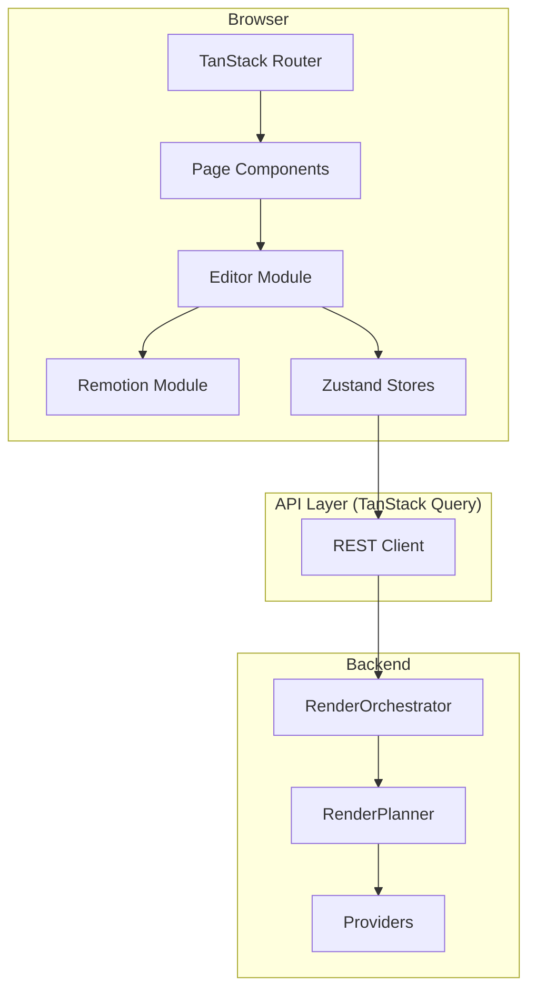

# Frontend Architecture

> **Module:** `frontend/`
> **Last Updated:** 2026-06-11
> **Status:** React-first migration

## Technology Stack

| Component | Role |
|-----------|------|
| React 19 | UI framework |
| TypeScript | Type safety |
| Vite | Build tool |
| Vitest | Test framework |
| TanStack Router | Client-side routing |
| Zustand | State management |
| TanStack Query | Server state management |
| Zod | Schema validation |
| Tailwind CSS | Styling |
| Radix UI / shadcn/ui | Component primitives |
| dnd-kit | Drag and drop |
| react-hook-form + zod | Form handling |
| TanStack Virtual | Virtual scrolling |
| Remotion | Video composition & preview |

## Why React-first

### 1. Remotion is React-native

RemotionRenderProvider, Remotion Player, Remotion Composition, subtitle templates, font effects, and consistent front/back-end preview are all built on React. Using React as the frontend framework means:

- Remotion Player runs directly in the browser as a React component
- Remotion Composition is authored in React
- Subtitle templates are React components
- Font effects are React components
- Preview and render share the same React component tree

### 2. No Vue/React bridge needed

The previous Vue 3 frontend was a separate application. This is a new project. There is no existing Vue code to maintain compatibility with. Introducing a Vue/React bridge would add unnecessary complexity, increase bundle size, and create a maintenance burden.

### 3. Ecosystem alignment

The render pipeline (Remotion, subtitle templates, font management) is React-based. Using React throughout the stack ensures:

- Shared types between frontend and Remotion compositions
- Shared validation schemas (Zod) across frontend, backend, and Remotion
- Consistent component model for preview and render
- Single mental model for developers

### 4. No Vue App Shell

The previous Vue App Shell (App.vue, router, stores) is not carried forward. The new frontend is a clean React project with no Vue dependencies.

## Architecture Principles

1. **React-first**: All UI is React. No Vue, no Vue/React bridge.
2. **Remotion-native**: Video preview and composition use Remotion directly.
3. **Schema-first**: RenderJob Schema is the contract between frontend, backend, and Remotion.
4. **State isolation**: Editor State does not leak into Remotion Composition. Editor State is converted to standard RenderJob/PreviewProps before passing to Remotion.
5. **Provider-agnostic UI**: Providers (FFmpeg, MLT, GPAC, Libass, Blender, BMF) are not directly exposed in the UI. They appear only as capabilities or export options determined by the backend RenderOrchestrator.
6. **Font asset management**: Fonts are managed through FontManifest/FontAsset. No system font dependency.
7. **Consistent rendering**: Front-end preview and back-end render use the same Composition + same inputProps + same font assets.

## Directory Structure

```
frontend/
  src/
    app/
      routes/              # TanStack Router routes
      providers/           # Context providers (QueryClient, Theme, etc.)
      layout/              # App layout components

    editor/
      components/          # Shared editor UI components
      timeline/            # Timeline component (dnd-kit based)
      canvas/              # Canvas / preview area
      captions/            # Caption editor
      templates/           # Template selector
      inspector/           # Properties inspector panel
      playback/            # Playback controls
      state/               # Zustand stores
      commands/            # Editor command pattern
      shortcuts/           # Keyboard shortcuts

    remotion/
      compositions/        # Remotion Composition definitions
      captions/            # Caption template components
      effects/             # Visual effects components
      fonts/               # Font loader components
      templates/           # Reusable template components
      player/              # Remotion Player wrapper

    render-job/
      schema/              # Zod schemas for RenderJob
      builders/            # RenderJob builder functions
      serializers/         # Serialization utilities
      validators/          # Validation helpers

    assets/
      upload/              # Asset upload flow
      library/             # Asset library browser
      metadata/            # Asset metadata editor

    api/
      render/              # Render API client
      materials/           # Materials API client
      projects/            # Projects API client

    shared/
      types/               # Shared TypeScript types
      utils/               # Utility functions
      constants/           # Constants
```

## Application Flow



## Key Pages & Routes

### Editor

| Route | Component | Purpose |
|-------|-----------|---------|
| `/editor/$projectId` | `EditorPage` | Main video editor with timeline, canvas, inspector |
| `/editor/$projectId/export` | `ExportPage` | Export settings and render job submission |

### Project Management

| Route | Component | Purpose |
|-------|-----------|---------|
| `/projects` | `ProjectListPage` | Project list |
| `/projects/$projectId` | `ProjectDetailPage` | Project details |
| `/projects/$projectId/assets` | `AssetLibraryPage` | Asset library |

### User Portal

| Route | Component | Purpose |
|-------|-----------|---------|
| `/` | `UserDashboardPage` | Dashboard with overview |
| `/me/settings` | `UserSettingsPage` | User settings |

### Admin Console

| Route | Component | Purpose |
|-------|-----------|---------|
| `/admin` | `AdminDashboard` | Admin overview |
| `/admin/feature-flags` | `FeatureFlagManagementPage` | Manage feature flags |
| `/admin/policies` | `PolicyManagementPage` | Policy management |

## State Management

### Editor State (Zustand)

- **Timeline state** — Tracks, clips, effects, transitions
- **Caption state** — Caption text, timing, style, template
- **Template state** — Selected template, parameters
- **Selection state** — Selected element, multi-select
- **Playback state** — Play/pause/seek, current time
- **UI state** — Panel visibility, zoom, scroll position

### Server State (TanStack Query)

- **Render jobs** — Job status, progress, results
- **Projects** — Project CRUD
- **Materials** — Asset upload, browse, manage
- **Font manifest** — Font asset management

## Data Flow

```
User Action
    │
    ▼
Editor State (Zustand)
    │
    ▼
Editor State → RenderJob (Builder)
    │
    ├──────────────────────────┐
    ▼                          ▼
Remotion Player         Backend API
(Preview)               (Render)
    │                          │
    ▼                          ▼
PreviewProps            RenderResult
(from RenderJob)        (from API)
```

## Monitoring Integration

| Service | Integration | Status |
|---------|-------------|--------|
| Sentry | `@sentry/react` | ✅ Planned |
| OpenReplay | `@openreplay/tracker` | ✅ Planned |

## Related Documents

- [React Architecture](../frontend/react-architecture.md)
- [Editor State Management](../frontend/editor-state.md)
- [Remotion Integration](../frontend/remotion-integration.md)
- [RenderJob Contract](../frontend/renderjob-contract.md)
- [Timeline Model](../frontend/timeline-model.md)
- [Caption Template System](../frontend/caption-template-system.md)
- [Font Asset Management](../frontend/font-asset-management.md)
