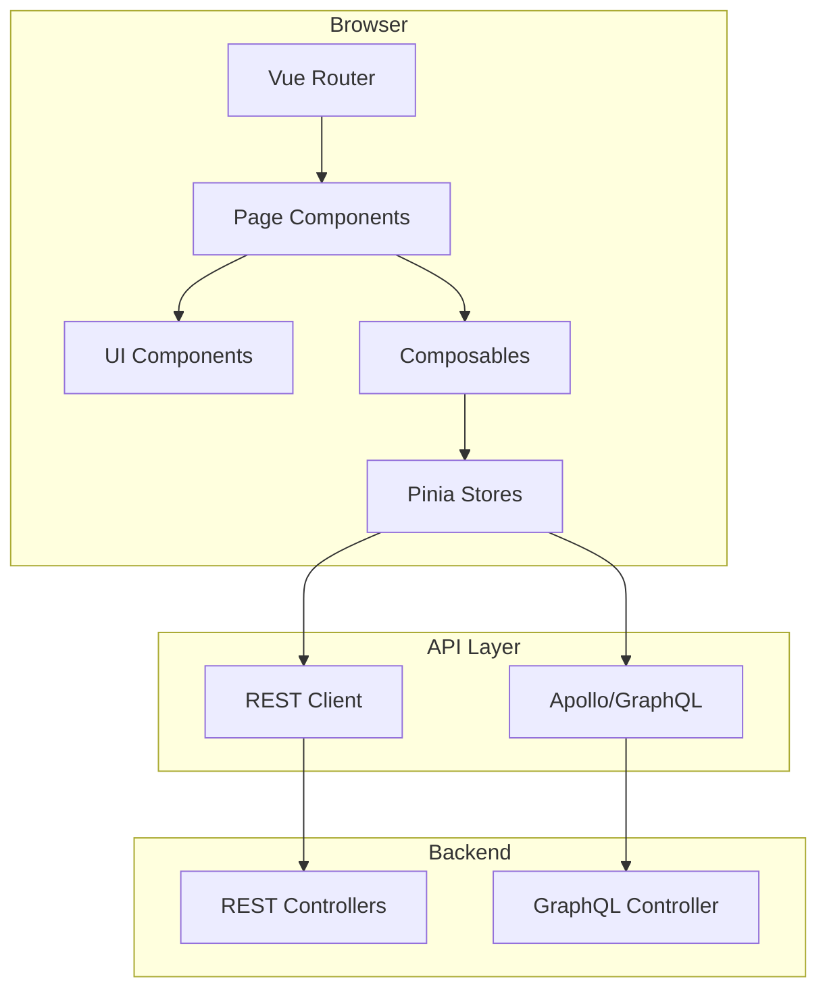

# Frontend Architecture

> **Module:** `frontend/`
> **Last Updated:** 2026-05-18

## Technology Stack

| Component | Role |
|-----------|------|
| Vue 3 | UI framework |
| Vite | Build tool |
| Vitest | Test framework |
| Vue Router | Client-side routing |
| Pinia | State management |
| Apollo Client | GraphQL client |

## Frontend Structure

```
frontend/src/
├── App.vue                    # Root component
├── main.ts                    # Entry point
├── router/                    # Vue Router configuration
├── pages/                     # Page components
│   ├── EditorPage.vue         # Main video editor
│   ├── admin/                 # Admin console pages (30+)
│   │   ├── AdminConsole.vue
│   │   ├── AdminDashboard.vue
│   │   ├── FeatureFlagManagementPage.vue
│   │   ├── FeatureFlagEditor.vue
│   │   ├── FeatureFlagRuleEditor.vue
│   │   ├── FeatureFlagEvaluationPreview.vue
│   │   ├── PolicyManagementPage.vue
│   │   ├── PolicySimulationPanel.vue
│   │   ├── RouteManagementPage.vue
│   │   ├── EntitlementManagementPage.vue
│   │   ├── ExtensionManagement.vue
│   │   ├── MonitoringFeedbackPage.vue
│   │   └── ... (20+ more)
│   ├── user/                  # User portal pages (10+)
│   │   ├── UserDashboardPage.vue
│   │   ├── MyCapabilitiesPage.vue
│   │   ├── MyUsagePage.vue
│   │   ├── MyBillingPage.vue
│   │   ├── MyCreditsPage.vue
│   │   ├── MyFeedbackPage.vue
│   │   ├── BetaFeaturesPanel.vue
│   │   └── ... (5 more)
│   ├── analytics/             # Analytics pages
│   │   ├── AnalyticsAssistantPage.vue
│   │   └── MyReportsPage.vue
│   ├── entitlement/           # Entitlement pages
│   │   ├── BillingHistoryPage.vue
│   │   ├── CurrentPlanPanel.vue
│   │   └── ... (5 more)
│   └── workspace/             # Workspace pages
│       ├── WorkspaceMembersPage.vue
│       └── ... (5 more)
├── components/                # Reusable components
│   ├── timeline/              # Timeline components
│   ├── export/                # Export panel
│   ├── effects/               # Effects panel
│   ├── subtitle/              # Subtitle components
│   ├── feedback/              # Feedback & monitoring
│   └── ... (20+ more)
├── composables/               # Vue composables
│   ├── usePlayback.ts
│   ├── useSaveProject.ts
│   ├── useExportValidation.ts
│   ├── useRenderJob.ts
│   ├── useArtifact.ts
│   └── useI18nError.ts
├── stores/                    # Pinia stores
├── api/                       # API client layer
├── graphql/                   # GraphQL queries
├── utils/                     # Utilities
│   ├── sentry.ts              # Sentry integration
│   ├── openreplay.ts          # OpenReplay integration
│   └── subtitleParser.ts      # Subtitle parsing
└── types/                     # TypeScript types
```

## Application Flow



## Key Pages & Routes

### User Portal

| Route | Component | Purpose |
|-------|-----------|---------|
| `/` | `UserDashboardPage` | Dashboard with overview |
| `/me/projects` | `MyProjectsPage` | Project list |
| `/me/capabilities` | `MyCapabilitiesPage` | Feature capabilities |
| `/me/usage` | `MyUsagePage` | Usage statistics |
| `/me/billing` | `MyBillingPage` | Billing overview |
| `/me/credits` | `MyCreditsPage` | Credit wallet |
| `/me/feedback` | `MyFeedbackPage` | Submit feedback |
| `/me/settings` | `MySettingsPage` | User settings |
| `/me/beta` | `BetaFeaturesPanel` | Beta feature access |
| `/me/analytics` | `AnalyticsAssistantPage` | NLQ analytics |
| `/me/reports` | `MyReportsPage` | Saved reports |

### Admin Console

| Route | Component | Purpose |
|-------|-----------|---------|
| `/admin` | `AdminDashboard` | Admin overview |
| `/admin/feature-flags` | `FeatureFlagManagementPage` | Manage feature flags |
| `/admin/policies` | `PolicyManagementPage` | Policy management |
| `/admin/entitlements` | `EntitlementManagementPage` | Entitlement management |
| `/admin/extensions` | `ExtensionManagement` | Extension management |
| `/admin/routes` | `RouteManagementPage` | Navigation route config |
| `/admin/monitoring` | `MonitoringFeedbackPage` | Monitoring status |
| `/admin/analytics/datasets` | `DatasetCatalogPage` | NLQ dataset catalog |

### Editor

| Route | Component | Purpose |
|-------|-----------|---------|
| `/editor` | `EditorPage` | Main video editor |

## State Management

Pinia stores manage:
- **Project state** — Current project, timeline, clips
- **User state** — Authentication, preferences
- **UI state** — Panel visibility, selected clips
- **Render state** — Job status, artifacts

## Monitoring Integration

| Service | Integration | Status |
|---------|-------------|--------|
| Sentry | `frontend/src/utils/sentry.ts` | ✅ Implemented |
| OpenReplay | `frontend/src/utils/openreplay.ts` | ✅ Implemented |

Both are configured via environment variables and disabled by default.
