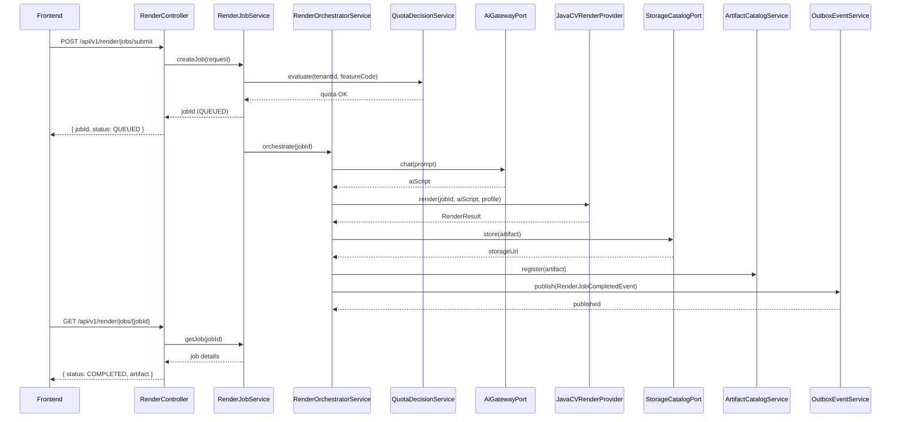
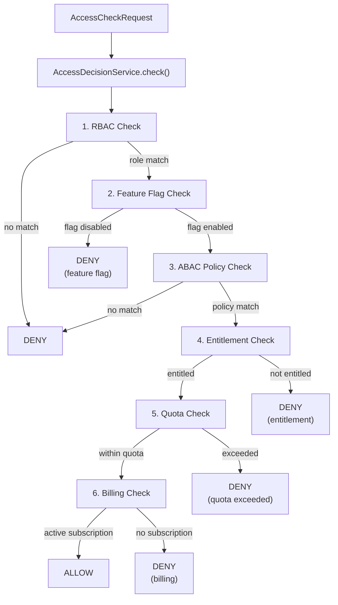
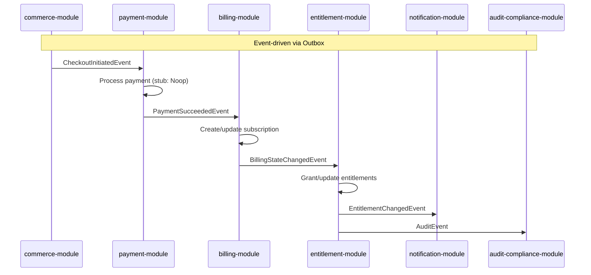
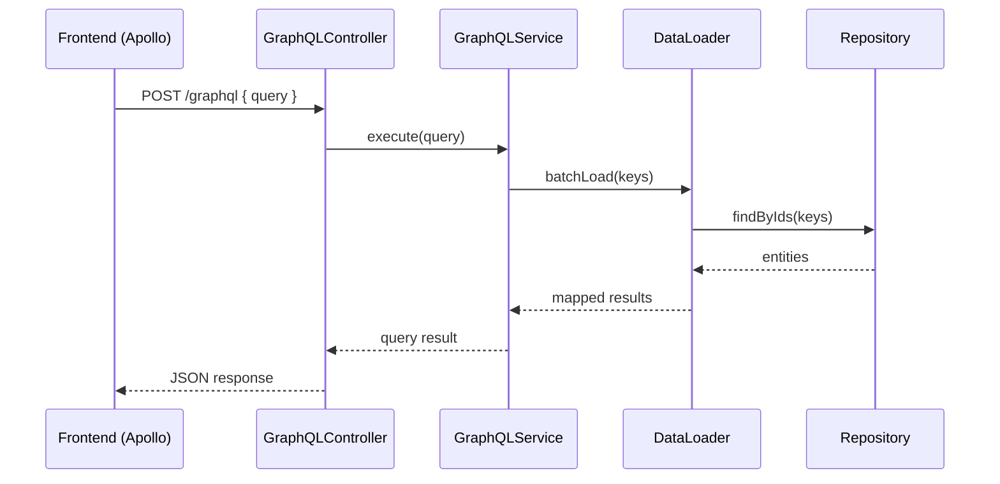
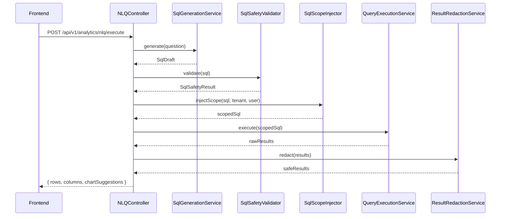
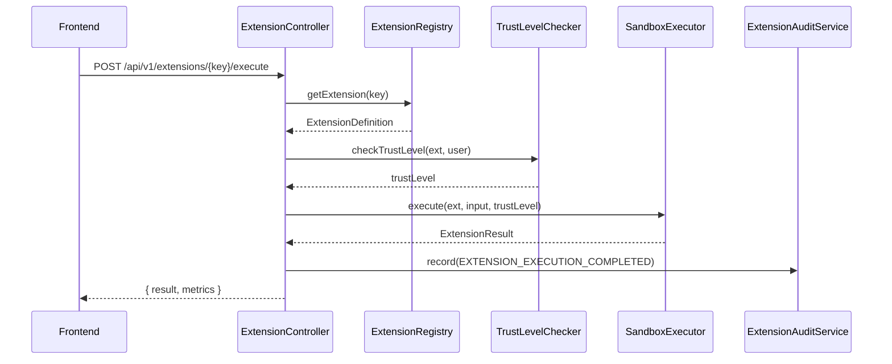
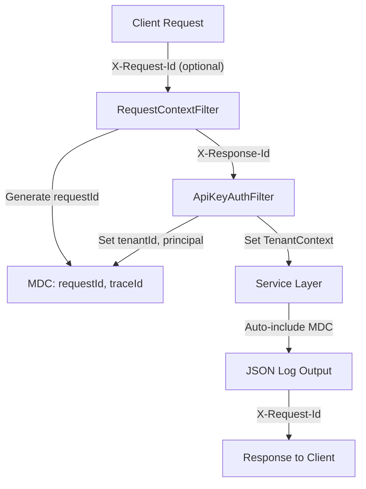

# Request Flows & Data Flows

> **Module:** All
> **Last Updated:** 2026-05-18

## Render Job Request Flow

## Access Decision Flow

## Commerce → Payment → Billing → Entitlement Flow

## GraphQL Query Flow

## NLQ Query Flow

## Extension Execution Flow

## Request Correlation Flow

