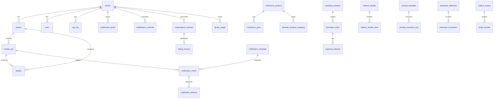

# Data Architecture & Schema

> **Module:** All persistence modules
> **Last Updated:** 2026-05-18

## Database: PostgreSQL 16

All tables reside in the **public** schema. Schema migrations are managed exclusively by **Flyway**.

## Flyway Migration History

| Version | File | Tables Added | Purpose |
|---------|------|-------------|---------|
| V1 | `V1__init.sql` | `render_job`, `notification_event`, `notification_template`, `notification_delivery`, `config_item` | Core tables |
| V2 | `V2__platform_v2.sql` | `storage_object`, `prompt_template`, `prompt_execution_log`, `cloud_resource_definition`, `secret_ref`, `extension_definition`, `extension_invocation`, `app_datasource` | Platform extensions |
| V3 | `V3__platform_v3.sql` | `outbox_events`, `audit_records`, `schedules`, `quota_definitions` | Operations |
| V4 | `V4__commerce_billing_entitlement.sql` | `commerce_product`, `commerce_price`, `provider_product_mapping`, `checkout_session`, `purchase_order`, `payment_attempt`, `provider_webhook_event`, `subscription_contract`, `billing_invoice`, `feature_definition`, `feature_bundle`, `feature_bundle_item`, `entitlement_grant`, `entitlement_override` | Commerce domain |
| V5 | `V5__outbox_audit_enhancements.sql` | (alters) `outbox_events`, `audit_records` | Enhancements |
| V6 | `V6__indexes_and_constraints.sql` | (indexes) ~40 indexes | Performance |
| V7 | `V7__identity_render_artifact.sql` | `tenant`, `project`, `user`, `api_key`, `artifact`, `notification_record` | Identity & artifacts |
| V8 | `V8__quota_usage_and_render_history.sql` | `quota_usage` | Quota tracking |
| V9 | `V9__outbox_enhancements.sql` | (alters) `outbox_events` | Outbox enhancements |
| V10 | `V10__render_job_status_history.sql` | (new table) | Status history |
| V11 | `V11__prompt_engineering_tables.sql` | (new tables) | Prompt engineering |
| V12 | `V12__problematic_data_tables.sql` | `problematic_data_record`, `quarantined_render_jobs`, `quarantined_prompt_executions`, `quarantined_provider_workers`, `problematic_data_rule_config` | Problematic data |
| V13 | `V13__extension_platform_upgrade.sql` | `extension_routing_rule`, `extension_resource_limit`, `extension_rollback_point`, `extension_audit_event`, `sandbox_execution_job` | Extension v2 |
| V14 | `V14__rbac_workspace.sql` | (new tables) | RBAC & workspace |
| V15 | `V15__entitlement_upgrade.sql` | (alters) | Entitlement upgrade |
| V16 | `V16__navigation.sql` | (new tables) | Configurable navigation |
| V17 | `V17__billing_models.sql` | (new tables) | Billing models |

## Entity Relationship Diagram



## Naming Conventions

| Category | Convention | Example |
|----------|-----------|---------|
| Table names | lowercase + underscore | `render_job` |
| Column names | lowercase + underscore | `created_at` |
| Primary key | `id varchar(64)` | — |
| Timestamps | `created_at timestamp not null` | — |
| Status columns | `status varchar(32) not null` | — |
| Foreign keys | `<entity>_id varchar(64) not null` | `tenant_id` |
| Indexes | `ix_<table>_<column>` | `ix_render_job_tenant_id` |

## Connection Pool (HikariCP)

```yaml
spring:
  datasource:
    hikari:
      maximum-pool-size: 20
      minimum-idle: 5
      connection-timeout: 30000
      idle-timeout: 600000
      max-lifetime: 1800000
```

## Volume Estimates

| Scenario | Data Size | Notes |
|----------|-----------|-------|
| Minimal (dev/test) | < 10 MB | Seed data only |
| Small (< 100 tenants) | ~100 MB | Moderate render volume |
| Medium (< 10K tenants) | ~1 GB | High render + event volume |
| Large (< 100K tenants) | ~10 GB | Requires partitioning |

## Test Database

H2 in-memory database is used for tests with PostgreSQL compatibility mode.
