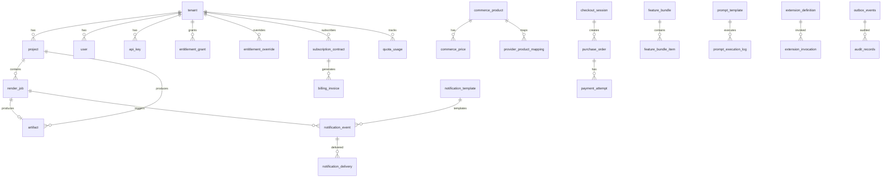

> [!NOTE]
> **Authority:** Supporting documentation.
> Canonical semantics are defined by the contracts in
> [canonical-contracts/](governance/canonical-contracts/).
> If this document conflicts with those contracts, the canonical contracts win.

# Data Architecture & Schema

> **Module:** All persistence modules
> **Last Updated:** 2026-05-18

## Database: PostgreSQL 16

All tables reside in the **public** schema. Schema migrations are managed exclusively by **Flyway**.

## Flyway Migration History

The current migration inventory and release policy are maintained in the one
normative [Flyway migration policy](../database/flyway-migration-baseline.md).
At this checkpoint the executable directory contains V1 through V10; this
supporting overview does not copy a second migration table. Future schema
changes require a new forward migration and an accepted governance decision.

## Entity Relationship Diagram


```mermaid
erDiagram
    tenant ||--o{ project : "has"
    tenant ||--o{ "user" : "has"
    tenant ||--o{ api_key : "has"
    tenant ||--o{ entitlement_grant : "grants"
    tenant ||--o{ entitlement_override : "overrides"
    tenant ||--o{ subscription_contract : "subscribes"
    tenant ||--o{ quota_usage : "tracks"

    project ||--o{ render_job : "contains"
    project ||--o{ artifact : "produces"

    render_job ||--o| artifact : "produces"
    render_job ||--o{ notification_event : "triggers"

    subscription_contract ||--o{ billing_invoice : "generates"

    commerce_product ||--o{ commerce_price : "has"
    commerce_product ||--o{ provider_product_mapping : "maps"

    checkout_session ||--o{ purchase_order : "creates"
    purchase_order ||--o{ payment_attempt : "has"

    feature_bundle ||--o{ feature_bundle_item : "contains"

    prompt_template ||--o{ prompt_execution_log : "executes"

    extension_definition ||--o{ extension_invocation : "invoked"

    outbox_events ||--o{ audit_records : "audited"

    notification_template ||--o{ notification_event : "templates"
    notification_event ||--o{ notification_delivery : "delivered"
```

## Naming Conventions

| Category | Convention | Example |
|----------|-----------|---------|
| Table names | lowercase + underscore | `render_job` |
| Column names | lowercase + underscore | `created_at` |
| Primary key | `id varchar(64)` | — |
| Timestamps | `created_at timestamp not null` | — |
| Status columns | `status varchar(32) not null` | — |
| Foreign keys | `<entity>_id varchar(64) not null` | `tenant_id` |
| Indexes | `ix_<table>_<column>` | `ix_render_job_tenant_id` |

## Connection Pool (HikariCP)

```yaml
spring:
  datasource:
    hikari:
      maximum-pool-size: 20
      minimum-idle: 5
      connection-timeout: 30000
      idle-timeout: 600000
      max-lifetime: 1800000
```

## Volume Estimates

| Scenario | Data Size | Notes |
|----------|-----------|-------|
| Minimal (dev/test) | < 10 MB | Seed data only |
| Small (< 100 tenants) | ~100 MB | Moderate render volume |
| Medium (< 10K tenants) | ~1 GB | High render + event volume |
| Large (< 100K tenants) | ~10 GB | Requires partitioning |

## Test Database

H2 in-memory database is used for tests with PostgreSQL compatibility mode.
