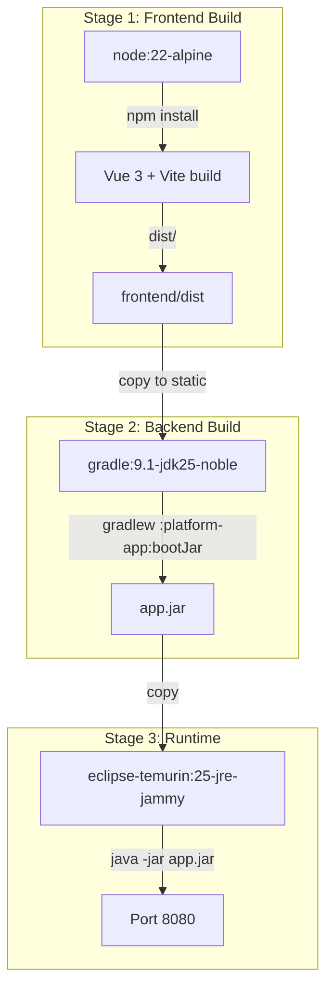
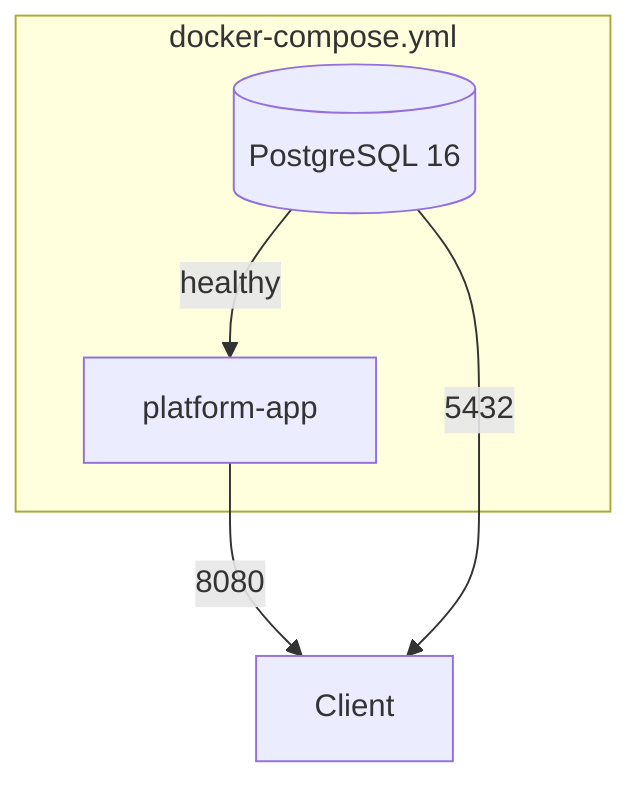
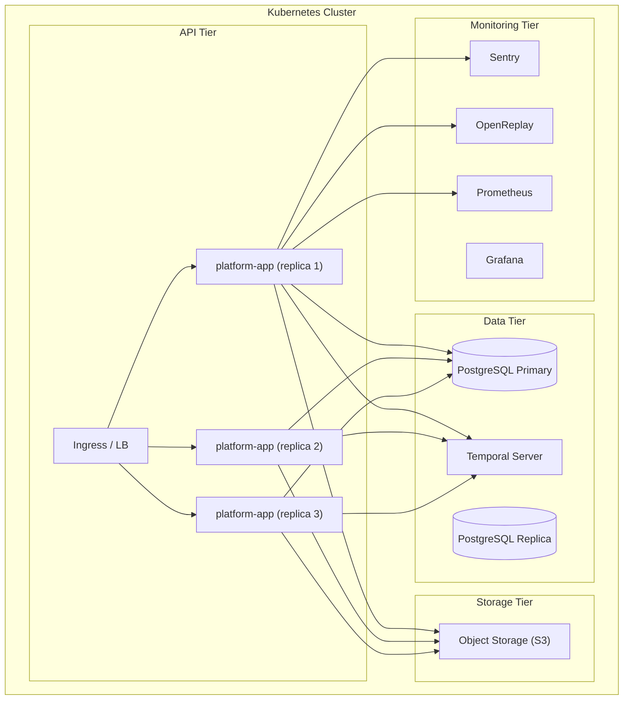
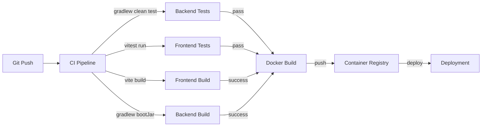

# Deployment Architecture

> **Module:** `platform-app`, `frontend`, infrastructure
> **Last Updated:** 2026-05-18

## Docker Build Pipeline



## Docker Compose (Local Development)



### Services

| Service | Image | Port | Purpose |
|---------|-------|------|---------|
| `db` | postgres:16-alpine | 5432 | Database |
| `app` | (built from Dockerfile) | 8080 | Application |

### Volumes

| Volume | Purpose |
|--------|---------|
| `pgdata` | PostgreSQL data persistence |
| `app-storage` | File storage for artifacts |

## Production Deployment Topology



## Render Execution Modes

| Mode | Adapter | Temporal Required | Use Case |
|------|---------|-------------------|----------|
| `local` | `LocalRenderExecutionAdapter` | No | Dev, test, simple deployments |
| `temporal` | `TemporalRenderExecutionAdapter` | Yes | Production, distributed systems |

```yaml
# Local mode (default)
render:
  execution:
    mode: local

# Temporal mode (production)
render:
  execution:
    mode: temporal
```

## Temporal Server Requirements

| Component | Minimum | Recommended |
|-----------|---------|-------------|
| Temporal Server | 1.22 | 1.24+ |
| Temporal SDK (Java) | 1.22 | 1.33 |
| CPU | 2 cores | 4 cores |
| Memory | 4 GB | 8 GB |
| Disk | 50 GB SSD | 100 GB SSD |

## Health Check Endpoints

| Endpoint | Purpose |
|----------|---------|
| `GET /actuator/health` | Overall health |
| `GET /actuator/health/liveness` | Kubernetes liveness probe |
| `GET /actuator/health/readiness` | Kubernetes readiness probe |
| `GET /actuator/metrics` | Micrometer metrics |
| `GET /actuator/prometheus` | Prometheus scrape endpoint |

## Environment Configuration

| Environment | Temporal | Database | Monitoring |
|-------------|----------|----------|------------|
| Local dev | Not required | H2 in-memory | Disabled |
| CI/CD tests | Not required | H2 in-memory | Disabled |
| Staging | Optional | PostgreSQL | Optional |
| Production | Required | PostgreSQL | Required |

## Resource Requirements

| Resource | Minimum | Recommended |
|----------|---------|-------------|
| CPU | 2 cores | 4 cores |
| Memory | 4 GB | 8 GB |
| Disk | 20 GB SSD | 50 GB SSD |
| Network | 100 Mbps | 1 Gbps |

## CI/CD Pipeline


