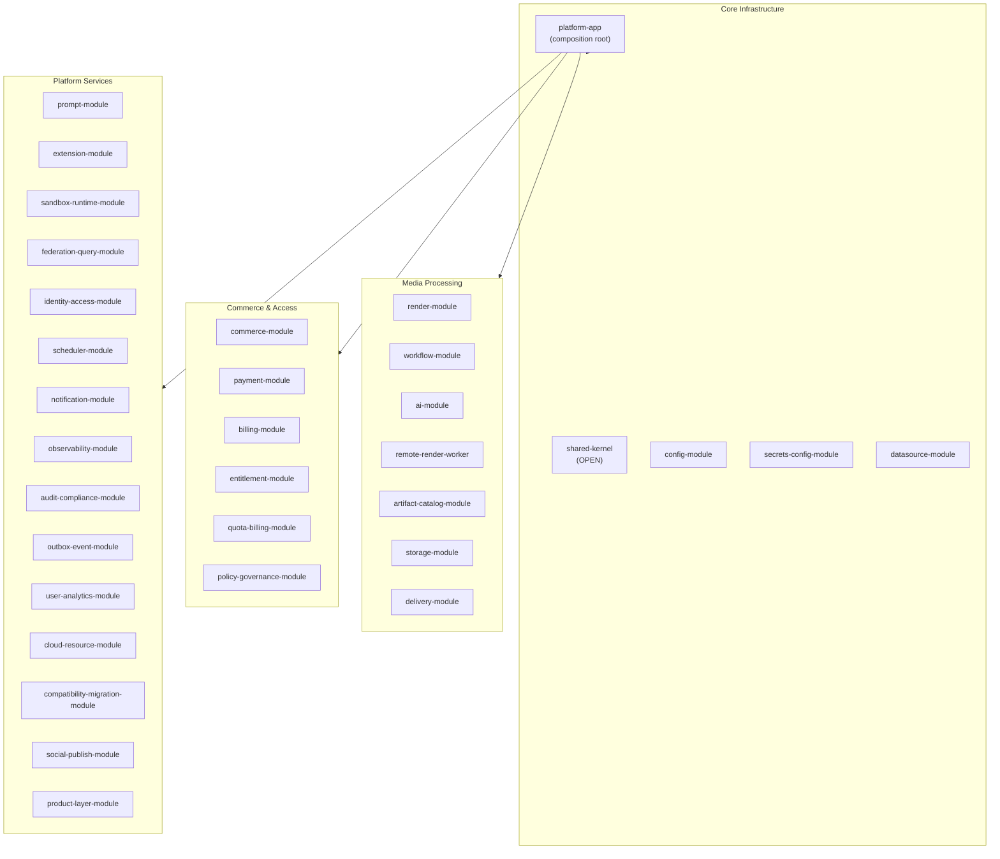
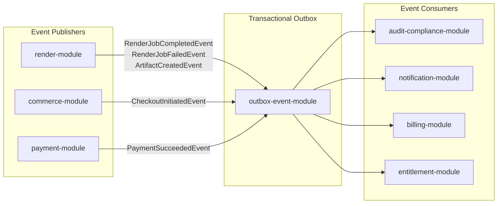
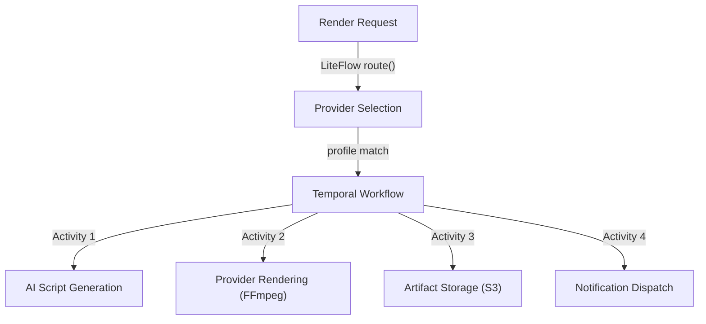
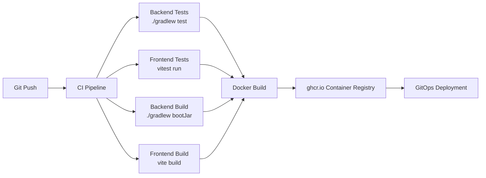

# System Blueprint — Target Architecture

## 1. System Overview

Media Platform is a **modular monolith** designed for media production workflows — rendering, timeline editing, subtitle/font processing, commerce, and entitlement management.

| Attribute | Value |
|-----------|-------|
| Architecture Style | Modular Monolith (Spring Modulith) |
| Runtime | JVM (Java 25 toolchain) |
| Framework | Spring Boot 4.0.4 + Spring Modulith 2.0.4 |
| Module Count | 32 Gradle modules (30 business + platform-app + shared-kernel) |
| Database | PostgreSQL 16 (production) |
| Workflow Engine | Temporal 1.33.0 (durable) + LiteFlow 2.15.3.2 (local rules) |
| Frontend | React 19 + TypeScript 5.7 + Vite 6 + TanStack Router/Query |
| Plugin System | PF4J 3.15.0 |
| API | REST (`/api/v1/*`) + GraphQL (optional) + OpenAPI 3 |

### Architecture Principles

1. **Modular Monolith** — Single deployable unit with enforced module boundaries via Spring Modulith
2. **Shared Kernel** — `shared-kernel` is the only `OPEN` module; all others are `CLOSED`
3. **Event-Driven Decoupling** — Cross-module communication via `ApplicationEventPublisher` + Transactional Outbox
4. **Port & Adapter** — Each module exposes named interfaces (`api`, `domain`) for cross-module access
5. **API Versioning** — REST APIs use `/api/v1/*` prefix with backward-compatible evolution
6. **Feature Flags** — Unleash-based gating for gradual rollouts (OpenFeature target)

---

## 2. Module Architecture

### Module Groups

### Dependency Rules

| Rule | Description |
|------|-------------|
| `shared-kernel` → none | Root of dependency graph, no outgoing deps |
| `platform-app` → all | Aggregator only, depends on all 30 modules |
| Cross-module → named interfaces | Must use `api` or `domain` packages |
| Event-based for decoupled flows | render→audit, render→notification, commerce→payment |
| Forbidden: any → `platform-app` | No module may depend on the aggregator |
| Forbidden: `shared-kernel` → any | Root must not have outgoing deps |

### Internal Layering (per module)

| Package | Responsibility |
|---------|---------------|
| `*.api` | Public boundary — Controllers, DTOs, request/response types |
| `*.app` | Application services — Use case orchestration, transaction boundaries |
| `*.domain` | Domain model — Entities, value objects, domain events |
| `*.spi` | Port interfaces — Interfaces for pluggable adapters |
| `*.infrastructure` | Adapters — External system integrations |

---

## 3. Security Model

### Authentication & Authorization

| Layer | Mechanism | Profile |
|-------|-----------|---------|
| OAuth2/OIDC | Authentik OIDC provider | `prod` |
| JWT Bearer | JJWT 0.12.6, HS256 | `prod`, `safe-mode` |
| API Key | Header-based (`X-API-Key`) | `prod` |
| Dev Auth | Permit-all + dev endpoints | `dev`, `preview` |

### Tenant Isolation

- `TenantGuard` filter extracts tenant context from JWT/claims
- `TenantContext` propagated via `ThreadLocal` (MDC fields: `tenantId`, `projectId`)
- All jOOQ queries scoped by `tenant_id` column

### Security Profiles

| Profile | `security.enabled` | `oauth2.enabled` | Auth Mode |
|---------|--------------------|--------------------|-----------|
| `dev-postgres`, `preview` | `false` | `false` | Permit-all |
| `prod`, `safe-mode` | `true` | `false` | JWT only |
| `prod` | `true` | `true` | Full OAuth2 |

### Network Security (K8s Production)

- Egress proxy (Squid) for outbound traffic control
- NetworkPolicy isolation: sandbox-worker fully isolated, api/render-worker via proxy
- Metadata IP (`169.254.169.254`) blocked in all policies
- `readOnlyRootFilesystem`, `runAsNonRoot`, `allowPrivilegeEscalation: false` on all containers

---

## 4. Data Flow

### Event-Driven Architecture

### Render Pipeline Flow

### Persistence Strategy

| Layer | Technology | Purpose |
|-------|-----------|---------|
| Schema Migration | Flyway (17 versions) | DDL management |
| Type-Safe SQL | jOOQ 3.19.18 | Query DSL (no codegen yet) |
| Object Storage | S3-compatible | Artifacts, media files |
| Connection Pool | HikariCP | 20 max, 5 min idle |

---

## 5. Deployment Architecture

### Build Pipeline

### Docker Build (Multi-Stage)

| Stage | Base Image | Output |
|-------|-----------|--------|
| 1. Frontend | `node:22-alpine` | `frontend/dist/` |
| 2. Backend | `gradle:9.1-jdk25-noble` | `app.jar` (bootJar) |
| 3. Runtime | `eclipse-temurin:25-jre-jammy` | Port 8080 |

### Production Topology (K8s)

| Tier | Components | Replicas |
|------|-----------|----------|
| API | `platform-app` | 3 |
| Render Worker | `remote-render-worker` | 1+ |
| Sandbox Worker | `sandbox-worker` | 1+ |
| Data | PostgreSQL 16 (primary + replica) | 2 |
| Workflow | Temporal Server | 1 |
| Storage | S3-compatible object storage | — |
| Monitoring | Sentry + OpenReplay + Prometheus + Grafana | — |

### Render Execution Modes

| Mode | Adapter | Temporal Required | Use Case |
|------|---------|-------------------|----------|
| `local` | `LocalRenderExecutionAdapter` | No | Dev, test, simple deployments |
| `temporal` | `TemporalRenderExecutionAdapter` | Yes | Production, distributed systems |

### Health Endpoints

| Endpoint | Purpose |
|----------|---------|
| `/actuator/health` | Overall health |
| `/actuator/health/readiness` | K8s readiness probe |
| `/actuator/health/liveness` | K8s liveness probe |
| `/actuator/metrics` | Micrometer metrics |
| `/actuator/prometheus` | Prometheus scrape |

---

## References

- [System Architecture (current)](../01-system-architecture.md)
- [Module Architecture](../03-module-architecture.md)
- [Deployment Architecture](../08-deployment-architecture.md)
- [Backend Architecture](../02-backend-architecture.md)
- [Data Architecture](../06-data-architecture.md)
- [Architecture Decisions](../07-architecture-decisions.md)
