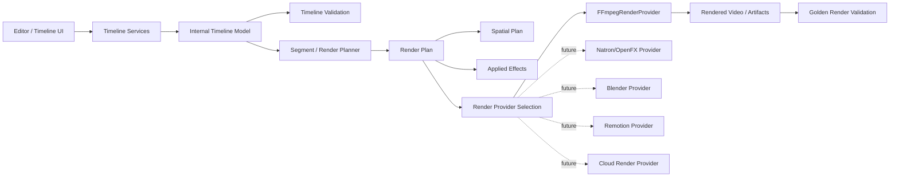
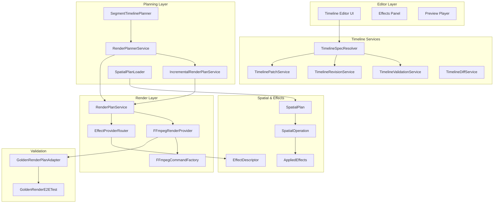
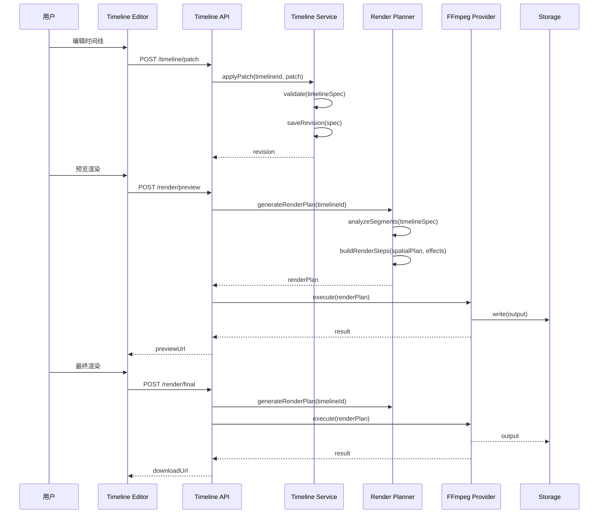
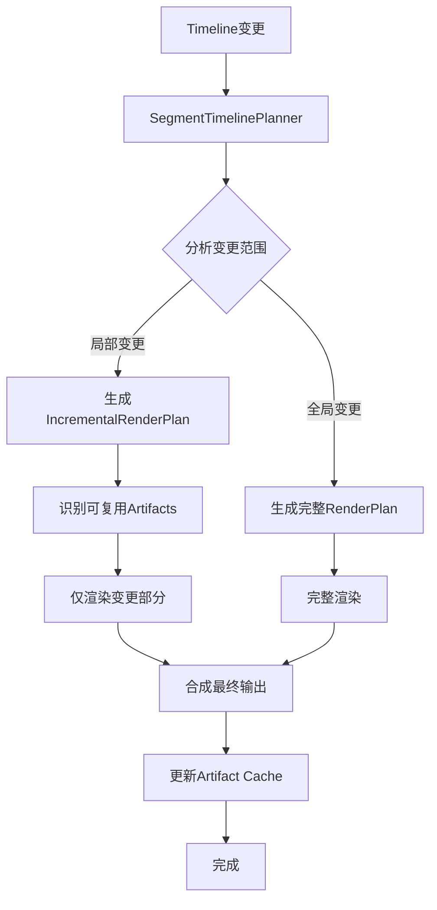

# 核心编辑与渲染架构文档

## 文档信息
- **版本**: v1.0
- **生成时间**: 2026-06-09
- **适用范围**: render-module, shared-kernel, frontend timeline/editor/effects/render
- **基于代码版本**: 当前实现
- **非目标**: Import/Export、ZIP、metadata persistence、staging readiness、RC 文档

---

## 1. 文档摘要

### 1.1 当前实现状态

| 维度 | 状态 | 说明 |
|------|------|------|
| **Timeline** | ✅ 完整 | Internal Timeline、Timeline Revision、Patch、Validation、Diff |
| **Render Plan** | ✅ 完整 | Render Plan生成、执行、Incremental Render支持 |
| **Spatial Plan** | ✅ 完整 | 坐标系统、Crop、Placement、Transform |
| **Effect Taxonomy** | ✅ 完整 | 12分类体系、Applied Effects、Provider路由 |
| **Render Provider** | ⚠️ 部分 | FFmpeg完整支持，其他provider为future/spike |
| **Golden Render** | ✅ 完整 | 验证框架、Plan Adapter |
| **OpenFX/Natron/Blender/Remotion/Cloud Render** | ❌ 未实现 | 设计方向/future integration |

### 1.2 核心结论

1. **Timeline系统完备**: 支持多轨道、多片段、版本管理、增量渲染
2. **Effect体系灵活**: 支持12种分类、多provider路由、参数化配置
3. **Provider架构可扩展**: 接口清晰，支持FFmpeg，预留future provider接入点
4. **Render Plan与Timeline解耦**: Timeline通过Planner转换为Render Plan，Provider消费Render Plan
5. **OpenFX/Natron等未实现**: 当前仅有设计方向和接口占位，无真实runtime

### 1.3 关键指标

- **核心Timeline类**: 20+ (TimelineSpec, TimelineTrack, TimelineClip, TimelineTransition等)
- **Render Plan类**: 10+ (RenderPlan, RenderStep, IncrementalRenderPlan等)
- **Effect分类**: 12种 (temporal, transition, filter, color, vfx, composite, text, audio, subtitle, transform, crop, overlay)
- **Render Provider**: 1个实际实现 (FFmpeg)，8个future/spike
- **Spatial Operation类型**: crop, overlay, transform, placement

---

## 2. 核心概念总览

### 2.1 概念表

| Concept | 中文名 | 作用 | 当前状态 | 关键代码/文档 |
|---------|--------|------|----------|--------------|
| Timeline | 时间线 | 音视频编辑的核心数据结构 | ✅ 完整 | `TimelineSpec`, `TimelineTrack`, `TimelineClip` |
| Internal Timeline | 内部时间线 | 平台标准时间线表示 | ✅ 完整 | `TimelineSpec`, `InternalTimelineAdapter` |
| Timeline Revision | 时间线版本 | 管理时间线变更历史 | ✅ 完整 | `TimelineRevisionService`, `TimelineRevisionRepository` |
| Timeline Patch | 时间线补丁 | 增量更新时间线 | ✅ 完整 | `TimelinePatchService`, `TimelinePatchOpsJson` |
| Timeline Validation | 时间线验证 | 验证时间线结构合法性 | ✅ 完整 | `TimelineValidationService`, `TimelineValidationResult` |
| Timeline Diff | 时间线差异 | 比较两个版本的时间线 | ✅ 完整 | `TimelineRevisionDiffService`, `TimelineSemanticDiffService` |
| Segment | 片段 | 时间线中的最小编辑单元 | ✅ 完整 | `TimelineSegment`, `SegmentTimelinePlanner` |
| Render Plan | 渲染计划 | 描述视频渲染步骤序列 | ✅ 完整 | `RenderPlan`, `RenderStep` |
| Spatial Plan | 空间计划 | 描述视频空间变换 | ✅ 完整 | `SpatialPlan`, `SpatialOperation` |
| Effect Taxonomy | 效果分类 | 效果的分类体系 | ✅ 完整 | `EffectTaxonomyMappingService`, 12分类 |
| Applied Effects | 应用效果 | 时间线上应用的效果实例 | ✅ 完整 | `TimelineClipEffect`, `AppliedEffect` |
| Render Provider | 渲染提供者 | 执行实际渲染的组件 | ⚠️ 部分 | `RenderProvider`接口, `FFmpegRenderProvider` |
| FFmpeg Provider | FFmpeg渲染器 | 当前唯一实际render provider | ✅ 完整 | `FFmpegRenderProvider`, `FFmpegCommandFactory` |
| Golden Render | 黄金渲染 | 渲染结果验证框架 | ✅ 完整 | `GoldenRenderPlanAdapter`, `GoldenRenderE2ETest` |
| Incremental Render | 增量渲染 | 只渲染变更部分 | ✅ 完整 | `IncrementalRenderPlanService`, `IncrementalRenderOrchestrationService` |
| OpenFX | OpenFX效果标准 | VFX效果标准 | ❌ 未实现 | 设计方向/future integration |
| Natron | Natron合成器 | 节点式合成软件 | ❌ 未实现 | `EffectProviderRouter`中预留 |
| Blender | Blender 3D | 3D渲染软件 | ❌ 未实现 | future/spike |
| Remotion | Remotion | 程序化视频 | ❌ 未实现 | future/spike |
| Cloud Render | 云渲染 | 云端渲染服务 | ❌ 未实现 | future/spike |

---

## 3. 总体架构

### 3.1 核心流程图



### 3.2 详细架构图



---

## 4. Timeline 架构

### 4.1 核心模型

#### 4.1.1 TimelineSpec (内部时间线规范)

TimelineSpec是平台的标准时间线表示，包含：

```java
public record TimelineSpec(
    String id,                           // 唯一标识
    String name,                         // 可读名称
    String description,                  // 描述
    List<TimelineTrack> tracks,          // 轨道列表
    List<TimelineTextOverlay> textOverlays, // 文字叠加
    TimelineOutputSpec outputSpec,       // 输出规格
    double totalDuration,                // 总时长(秒)
    Map<String, String> metadata         // 元数据
)
```

**关键特性**:
- JSON序列化，支持OTIO格式转换
- 支持多轨道 (Video, Audio, Subtitle)
- 支持文字叠加 (TextOverlay)
- 内置验证逻辑

#### 4.1.2 TimelineTrack (轨道)

```java
public record TimelineTrack(
    String id,
    String name,
    TrackType type,          // VIDEO, AUDIO, SUBTITLE
    int layer,               // 合成层级(低=后)
    List<TimelineClip> clips, // 片段列表
    boolean muted,           // 静音
    boolean locked           // 锁定
)
```

#### 4.1.3 TimelineClip (片段)

```java
public record TimelineClip(
    String id,
    String name,
    TimelineAssetRef assetRef,  // 资源引用
    double timelineStart,       // 时间线起始位置
    double clipDuration,        // 片段时长
    double assetInPoint,        // 资源入点
    double assetOutPoint,       // 资源出点
    List<TimelineClipEffect> effects, // 应用效果
    TimelineTransition transitionIn,  // 入过渡
    TimelineTransition transitionOut  // 出过渡
)
```

#### 4.1.4 TimelineTransition (过渡)

```java
public record TimelineTransition(
    String type,             // 过渡类型
    double duration,         // 过渡时长
    String easing            // 缓动函数
)
```

支持的过渡类型:
- `cross_dissolve` - 交叉溶解
- `fade_in` / `fade_out` - 淡入/淡出
- `wipe` - 擦除
- `slide` - 滑动
- `zoom` - 缩放

### 4.2 Timeline版本管理

#### 4.2.1 TimelineRevision (版本)

```java
public record TimelineRevision(
    String id,
    String timelineId,
    int versionNumber,
    TimelineSpec spec,
    String authorId,
    Instant createdAt,
    String label,
    RevisionStatus status
)
```

**版本管理流程**:
1. 用户编辑时间线
2. 系统创建新版本
3. 保存版本历史
4. 支持版本回滚

#### 4.2.2 TimelinePatch (补丁)

支持增量更新:
- `add_track` - 添加轨道
- `remove_track` - 删除轨道
- `add_clip` - 添加片段
- `remove_clip` - 删除片段
- `move_clip` - 移动片段
- `update_effect` - 更新效果
- `update_transition` - 更新过渡

#### 4.2.3 TimelineDiff (差异)

两种diff模式:
1. **JsonDiff**: 结构化diff，精确到字段级别
2. **SemanticDiff**: 语义diff，描述变更含义

### 4.3 Timeline验证

验证规则:
- 至少有一个轨道
- 每个片段必须有有效的时间
- 每个片段必须有资源引用
- 输出规格必须完整

---

## 5. Effect / OpenFX 架构

### 5.1 Effect Taxonomy v1 (效果分类)

12种分类:

| 分类 | 中文名 | 说明 | 示例效果 |
|------|--------|------|----------|
| temporal | 时间 | 时间相关的过渡效果 | fade_in, fade_out |
| transition | 过渡 | 片段间过渡 | cross_dissolve, wipe, slide, zoom |
| filter | 滤镜 | 视频滤镜 | blur, sharpen, vignette |
| color | 调色 | 颜色调整 | brightness, contrast, grayscale, sepia |
| vfx | 视觉特效 | 高级视觉效果 | particle_overlay, chromatic |
| composite | 合成 | 图层合成 | overlay, pip, watermark |
| text | 文字 | 文字效果 | subtitle_burn_in, overlay |
| audio | 音频 | 音频效果 | volume, fade |
| subtitle | 字幕 | 字幕处理 | subtitle_burn_in |
| transform | 变换 | 几何变换 | scale, rotate, translate |
| crop | 裁剪 | 画面裁剪 | crop |
| overlay | 叠加 | 叠加层 | overlay |

### 5.2 Effect Descriptor (效果描述)

```java
public record EffectDescriptor(
    String effectKey,                    // 效果键 (如 "video.blur")
    String displayName,                  // 显示名称
    String category,                     // 分类
    String description,                  // 描述
    List<EffectParameterSchema> paramSchemas, // 参数模式
    List<String> providerKeys,           // 支持的provider
    Map<String, Object> defaultParams,  // 默认参数
    List<String> allowedTiers,           // 允许的订阅层级
    String taxonomyCategory,             // 分类(v1)
    Boolean isEffect                     // 是否启用
)
```

### 5.3 Effect Provider Router (效果提供者路由)

Provider优先级:
1. ffmpeg (轻量级，优先)
2. javacv
3. gstreamer
4. mlt
5. natron
6. ofx
7. gpac
8. bento4
9. shotstack

**路由逻辑**:
1. 查找效果的provider映射
2. 按优先级选择可用provider
3. 检查租户权限
4. 返回最佳provider

### 5.4 Applied Effects (应用效果)

```java
public record TimelineClipEffect(
    String effectKey,
    Map<String, Object> parameters,
    double startTime,
    double duration,
    boolean enabled
)
```

### 5.5 OpenFX / Natron 状态

**当前状态**: ❌ 未实现真实OpenFX runtime

**代码中仅有**:
- `EffectProviderRouter`中的`requiresOfxPipeline()`方法
- `EffectProviderRouter`中的`requiresNatronPipeline()`方法
- 效果分类中的`natron_*`前缀效果键

**Future设计方向**:
1. OpenFX标准集成
2. Natron节点式合成
3. OFX插件加载器
4. GPU加速渲染

---

## 6. Spatial Plan 架构

### 6.1 坐标系统

```java
public record SpatialPlan(
    String schemaVersion,
    String version,
    String projectId,
    String description,
    CoordinateSystem coordinateSystem,  // 坐标系
    CanvasConfig canvas,                // 画布配置
    List<SpatialOperation> operations,  // 空间操作列表
    RoundingPolicy roundingPolicy       // 舍入策略
)
```

### 6.2 空间操作类型

```java
public record SpatialOperation(
    String id,
    String type,              // crop, overlay, transform, placement
    String description,
    String status,            // supported, unsupported
    String reason,
    SpatialSource source,     // 源区域
    PpmRegion region,         // 目标区域(PPM坐标)
    PpmPosition position,     // 位置(PPM坐标)
    Double opacity,           // 透明度
    String blendMode,         // 混合模式
    String space,             // 坐标空间
    SafeAreaInsets insets,    // 安全区域
    Boolean clampToFrame      // 裁剪到帧
)
```

### 6.3 PPM坐标系统

**normalized_ppm**: 归一化像素坐标
- 范围: 0.0 到 1.0
- 支持不同分辨率
- 支持相对定位

### 6.4 空间操作类型

| 类型 | 说明 | FFmpeg支持 |
|------|------|-----------|
| crop | 裁剪画面 | ✅ 直接支持 |
| overlay | 叠加图层 | ✅ 直接支持 |
| transform | 几何变换 | ✅ 部分支持 |
| placement | 位置放置 | ✅ 直接支持 |
| scale | 缩放 | ✅ 直接支持 |
| rotate | 旋转 | ✅ 直接支持 |

---

## 7. Render Plan 架构

### 7.1 核心模型

```java
public record RenderPlan(
    String id,
    String renderJobId,
    RenderProfile profile,          // 渲染配置
    List<RenderStep> steps,         // 渲染步骤
    RenderStepStatus status,        // 状态
    Instant createdAt,
    Instant startedAt,
    Instant completedAt,
    Map<String, String> parameters  // 参数
)
```

### 7.2 Render Step

```java
public record RenderStep(
    String id,
    String name,
    String type,              // ffmpeg, effect, compose, export
    RenderStepStatus status,
    Map<String, Object> parameters,
    String outputPath,
    Instant startedAt,
    Instant completedAt,
    String errorMessage
)
```

### 7.3 Render Profile (渲染配置)

```java
public record RenderProfile(
    String format,           // mp4, mov, webm
    int width,               // 宽度
    int height,              // 高度
    int frameRate,           // 帧率
    String videoCodec,       // h264, h265, vp9
    String audioCodec,       // aac, opus
    int videoBitrateKbps,    // 视频码率
    int audioBitrateKbps,    // 音频码率
    String quality           // low, medium, high
)
```

### 7.4 Incremental Render (增量渲染)

**核心思想**: 只渲染变更的部分，减少重渲染时间

```java
public record IncrementalRenderPlan(
    String id,
    String timelineId,
    String baseVersion,
    String targetVersion,
    List<IncrementalTask> tasks,     // 任务列表
    List<String> reuseArtifacts,     // 可复用产物
    double estimatedCost             // 预估成本
)
```

**Incremental Task类型**:
- `render_segment` - 渲染片段
- `apply_effect` - 应用效果
- `compose_layers` - 合成图层
- `transcode` - 转码

### 7.5 Segment Timeline Planner

**职责**: 将Timeline转换为可渲染的segments

**规划逻辑**:
1. 分析时间线结构
2. 识别变更区域
3. 生成渲染segments
4. 优化渲染顺序
5. 标记可复用区域

---

## 8. Render Provider 架构

### 8.1 RenderProvider 接口

```java
public interface RenderProvider {
    String providerKey();
    boolean supportsEffect(String effectKey);
    RenderResult execute(RenderPlan plan, RenderContext context);
    RenderCapabilities getCapabilities();
}
```

### 8.2 FFmpegRenderProvider

**当前唯一实际render provider**

**支持能力**:
- 视频转码 (H.264, H.265, VP9)
- 格式转换 (MP4, MOV, WebM)
- 视频裁剪
- 字幕烧录
- 水印叠加
- 音频处理
- 过渡效果 (fade, dissolve, wipe等)

**FFmpegCommandFactory职责**:
1. 解析Render Plan
2. 生成FFmpeg命令参数
3. 处理Spatial Plan
4. 应用Effects
5. 执行渲染

### 8.3 Golden Render

**目的**: 验证Render Provider输出质量

**GoldenRenderPlanAdapter**:
- 加载golden-render-plan.json
- 转换为TimelineSpec JSON
- 用于E2ETest验证

**Golden Render验证流程**:
1. 加载标准测试项目
2. 执行渲染
3. 对比像素级差异
4. 生成验证报告

### 8.4 Future Render Providers

| Provider | 类型 | 能力 | 当前状态 |
|----------|------|------|----------|
| Natron | 节点式合成 | VFX合成、关键帧动画 | ❌ 未实现 |
| Blender | 3D渲染 | 3D场景渲染 | ❌ 未实现 |
| Remotion | 程序化视频 | React组件渲染 | ❌ 未实现 |
| Cloud Render | 云端渲染 | 分布式渲染 | ❌ 未实现 |
| OpenFX | 效果标准 | VFX插件 | ❌ 未实现 |

**Provider Capability Matrix**: [render-provider-capability-matrix.md](../media-rendering/render-provider-capability-matrix.md)

---

## 9. 核心编辑流程

### 9.1 编辑流程时序图



### 9.2 增量渲染流程



### 9.3 Timeline到Render Plan转换

**转换步骤**:
1. 解析TimelineSpec
2. 识别所有Clips和Effects
3. 加载Spatial Plan
4. 生成Render Steps
5. 优化渲染顺序
6. 生成Render Plan

**关键类**:
- `RenderPlannerService` - 主规划服务
- `SegmentTimelinePlanner` - 片段规划
- `RenderPlanBridgeService` - 桥接服务
- `IncrementalRenderPlanService` - 增量规划

---

## 10. 前端实现概述

### 10.1 Timeline Editor组件

**核心组件**:
- `TimelineComponent` - 时间线主组件
- `TrackComponent` - 轨道组件
- `ClipComponent` - 片段组件
- `EffectPanel` - 效果面板
- `PreviewPlayer` - 预览播放器

### 10.2 Editor State管理

**Store结构**:
- `timeline` - 当前时间线状态
- `selection` - 当前选择
- `effects` - 可用效果列表
- `preview` - 预览状态

### 10.3 Effect Taxonomy前端映射

前端使用与后端一致的12分类体系:
- 效果面板按分类展示
- 支持效果搜索和过滤
- 支持效果参数调整

---

## 11. 技术债与改进建议

### 11.1 当前技术债

| ID | 债务 | 影响 | 优先级 | 解决方案 |
|----|------|------|--------|----------|
| TD-1 | OpenFX/Natron未实现 | VFX能力受限 | P3 | 集成OpenFX runtime |
| TD-2 | Blender未实现 | 3D渲染缺失 | P3 | 开发Blender provider |
| TD-3 | Remotion未实现 | 程序化视频缺失 | P3 | 集成Remotion API |
| TD-4 | Cloud Render未实现 | 无云端渲染 | P3 | 开发云服务集成 |
| TD-5 | GPU加速缺失 | 渲染性能受限 | P2 | 集成GPU渲染 |
| TD-6 | 实时预览性能 | 大项目卡顿 | P2 | 优化预览流程 |
| TD-7 | 效果参数UI复杂 | 用户体验差 | P3 | 简化参数界面 |

### 11.2 改进建议

**短期 (1-2周)**:
1. 优化Timeline验证性能
2. 完善错误提示
3. 添加更多过渡效果

**中期 (1-2月)**:
1. 实现GPU加速预览
2. 优化增量渲染算法
3. 添加效果预设

**长期 (3-6月)**:
1. 集成OpenFX/Natron
2. 支持3D渲染
3. 实现云端渲染

---

## 12. 人工复核清单

### 12.1 Security Review
- [ ] 时间线API权限验证
- [ ] 渲染任务权限控制
- [ ] 资源访问权限

### 12.2 Performance Review
- [ ] 大时间线渲染性能
- [ ] 增量渲染效率
- [ ] 内存使用优化

### 12.3 Architecture Review
- [ ] Provider接口设计
- [ ] Effect分类完整性
- [ ] Spatial Plan坐标系统

### 12.4 Frontend Review
- [ ] 编辑器用户体验
- [ ] 效果面板交互
- [ ] 预览性能

---

## 13. 文档索引

### 架构文档
- [系统架构文档](./01-system-architecture.md)
- [后端架构文档](./02-backend-architecture.md)
- [模块架构文档](./03-module-architecture.md)
- [前端架构文档](./04-frontend-architecture.md)
- [数据架构文档](./06-data-architecture.md)
- [部署架构文档](./08-deployment-architecture.md)

### 媒体渲染文档
- [Render Provider能力矩阵](../media-rendering/render-provider-capability-matrix.md)
- [Internal Timeline Schema v1](../media-rendering/13-internal-timeline-schema-v1.md)
- [Effect Taxonomy v1](../media-rendering/effect-taxonomy-v1.md)
- [Spatial Coordinate System](../media-rendering/spatial-coordinate-system.md)
- [Project Export](../media-rendering/project-export.md)

### 测试文档
- [Golden Render Project](../media-rendering/golden-render-project.md)

---

## 变更历史

| 版本 | 日期 | 变更 | 作者 |
|------|------|------|------|
| v1.0 | 2026-06-09 | 初始版本 | Kilo Code AI |
