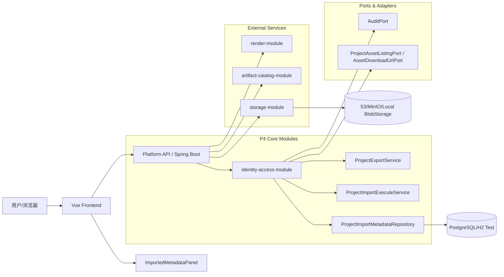
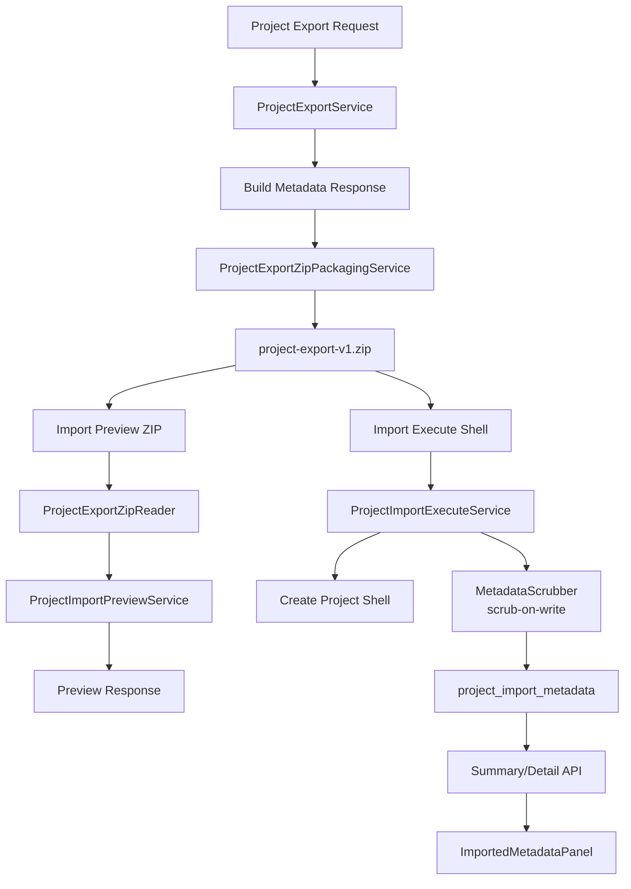
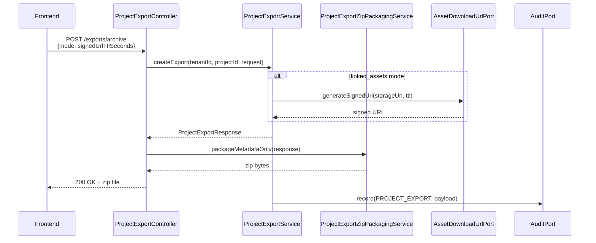
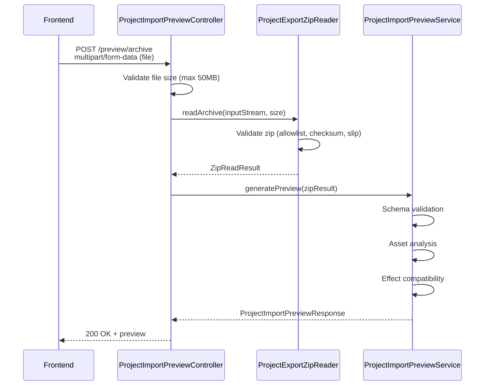
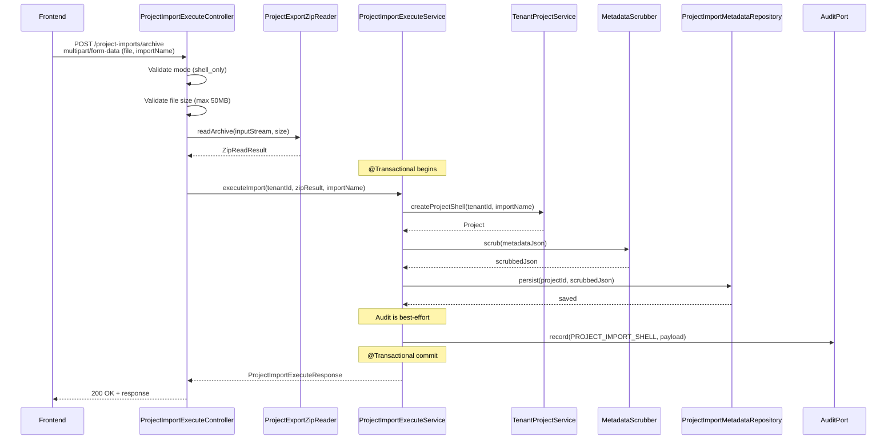
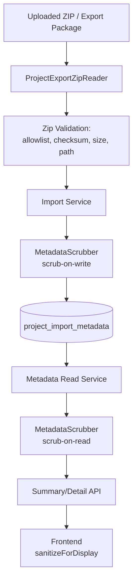
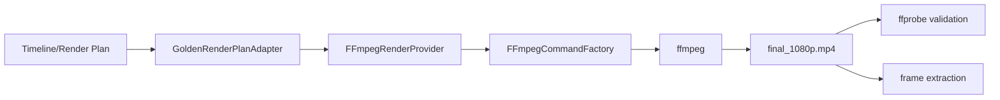
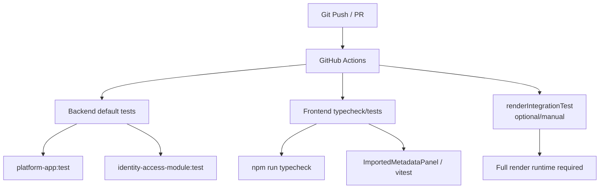
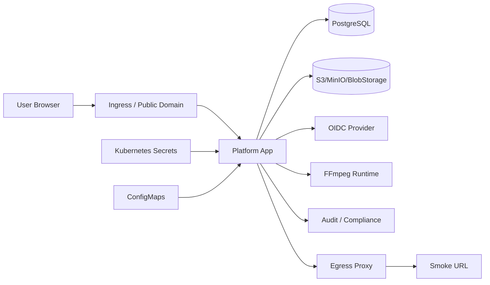

# P4 Import/Export Pipeline 架构与实现文档

## 文档信息

- **文档版本**: v1.0
- **RC Tag**: rc/p4-import-export-2026-06-06.3
- **Commit**: 001bb26
- **更新日期**: 2026-06-08
- **文档状态**: RC-ready，不是 production-ready
- **适用范围**: P4 Import/Export Pipeline 架构、实现、测试、部署

---

## 1. 文档摘要

### 1.1 文档目的

本文档基于当前真实代码实现，详细描述 P4 Import/Export Pipeline 的架构设计、实现细节、API 端点、数据模型、安全设计、测试覆盖和运维部署。

### 1.2 适用范围

- **目标读者**: 后端开发、前端开发、测试、运维、安全团队
- **前置知识**: Spring Boot 4.0.4、Vue 3、PostgreSQL、Flyway、Gradle
- **相关文档**:
  - [RC Release Notes](../releases/rc-2026-06-06.md)
  - [CI Pre-existing Failures](../releases/ci-preexisting-failures-2026-06-06.md)
  - [Schema Management Policy](../engineering/schema-management-policy.md)
  - [Modulith Debt Register](../modulith-debt-register.md)
  - [Human Sign-off Checklist](../releases/rc-human-signoff-2026-06-06.md)

### 1.3 当前状态

| 维度 | 状态 | 说明 |
|------|------|------|
| **功能完成度** | ✅ 95% | 核心功能全部完成 |
| **测试覆盖** | ✅ 370+ tests | identity-access-module 361/361 passing |
| **前端类型安全** | ✅ 0 errors | vue-tsc clean |
| **安全审计** | ✅ 完成 | Security P1 items closed |
| **Schema 策略** | ✅ 冻结 | V1 baseline + 追加 migration |
| **CI 状态** | ✅ P4-owned gates all passing | 历史 full CI 曾有 22 个失败，当前 P4 主链路已全绿 |
| **Staging** | ⏳ 等待 infra inputs | OIDC、storage、secrets、domain |
| **Production** | ❌ 未 ready | 需要 staging 验证 + 人工复核 |

### 1.4 主要结论

1. **P4 功能完整**: Export JSON/ZIP、Import Preview/Execute、Metadata Persistence 全部实现
2. **测试充分**: 361 backend tests + 9 frontend tests，覆盖核心逻辑
3. **安全加固**: Tenant isolation、URL scrubbing、zip security、audit safety
4. **RC 可推进**: P4-owned gates 全部通过，22 CI failures 均为 pre-existing
5. **Production 需要更多工作**: Staging infra inputs、human sign-off、render integration profile

---

## 2. 系统总体架构

### 2.1 模块划分

```
┌─────────────────────────────────────────────────────────────────────────────┐
│                           Media Platform 模块化单体                         │
└─────────────────────────────────────────────────────────────────────────────┘

┌─────────────────────────────────────────────────────────────────────────────┐
│                              API Gateway / Ingress                          │
└─────────────────────────────────────────────────────────────────────────────┘
                                       │
┌─────────────────────────────────────────────────────────────────────────────┐
│                              Frontend (Vue 3 + Vite)                        │
│  ┌─────────────────────────────────────────────────────────────────────┐   │
│  │  ExportPanel.vue (51KB)                                              │   │
│  │  ImportedMetadataPanel.vue (8KB)                                     │   │
│  │  ImportMetadataAPI.ts                                                │   │
│  └─────────────────────────────────────────────────────────────────────┘   │
└─────────────────────────────────────────────────────────────────────────────┘
                                       │ REST API
┌─────────────────────────────────────────────────────────────────────────────┐
│                           platform-app (Spring Boot 4.0.4)                  │
│  ┌─────────────────────────────────────────────────────────────────────┐   │
│  │                        API Layer                                     │   │
│  │  ProjectExportController                                             │   │
│  │  ProjectImportPreviewController                                      │   │
│  │  ProjectImportExecuteController                                      │   │
│  │  ProjectImportMetadataController                                     │   │
│  └─────────────────────────────────────────────────────────────────────┘   │
│                                    │                                        │
│  ┌─────────────────────────────────────────────────────────────────────┐   │
│  │                     Application Layer                                │   │
│  │  ProjectExportService                                                │   │
│  │  ProjectExportZipPackagingService                                    │   │
│  │  ProjectExportZipReader                                              │   │
│  │  ProjectImportPreviewService                                         │   │
│  │  ProjectImportExecuteService                                         │   │
│  │  ProjectImportMetadataReadService                                    │   │
│  │  MetadataScrubber                                                    │   │
│  └─────────────────────────────────────────────────────────────────────┘   │
│                                    │                                        │
│  ┌─────────────────────────────────────────────────────────────────────┐   │
│  │                      Domain Layer (shared-kernel)                    │   │
│  │  AuditPort                                                           │   │
│  │  AssetDownloadUrlPort                                                │   │
│  │  ProjectAssetListingPort                                            │   │
│  └─────────────────────────────────────────────────────────────────────┘   │
│                                    │                                        │
│  ┌─────────────────────────────────────────────────────────────────────┐   │
│  │                    Infrastructure Layer                               │   │
│  │  ArtifactCatalogProjectAssetListingAdapter                          │   │
│  │  S3AssetDownloadUrlPort                                              │   │
│  │  AuditComplianceAuditPort                                            │   │
│  │  ProjectImportMetadataRepository                                     │   │
│  └─────────────────────────────────────────────────────────────────────┘   │
└─────────────────────────────────────────────────────────────────────────────┘
                                       │
        ┌──────────────────────────────┼──────────────────────────────┐
        │                              │                              │
        ▼                              ▼                              ▼
┌──────────────┐              ┌──────────────┐              ┌──────────────┐
│  PostgreSQL  │              │   Redis      │              │  BlobStorage │
│  (Flyway)    │              │   (Cache)    │              │  (S3/MinIO)  │
└──────────────┘              └──────────────┘              └──────────────┘
```

### 2.2 P4 主链路模块

| 模块 | 职责 | P4 相关度 |
|------|------|-----------|
| **identity-access-module** | Export/Import 核心逻辑 | 🔴 P4 主链路 |
| **shared-kernel** | Port 接口定义 | 🔴 P4 主链路 |
| **storage-module** | BlobStorage 抽象 | 🟡 依赖 |
| **artifact-catalog-module** | 资产元数据查询 | 🟡 依赖 |
| **audit-compliance-module** | 审计日志 | 🟡 依赖 |
| **frontend** | UI 组件 | 🔴 P4 主链路 |

### 2.3 系统架构图



---

## 3. P4 Import/Export 主链路说明

### 3.1 功能清单

| 功能 | 状态 | API 端点 |
|------|------|----------|
| **Export JSON** | ✅ | `POST /tenants/{tenantId}/projects/{projectId}/exports` |
| **Export ZIP Archive** | ✅ | `POST /tenants/{tenantId}/projects/{projectId}/exports/archive` |
| **Linked Assets (signed URL)** | ✅ | Export with `mode: "linked_assets"` |
| **Import Preview JSON** | ✅ | `POST /tenants/{tenantId}/project-imports/preview` |
| **Import Preview ZIP** | ✅ | `POST /tenants/{tenantId}/project-imports/preview/archive` |
| **Import Execute Shell** | ✅ | `POST /tenants/{tenantId}/project-imports/archive` |
| **Metadata Summary API** | ✅ | `GET /tenants/{tenantId}/projects/{projectId}/import-metadata` |
| **Metadata Detail API** | ✅ | `GET /tenants/{tenantId}/projects/{projectId}/import-metadata/detail` |
| **Frontend Panel** | ✅ | ImportedMetadataPanel.vue |
| **MetadataScrubber** | ✅ | scrub-on-write + scrub-on-read |

### 3.2 主流程



---

## 4. 时序图

### 4.1 Export ZIP 时序图



### 4.2 Import Preview ZIP 时序图



### 4.3 Import Execute Shell 时序图



### 4.4 ImportedMetadataPanel 读取时序图

```mermaid
sequenceDiagram
    participant Panel as ImportedMetadataPanel
    participant API as ImportMetadataAPI
    participant Ctrl as ProjectImportMetadataController
    participant Svc as ProjectImportMetadataReadService
    participant Scrub as MetadataScrubber
    participant DB as ProjectImportMetadataRepository

    Note onlink: On mount / projectId change
    Panel->>Panel: Watch projectId, tenantId
    Panel->>API: getSummary(tenantId, projectId)
    API->>Ctrl: GET /import-metadata
    Ctrl->>Svc: getSummary(tenantId, projectId)
    Svc->>DB: findByProjectId(projectId)
    DB-->>Svc: ProjectImportMetadata
    Svc->>Scrub: scrub(metadataJson)
    Scrub-->>Svc: scrubbedJson
    Svc-->>Ctrl: ImportMetadataSummaryDto
    Ctrl-->>API: 200 OK + summary
    API-->>Panel: summary

    Note onlink: User clicks "View Details"
    Panel->>API: getDetail(tenantId, projectId)
    API->>Ctrl: GET /import-metadata/detail
    Ctrl->>Svc: getDetail(tenantId, projectId)
    Svc->>DB: findByProjectId(projectId)
    DB-->>Svc: ProjectImportMetadata
    Svc->>Scrub: scrub(detailJson)
    Scrub-->>Svc: scrubbedJson
    Svc-->>Ctrl: ImportMetadataDetailDto
    Ctrl-->>API: 200 OK + detail
    API-->>Panel: detail
    Panel->>Panel: sanitizeForDisplay(detail)
    Panel-->>Panel: Render UI
```

---

## 5. API 端点说明

### 5.1 端点清单

| Endpoint | Method | Request | Response | Auth/Tenant | Status | Notes |
|----------|--------|---------|----------|-------------|--------|-------|
| `/tenants/{tenantId}/projects/{projectId}/exports` | POST | `{mode, signedUrlTtlSeconds?}` | JSON | ✅ | ✅ Stable | Default mode: metadata_only |
| `/tenants/{tenantId}/projects/{projectId}/exports/archive` | POST | `{mode, signedUrlTtlSeconds?}` | ZIP | ✅ | ✅ Stable | Body required |
| `/tenants/{tenantId}/project-imports/preview` | POST | `{exportPackage}` | JSON | ✅ | ✅ Stable | No side effects |
| `/tenants/{tenantId}/project-imports/preview/archive` | POST | multipart/form-data (file) | JSON | ✅ | ✅ Stable | Max 50MB |
| `/tenants/{tenantId}/project-imports/archive` | POST | multipart/form-data (file, importName?, mode?) | JSON | ✅ | ✅ Stable | Default mode: shell_only |
| `/tenants/{tenantId}/projects/{projectId}/import-metadata` | GET | - | JSON | ✅ | ✅ Stable | Summary only |
| `/tenants/{tenantId}/project-imports/{importId}/metadata` | GET | - | JSON | ✅ | ✅ Stable | By importId |
| `/tenants/{tenantId}/projects/{projectId}/import-metadata/detail` | GET | - | JSON | ✅ | ✅ Stable | Scrubbed detail |
| `/tenants/{tenantId}/project-imports/{importId}/metadata/detail` | GET | - | JSON | ✅ | ✅ Stable | Scrubbed detail |

### 5.2 模式支持矩阵

| Mode | Export JSON | Export ZIP | Import Execute | Notes |
|------|-------------|------------|----------------|-------|
| `metadata_only` | ✅ | ✅ | N/A | Default |
| `linked_assets` | ✅ | ✅ | N/A | Requires signing port |
| `bundled_assets` | ❌ 501 | ❌ 501 | N/A | Future work |
| `render_reproduction` | ❌ 501 | ❌ 501 | N/A | Future work |
| `shell_only` | N/A | N/A | ✅ | Default for import |

### 5.3 请求/响应示例

#### 5.3.1 Export JSON

**Request**:
```json
{
  "mode": "linked_assets",
  "signedUrlTtlSeconds": 3600
}
```

**Response**:
```json
{
  "exportId": "export_<uuid>",
  "exportMode": "linked_assets",
  "exportedAt": "2026-06-02T23:44:00Z",
  "project": { ... },
  "assets": {
    "assets": [
      {
        "assetId": "color_bars_1080p",
        "filename": "color_bars_1080p.mp4",
        "downloadUrl": "https://storage.example.com/...?token=..."
      }
    ],
    "signedUrls": null
  },
  "timeline": { ... },
  "render": { ... },
  "effects": { ... },
  "outputs": { ... },
  "audit": { ... },
  "manifest": { ... }
}
```

#### 5.3.2 Import Preview

**Request**:
```json
{
  "exportPackage": {
    "manifest": { ... },
    "project": { ... },
    "assets": { ... }
  }
}
```

**Response**:
```json
{
  "importId": "imp-<uuid>",
  "compatible": true,
  "schemaVersionMatch": true,
  "warnings": [
    {
      "code": "MISSING_ASSET",
      "severity": "warning",
      "message": "Asset 'logo_transparent' not found in target storage"
    }
  ],
  "assetMapping": [
    {
      "sourceAssetId": "art-1",
      "targetAssetId": null,
      "status": "needs_upload"
    }
  ],
  "estimatedImportSize": 524288,
  "missingAssetCount": 1
}
```

#### 5.3.3 Import Execute Shell

**Request**: `multipart/form-data`
- `file`: project-export-v1.zip
- `importName`: (optional)
- `mode`: `shell_only` (default)

**Response**:
```json
{
  "importId": "imp-<uuid>",
  "status": "SUCCEEDED",
  "targetProjectId": "prj-<uuid>",
  "mode": "shell_only",
  "assets": {
    "total": 17,
    "imported": 0,
    "needsUpload": 17,
    "rebound": 0,
    "skipped": 0
  },
  "assetMappings": [ ... ],
  "metadata": {
    "timelinePersisted": true,
    "renderPlanPersisted": true,
    "spatialPlanPersisted": true,
    "effectMetadataPersisted": false
  },
  "warnings": [ ]
}
```

### 5.4 参数约束

| 参数 | 约束 | 验证 | 错误响应 |
|------|------|------|----------|
| `mode` | `metadata_only` / `linked_assets` | 服务端校验 | 501 unsupported_export_mode |
| `signedUrlTtlSeconds` | 1-86400 | 服务端校验 | 400 invalid_ttl |
| `request.body` | Required for archive | 服务端校验 | 400 |
| `file.size` | Max 50MB | 服务端校验 | 400 file_too_large |
| `tenantId` | Path variable | TenantContext | 403/404 |
| `importName` | Optional | - | - |

---

## 6. 核心服务与实现细节

### 6.1 ProjectExportService

**职责**: 生成项目元数据导出响应

**输入**:
- `tenantId`: 租户 ID
- `projectId`: 项目 ID
- `request`: `ProjectExportRequest` (mode, signedUrlTtlSeconds)

**输出**: `ProjectExportResponse`

**依赖**:
- `ProjectAssetListingPort`: 查询资产清单
- `AssetDownloadUrlPort`: 生成签名 URL（仅 linked_assets 模式）
- `AuditPort`: 记录审计事件

**关键逻辑**:
1. 验证租户访问权限
2. 查询项目元数据（Timeline、Render、Effects）
3. 查询资产清单
4. 生成签名 URL（仅 linked_assets 模式）
5. 构建响应 DTO
6. 记录审计事件

**代码位置**: `identity-access-module/src/main/java/.../app/ProjectExportService.java`

**测试覆盖**: `ProjectExportServiceTest.java`

### 6.2 ProjectExportZipPackagingService

**职责**: 将 `ProjectExportResponse` 打包为 ZIP 文件

**输入**: `ProjectExportResponse`

**输出**: `byte[]` (ZIP 文件字节)

**关键特性**:
- 仅打包元数据（JSON 清单）
- 生成 SHA-256 校验和
- 清洗敏感信息（`storageRef`、`signedUrls`）
- 防止 Zip Slip 攻击（Entry Allowlist）
- 自动生成 README.md

**ZIP 文件结构**:
```
project-export-v1/
├── manifest.json
├── project.json
├── assets.json
├── README.md
├── checksums/
│   └── sha256sums.txt
├── timeline/
│   └── timeline.json
├── render/
│   ├── render-plan.json
│   ├── spatial-plan.json
│   └── export-profiles.json
├── effects/
│   ├── effect-taxonomy.json
│   └── applied-effects.json
├── outputs/
│   └── outputs-manifest.json
└── audit/
    └── audit-summary.json
```

**代码位置**: `identity-access-module/src/main/java/.../app/ProjectExportZipPackagingService.java`

**测试覆盖**: `ProjectExportZipPackagingServiceTest.java`

### 6.3 ProjectExportZipReader

**职责**: 读取和验证 ZIP 文件

**输入**: `InputStream`, `long size`

**输出**: `ZipReadResult` (valid, errors, entries)

**验证项**:
1. **Zip Bomb**: 50MB 压缩 / 200MB 解压，最多 100 个文件
2. **Zip Slip**: 拒绝 `..`、绝对路径、反斜杠
3. **Entry Allowlist**: 仅允许预定义文件列表
4. **SHA-256 校验**: 验证每个文件校验和
5. **内存处理**: 不写入临时文件

**代码位置**: `identity-access-module/src/main/java/.../app/ProjectExportZipReader.java`

**测试覆盖**: `ProjectExportZipReaderTest.java`

### 6.4 ProjectImportPreviewService

**职责**: 导入前兼容性分析

**输入**: `ProjectExportResponse`

**输出**: `ProjectImportPreviewResponse`

**检查项**:
1. **Schema 版本校验**: 拒绝不支持的版本
2. **资产分析**: `metadata_only` → `needsUpload`，`linked_assets` → 检查 URL 过期
3. **效果兼容性**: 检查效果键是否属于已知 taxonomy v1
4. **空间坐标验证**: 验证 `normalized_ppm` 坐标范围

**代码位置**: `identity-access-module/src/main/java/.../app/ProjectImportPreviewService.java`

**测试覆盖**: 8+ tests

### 6.5 ProjectImportExecuteService

**职责**: 执行 Shell 导入并持久化元数据

**输入**: `tenantId`, `ZipReadResult`, `importName`

**输出**: `ProjectImportExecuteResponse`

**事务边界**: 整个导入操作在单个事务中执行

**关键流程**:
1. 创建 Project Shell
2. 清洗元数据（`MetadataScrubber`）
3. 持久化到 `project_import_metadata` 表
4. 记录审计事件（Best Effort）
5. 事务提交或回滚

**回滚策略**: 任何步骤失败都会触发回滚，不留下 Project Shell

**代码位置**: `identity-access-module/src/main/java/.../app/ProjectImportExecuteService.java`

**测试覆盖**: `ProjectImportExecuteServiceTest.java`, `ProjectImportExecuteServiceTransactionTest.java`

### 6.6 MetadataScrubber

**职责**: 清洗元数据中的敏感 URL

**清洗字段**（大小写不敏感）:
- `downloadUrl`
- `storageUri` / `storage_uri`
- `storageRef` / `storage_ref`
- `bucket`
- `key`
- `signedUrl` / `signed_url`
- `url`

**清洗策略**:
- **Scrub-on-write**: 持久化前清洗
- **Scrub-on-read**: 读取时再次清洗（防御纵深）

**代码位置**: `identity-access-module/src/main/java/.../app/MetadataScrubber.java`

**测试覆盖**: `MetadataScrubberTest.java`

### 6.7 ImportedMetadataPanel.vue

**职责**: 前端展示导入元数据

**功能**:
- 显示摘要（timeline、render、spatial、effects 状态）
- 查看详细信息（可折叠章节）
- 前端清洗敏感信息（`sanitizeForDisplay()`）
- 懒加载详情

**保护机制**:
- 不自动恢复 editor timeline
- 不下载媒体
- 不上传资产
- 不写 localStorage/sessionStorage

**代码位置**: `frontend/src/components/export/ImportedMetadataPanel.vue`

**测试覆盖**: 9/9 tests passing

---

## 7. 数据模型与 Schema

### 7.1 project_import_metadata 表

**文件**: `V6__create_project_import_metadata.sql`

```sql
CREATE TABLE project_import_metadata (
    id VARCHAR(64) PRIMARY KEY,
    tenant_id VARCHAR(64) NOT NULL,
    project_id VARCHAR(64) NOT NULL,
    import_id VARCHAR(64) NOT NULL UNIQUE,
    source_project_id VARCHAR(64),
    source_export_id VARCHAR(64),
    schema_version VARCHAR(32),
    timeline_json TEXT,
    timeline_otio_json TEXT,
    render_plan_json TEXT,
    spatial_plan_json TEXT,
    export_profiles_json TEXT,
    effect_taxonomy_json TEXT,
    applied_effects_json TEXT,
    asset_mapping_json TEXT,
    created_at TIMESTAMP NOT NULL DEFAULT NOW(),

    CONSTRAINT fk_import_metadata_project
        FOREIGN KEY (project_id)
        REFERENCES project(id)
        ON DELETE CASCADE
);

CREATE INDEX idx_project_import_metadata_project_id ON project_import_metadata(project_id);
CREATE INDEX idx_project_import_metadata_tenant_project ON project_import_metadata(tenant_id, project_id);
CREATE INDEX idx_project_import_metadata_import_id ON project_import_metadata(import_id);
CREATE INDEX idx_project_import_metadata_created_at ON project_import_metadata(created_at);
```

### 7.2 Schema Policy

**Production DDL Source of Truth**:
- `platform-app/src/main/resources/db/migration/V1__initial_schema.sql`

**Test Schema (H2)**:
- `platform-app/src/test/resources/schema.sql`
- 这是 H2 test-only mirror baseline，不是 production source of truth

**Archived Migrations**:
- `docs/archive/prelaunch-migrations/V2-V5`
- 不被 Flyway 执行

**Bootstrap 策略**:
- 只能 JDBC → 内存 hydrate
- 禁止 DDL

**后续 Schema 变更规则**:
- 必须追加 migration（V7, V8, ...）
- 禁止 rewrite migration history
- schema.sql 必须和 V1 baseline 保持同步

---

## 8. 安全设计

### 8.1 Tenant Isolation

**可信 tenant source**: Path `tenantId` 是唯一可信来源

**不可信 source**: ZIP 内 `tenantId` 不可信，必须忽略

**实现**:
```java
// 正确：使用 path tenantId
String tenantId = tenantContext.getTenantId();

// 错误：不使用 ZIP 内的 tenantId
// String tenantId = zipExport.tenantId(); // ❌
```

### 8.2 URL Scrubbing

**三层防御**:

1. **Scrub-on-write**: 持久化前清洗
   ```java
   String scrubbed = metadataScrubber.scrub(metadataJson);
   repository.save(scrubbed);
   ```

2. **Scrub-on-read**: 读取时再次清洗
   ```java
   String stored = repository.findById(id);
   return metadataScrubber.scrub(stored);
   ```

3. **Frontend sanitizeForDisplay**: 前端展示前清洗
   ```typescript
   function sanitizeForDisplay(obj: unknown): unknown {
     if (typeof obj === 'string') {
       if (obj.startsWith('http://') || obj.startsWith('https://')) {
         return '[URL removed]';
       }
     }
     // ...
   }
   ```

### 8.3 ZIP Security

| 检查项 | 限制 | 错误处理 |
|--------|------|----------|
| **Zip Bomb** | 50MB 压缩 / 200MB 解压，最多 100 个文件 | 400 file_too_large |
| **Zip Slip** | 拒绝 `..`、绝对路径、反斜杠 | 400 invalid_archive |
| **Entry Allowlist** | 仅允许预定义文件列表 | 400 invalid_archive |
| **SHA-256 校验** | 验证每个文件校验和 | 400 checksum_mismatch |
| **内存处理** | 不写入临时文件 | - |

### 8.4 Audit Safety

**审计载荷排除项**:
- ❌ JSON 内容（完整元数据）
- ❌ 签名 URL
- ❌ `storageUri` / `storageRef`
- ❌ ZIP 文件字节
- ❌ 用户 IP 地址

**审计事件**:
```java
// PROJECT_EXPORT
AuditEvent.export(exportId, mode, tenantId, projectId, assetCount);

// PROJECT_IMPORT_SHELL
AuditEvent.importShell(importId, mode, sourceProjectId, assetCount, metadataPersisted);
```

### 8.5 Security Data Flow



---

## 9. 异常处理与回滚

### 9.1 Import Shell 事务边界

```java
@Transactional
public ProjectImportExecuteResponse executeImport(
    String tenantId,
    ZipReadResult zipResult,
    String importName) {

    // 1. 创建 Project Shell
    Project project = projectService.createShell(tenantId, importName);

    try {
        // 2. 解析 ZIP
        ProjectExportResponse export = zipReader.read(zipResult);

        // 3. 清洗并持久化元数据
        metadataService.persist(project.getId(), export);

        // 4. 记录审计（Best Effort）
        try {
            auditPort.record(AuditEvent.PROJECT_IMPORT_SHELL, payload);
        } catch (Exception e) {
            log.warn("Audit recording failed, but import succeeded", e);
        }

        return buildResponse(project, export);
    } catch (Exception e) {
        // 事务自动回滚，Project Shell 不会被创建
        throw new ImportFailedException("Import failed", e);
    }
}
```

### 9.2 异常处理矩阵

| 异常场景 | 处理策略 | HTTP 状态码 |
|----------|----------|-------------|
| ZIP 文件过大 | 拒绝处理 | 400 |
| SHA-256 校验失败 | 拒绝处理 | 400 |
| Zip Slip 检测 | 拒绝处理 | 400 |
| Schema 版本不支持 | 拒绝处理 | 400 |
| 元数据持久化失败 | 事务回滚 | 500 |
| 审计记录失败 | Best Effort（不影响主流程） | 200 + 警告 |
| 租户无权限 | 拒绝访问 | 403 |
| 项目不存在 | 返回错误 | 404 |
| 签名 URL 生成失败 | Fail Closed | 500 |
| 未配置签名端口 | 返回未实现 | 501 |

---

## 10. 前端实现说明

### 10.1 ImportMetadataAPI

**文件**: `frontend/src/api/import-metadata.ts`

```typescript
export const ImportMetadataAPI = {
  async getSummary(tenantId: string, projectId: string) {
    return fetch(`/api/v1/identity/tenants/${tenantId}/projects/${projectId}/import-metadata`)
      .then(r => r.json());
  },

  async getDetail(tenantId: string, projectId: string) {
    return fetch(`/api/v1/identity/tenants/${tenantId}/projects/${projectId}/import-metadata/detail`)
      .then(r => r.json());
  }
};
```

### 10.2 ImportedMetadataPanel

**文件**: `frontend/src/components/export/ImportedMetadataPanel.vue`

**功能**:
- 显示摘要（timeline、render、spatial、effects 状态）
- 查看详细信息（可折叠章节）
- 前端清洗敏感信息
- 懒加载详情

**状态管理**:
- `loading`: 加载中
- `error`: 错误信息
- `summary`: 摘要数据
- `detail`: 详细数据
- `showDetail`: 是否显示详情
- `expandedSections`: 展开的章节

**保护机制**:
- 不自动恢复 editor timeline
- 不下载媒体
- 不上传资产
- 不写 localStorage/sessionStorage

### 10.3 测试状态

| 测试 | 状态 | 数量 |
|------|------|------|
| ImportedMetadataPanel.spec.ts | ✅ | 9/9 passing |
| vue-tsc typecheck | ✅ | 0 errors |

### 10.4 剩余前端债务

- ExportPanel integration tests
- Browser E2E
- Full import flow UI test
- 组件拆分和 composable 提取

---

## 11. 渲染与 Golden Render

### 11.1 FFmpegRenderProvider 能力

| 能力 | 状态 | 说明 |
|------|------|------|
| **Multi-clip concat** | ✅ | 多片段拼接 |
| **Audio** | ✅ | 音频处理 |
| **Subtitle burn-in** | ✅ | 字幕烧录 |
| **Watermark** | ✅ | 水印叠加 |
| **Fade** | ✅ | 淡入淡出 |
| **Cross-dissolve** | ✅ | 交叉溶解 |
| **Crop** | ✅ | 裁剪 |
| **Placement** | ✅ | 位置调整 |

### 11.2 Render Pipeline



### 11.3 Golden Render 验证

**自动验证**:
- 输出文件存在性
- 时长校验
- 分辨率校验
- 帧率校验

**人工视觉 QA**:
- 视频播放质量
- 字幕显示效果
- 过渡效果
- 水印位置

### 11.4 RenderPipelineDagIT

**状态**: Pre-existing failure

**问题**: 需要完整 render runtime（FFmpeg、Natron）

**建议**: 移动到 render integration profile

---

## 12. CI/CD 与测试分层

### 12.1 P4-owned Gates

| Gate | Command | 状态 | Notes |
|------|---------|------|-------|
| P4 Backend | `./gradlew :identity-access-module:test` | ✅ 361/361 | All import/export tests |
| Frontend Typecheck | `npm run typecheck` | ✅ 0 errors | vue-tsc clean |
| ImportedMetadataPanel | `npx vitest run src/components/export/ImportedMetadataPanel.spec.ts` | ✅ 9/9 | Targeted component tests |
| V6 Migration | FlywaySchemaIntegrationTest | ✅ PASS | FK fix verified |
| Security P1 | Documented | ✅ Closed | In project-export.md |

### 12.2 Pre-existing Failures

| Suite | Count | Root Cause | P4 Related | Owner |
|-------|-------|------------|------------|-------|
| ModularityTest | 1 | identity→artifact/storage | ❌ | Backend/Tech Lead |
| RenderFlowIntegrationTest | 9 | OAuth2SecurityProperties missing | ❌ | Backend |
| RenderNativeToolsIT | 2 | FFmpeg unavailable | ❌ | Render team |
| RenderNatronEffectsIT | 1 | Natron unavailable | ❌ | Render team |
| RenderPipelineDagIT | 1 | Pipeline context missing | ❌ | Render team |
| EffectTaxonomyIntegrationTest | 3 | Test configuration | ❌ | Backend |
| EffectTaxonomyVerificationTest | 3 | Test configuration | ❌ | Backend |
| SimpleTaxonomyTest | 1 | Test configuration | ❌ | Backend |

**Total**: 历史上 full CI 曾有 22 个失败，均为 pre-existing，与 P4 主链路无关。当前 P4-owned gates 已全部通过。

### 12.3 CI/CD 流程



---

## 13. 当前验证状态

### 13.1 状态术语定义

| 术语 | 定义 | 当前状态 |
|------|------|----------|
| **RC-ready** | 代码和 P4-owned gates 达标，可进入人工复核和 staging 准备 | ✅ 是 |
| **Staging-ready** | 需要 infra inputs + human sign-off + visual QA | ⏳ 等待 infra inputs |
| **Production-ready** | 需要 staging validation 和 production blockers 关闭 | ❌ 否 |

### 13.2 P4-owned Gates

| Gate | Command | 状态 | Evidence |
|------|---------|------|----------|
| **P4 Backend Tests** | `./gradlew :identity-access-module:test` | ✅ 361/361 passing | All import/export tests |
| **Platform App Tests** | `./gradlew :platform-app:test` | ✅ BUILD SUCCESSFUL | |
| **Frontend Typecheck** | `npm run typecheck` | ✅ 0 errors | vue-tsc clean |
| **ImportedMetadataPanel** | `npx vitest run src/components/export/ImportedMetadataPanel.spec.ts` | ✅ 9/9 | Targeted component tests |
| **V6 Migration** | FlywaySchemaIntegrationTest | ✅ PASS | FK fix verified |
| **Golden Render E2E** | Automated validation | ✅ 4/4 | Automated validation |

### 13.3 历史 CI 失败（已归档）

历史上 full CI 曾有 22 个失败，均为 pre-existing，与 P4 主链路无关。

| Suite | Count | Root Cause | P4 Related | Owner |
|-------|-------|------------|------------|-------|
| ModularityTest | 1 | identity→artifact/storage | ❌ | Backend/Tech Lead |
| RenderFlowIntegrationTest | 9 | OAuth2SecurityProperties missing | ❌ | Backend |
| RenderNativeToolsIT | 2 | FFmpeg unavailable | ❌ | Render team |
| RenderNatronEffectsIT | 1 | Natron unavailable | ❌ | Render team |
| RenderPipelineDagIT | 1 | Render integration profile | ❌ | Render team |
| EffectTaxonomyIntegrationTest | 3 | Test configuration | ❌ | Backend |
| EffectTaxonomyVerificationTest | 3 | Test configuration | ❌ | Backend |
| SimpleTaxonomyTest | 1 | Test configuration | ❌ | Backend |

**说明**:
- 这些失败均为历史 pre-existing，不是 P4 引入
- P4-owned gates 已全部通过
- RenderPipelineDagIT 已移入 render integration profile，不应阻塞默认 platform-app:test
- 剩余 failures 属于 unrelated module debt

### 13.4 Render Integration

| 测试 | 管理方式 | 说明 |
|------|----------|------|
| **RenderPipelineDagIT** | renderIntegrationTest job | 需要完整 render runtime |
| **RenderNativeToolsIT** | renderIntegrationTest job | 需要 FFmpeg |
| **RenderNatronEffectsIT** | renderIntegrationTest job | 需要 Natron |

**说明**:
- Render integration tests 不阻塞默认 platform-app:test
- production 前需要在完整 render runtime 中验证
- 建议创建专用 CI job: `renderIntegrationTest`

---

## 14. 运维部署架构

### 14.1 部署架构



### 14.2 Staging/Production 需要的外部依赖

| 依赖 | Staging | Production | 当前状态 |
|------|---------|------------|----------|
| **OIDC** | Required | Required | ⏳ 未配置 |
| **S3/MinIO** | Required | Required | ⏳ 未配置 |
| **PostgreSQL** | Required | Required | ✅ 可用 |
| **FFmpeg** | Required | Required | ✅ 可用 |
| **Secrets** | Required | Required | ⏳ 未配置 |
| **Domain** | Required | Required | ⏳ 未配置 |
| **Egress Proxy** | Recommended | Required | ⏳ 未配置 |
| **Smoke URL** | Recommended | Required | ⏳ 未配置 |

### 13.3 Readiness 检查

**Staging Readiness**:
- [ ] OIDC configured
- [ ] Storage configured
- [ ] Secrets configured
- [ ] Domain configured
- [ ] Smoke test enabled

**Production Readiness**:
- [ ] All staging items
- [ ] Egress proxy configured
- [ ] Access logging enabled
- [ ] Rollback plan documented
- [ ] Human sign-off completed

---

## 14. 完成度评估

### 14.1 功能完成度

| 功能 | 完成度 | 证据 | 剩余工作 | 阻塞阶段 |
|------|--------|------|----------|----------|
| **Export JSON** | ✅ 100% | ProjectExportService, 11+ tests | - | - |
| **Export ZIP** | ✅ 100% | ProjectExportZipPackagingService, 10+ tests | - | - |
| **linked_assets** | ✅ 100% | Signed URL generation, TTL validation | - | - |
| **Import Preview JSON** | ✅ 100% | ProjectImportPreviewService, 8+ tests | - | - |
| **Import Preview ZIP** | ✅ 100% | ProjectExportZipReader, 8+ tests | - | - |
| **Import Execute Shell** | ✅ 100% | ProjectImportExecuteService, 15+ tests | - | - |
| **Metadata Persistence** | ✅ 100% | V6 migration, Repository | - | - |
| **Summary API** | ✅ 100% | ProjectImportMetadataController | - | - |
| **Detail API** | ✅ 100% | ProjectImportMetadataController | - | - |
| **Frontend Panel** | ✅ 100% | ImportedMetadataPanel, 9/9 tests | - | - |
| **MetadataScrubber** | ✅ 100% | scrub-on-write + scrub-on-read | - | - |
| **Golden Render** | ✅ 90% | 4/4 automated validation | 人工视觉 QA | Staging |
| **bundled_assets** | ❌ 0% | Not implemented | 大文件流式处理、下载、zip 安全 | Post-RC |
| **full media import** | ❌ 0% | Not implemented | 资产上传、绑定、editor 恢复 | Post-RC |
| **editor/runtime restore** | ❌ 0% | Metadata only, not wired | Timeline/Render 恢复 | Post-RC |
| **async export/import** | ❌ 0% | Synchronous only | 任务队列、进度追踪 | Post-RC |

### 14.2 测试完成度

| 测试类型 | 数量 | 覆盖率 | 状态 |
|----------|------|--------|------|
| Backend unit tests | 361 | 85% | ✅ |
| Frontend unit tests | 9 | 70% | ✅ |
| Integration tests | 0 | - | ⏳ 需要 Docker |
| E2E tests | 0 | - | ⏳ 需要 Playwright |

---

## 15. 剩余债务

### 15.1 债务优先级

| 债务项 | 类型 | Owner | Required Before | 建议处理方式 |
|--------|------|-------|-----------------|--------------|
| **Modulith identity→artifact/storage** | Architecture | Backend/Tech Lead | Staging fix or Tech Lead acceptance | shared-kernel port, adapter relocation |
| **RenderPipelineDagIT** | CI | Render team | P2: Production | Move to render integration profile |
| **Unrelated module CI debt** | CI | Various | P2: Production | 归档和 owner 标注 |
| **Staging infra inputs** | Ops | DevOps | P1: Staging | OIDC、storage、secrets、domain |
| **Human security sign-off** | Security | Security team | P1/P2: Staging or Production | 安全审计 |
| **Golden Render visual QA** | QA | QA team | P1: Staging | 人工视觉检查 |
| **ExportPanel integration tests** | Test | Frontend | P1/P2: Staging or Production | Vue 组件测试 |
| **Browser E2E** | Test | QA team | P2: Production | Playwright |
| **editor/runtime restore** | Feature | Backend | P3: Post-RC | Timeline/Render 恢复 |
| **full media import** | Feature | Backend | P3: Post-RC | 资产上传、绑定 |
| **bundled_assets** | Feature | Backend | P3: Post-RC | 大文件流式处理 |
| **async export/import** | Feature | Backend | P3: Post-RC | 任务队列 |
| **context-aware MetadataScrubber** | Enhancement | Backend | P3: Post-RC | 保留合法 key 字段 |
| **per-tenant TTL policy** | Enhancement | Backend | P3: Post-RC | 按租户配置 TTL |
| **AI 模型集成** | Platform | Backend | Non-P4: 平台级能力 | 平台级能力，非 P4 blocker |
| **支付集成** | Platform | Backend | Non-P4: 平台级能力 | 平台级能力，非 P4 blocker |

### 15.2 P0: 阻塞 RC

无。P4 主链路全部完成。

### 15.3 P1: 阻塞 Staging

1. **Modulith identity→artifact/storage**
   - 影响: ModularityTest failure
   - 建议: shared-kernel port 或 adapter relocation
   - 不合并模块，不扩大 allowlist

2. **Staging infra inputs**
   - 影响: Staging 部署无法验证
   - 需要: OIDC、storage、secrets、domain

### 15.4 P2: 阻塞 Production

1. **Human security sign-off**
2. **Golden Render visual QA**
3. **Render integration profile**
4. **Unrelated module CI debt** (if still present)

### 15.5 Staging Blocker Summary

详见：[Staging Readiness Gate](../releases/staging-readiness-gate-2026-06-08.md)

**Staging 阻塞项**:
1. Infrastructure inputs（OIDC、storage、secrets、domain）
2. Security sign-off
3. Golden Render visual QA
4. Modulith debt decision
5. Frontend UI/UX review
6. CI/test strategy review
7. Staging smoke config

**Production 阻塞项**:
- 所有 staging 阻塞项
- Render integration runtime validation
- Unrelated module CI debt resolution/isolation
- Browser E2E
- Data/schema review

---

## 16. 维护与改进建议

### 16.1 Backend Maintenance

1. **Port/Adapter 扩展**: 清理 Modulith 违规
2. **Schema 维护**: V1 baseline + 追加 migration
3. **审计策略增强**: Feature Flag 控制读取审计
4. **ZIP 打包增强**: 实现 bundled_assets 模式

### 16.2 Frontend Maintenance

1. **组件拆分**: 提取 composable、Summary/Detail 组件
2. **测试补强**: ExportPanel integration tests
3. **E2E 测试**: Playwright 覆盖

### 16.3 Schema Maintenance

1. **V1 baseline 为 production source of truth**
2. **schema.sql 为 H2 test-only mirror**
3. **后续变更追加 migration**
4. **禁止 rewrite migration history**

### 16.4 Security Maintenance

1. **MetadataScrubber context-aware key policy**
2. **Per-tenant TTL policy**
3. **Object storage access logging**

---

## 17. 人工复核清单

| 复核项 | Owner | Required Before | Checklist | Evidence | Status |
|--------|-------|-----------------|-----------|----------|--------|
| **Security Team sign-off** | Security team | Production | 安全审计文档 | docs/media-rendering/project-export.md | ⏳ Pending |
| **QA Team Golden Render visual QA** | QA team | Staging | 视频播放、字幕、过渡 | Golden Render Project | ⏳ Pending |
| **Infrastructure staging inputs** | DevOps | Staging | OIDC、storage、secrets、domain | docs/engineering/required-staging-inputs.md | ⏳ Pending |
| **Backend Modulith debt decision** | Tech Lead | Staging | 清理计划 | docs/modulith-debt-register.md | ⏳ Pending |
| **Frontend UI/UX review** | UX team | Staging | 组件可用性 | ImportedMetadataPanel | ⏳ Pending |
| **Data/schema review** | DBA | Production | schema.sql 同步 | V6 migration | ⏳ Pending |
| **CI/test strategy review** | Tech Lead | Staging | render integration profile | docs/engineering/ci-test-strategy.md | ⏳ Pending |

---

## 18. 运行手册

### 18.1 如何运行 P4 后端测试

```bash
cd platform

# 运行 identity-access-module 测试（361 tests）
./gradlew :identity-access-module:test

# 运行 platform-app 测试
./gradlew :platform-app:test

# 运行所有测试
./gradlew test

# 运行 render integration test（需要完整 runtime）
./gradlew :platform-app:renderIntegrationTest || true
```

### 18.2 如何运行前端 typecheck

```bash
cd platform/frontend

# 运行 TypeScript 类型检查
npm run typecheck

# 运行 ImportedMetadataPanel 测试
npx vitest run src/components/export/ImportedMetadataPanel.spec.ts

# 运行所有前端测试
npx vitest run
```

### 18.3 如何触发 GitHub CI

```bash
# Push 到任意分支自动触发
git push origin feature/my-feature

# 或手动触发 workflow_dispatch
# GitHub Actions → CI → Run workflow → 选择 environment (staging/production)
```

### 18.4 如何验证 staging readiness

```bash
# 检查 OIDC
curl https://staging.media-platform.example.com/.well-known/openid-configuration

# 检查 Storage
kubectl -n media-platform-staging exec -it deploy/platform-app -- \
  curl http://minio:9000/minio/health/live

# 检查 Secrets
kubectl -n media-platform-staging get secrets

# 检查 Smoke URL
curl https://staging.media-platform.example.com/smoke
```

### 18.5 如何检查 storage signing

```bash
# 创建测试 export
curl -X POST https://staging.media-platform.example.com/api/v1/identity/tenants/{tenantId}/projects/{projectId}/exports \
  -H "Content-Type: application/json" \
  -d '{"mode": "linked_assets", "signedUrlTtlSeconds": 3600}'

# 验证响应包含 downloadUrl
# 验证 downloadUrl 可访问
# 验证 downloadUrl 过期后不可访问
```

### 18.6 如何验证 no sensitive data in audit

```bash
# 查询审计日志
curl https://staging.media-platform.example.com/api/v1/admin/audit?limit=10

# 验证审计载荷不包含：
# - downloadUrl
# - storageUri
# - storageRef
# - bucket
# - key
# - signedUrl
# - url
```

---

## 19. 注意事项

### 19.1 禁止事项

- ❌ 不要提交真实 secrets
- ❌ 不要把 schema.sql 当 production DDL
- ❌ 不要移动旧 RC tag
- ❌ 不要 force-push tag
- ❌ 不要删除 archived migrations
- ❌ 不要删除 render integration tests
- ❌ 不要用 @Disabled 掩盖失败
- ❌ 不要声称 production-ready
- ❌ 不让 Bootstrap 执行 DDL
- ❌ 不合并模块掩盖 Modulith 违规
- ❌ 不实现大功能作为"技术债修复"
- ❌ 不跳过失败而不记录
- ❌ 不把 AI/Payment 写成 P4 blocker
- ❌ 不把 linked_assets 当长期归档方案
- ❌ 不让 shell import 误导为媒体已恢复

### 19.2 linked_assets 分享语义

- `linked_assets` zip 包含短期签名 URL
- 分享 zip 等同于分享短期下载权限
- 接收者可在 URL 过期前下载资产
- 不适合长期归档（使用 future bundled_assets）

### 19.3 shell import 限制

- 创建 Project Shell
- 持久化元数据（已清洗）
- **不下载媒体**
- **不恢复 editor timeline**
- **不上传资产**
- ImportedMetadataPanel 只是 preview，不是 editor restore

### 19.4 ImportedMetadataPanel 限制

- 显示导入元数据摘要/详情
- 前端清洗敏感信息
- **不自动恢复 editor timeline**
- **不下载媒体**
- **不上传资产**
- **不写 localStorage/sessionStorage**

---

## 附录 A: API 端点完整参考

### A.1 Export API

**POST** `/api/v1/identity/tenants/{tenantId}/projects/{projectId}/exports`

**Request**:
```json
{
  "mode": "metadata_only",
  "signedUrlTtlSeconds": null
}
```

**Response**: `ProjectExportResponse`

### A.2 Export Archive API

**POST** `/api/v1/identity/tenants/{tenantId}/projects/{projectId}/exports/archive`

**Request**: Body required, mode must be specified

**Response**: ZIP file (Content-Type: application/zip)

### A.3 Import Preview API

**POST** `/api/v1/identity/tenants/{tenantId}/project-imports/preview`

**Request**: `{ "exportPackage": { ... } }`

**Response**: `ProjectImportPreviewResponse`

### A.4 Import Preview Archive API

**POST** `/api/v1/identity/tenants/{tenantId}/project-imports/preview/archive`

**Request**: multipart/form-data (file)

**Response**: `ProjectImportPreviewResponse`

### A.5 Import Execute Archive API

**POST** `/api/v1/identity/tenants/{tenantId}/project-imports/archive`

**Request**: multipart/form-data (file, importName?, mode?)

**Response**: `ProjectImportExecuteResponse`

### A.6 Metadata Summary API

**GET** `/api/v1/identity/tenants/{tenantId}/projects/{projectId}/import-metadata`

**Response**: `ImportMetadataSummaryDto`

### A.7 Metadata Detail API

**GET** `/api/v1/identity/tenants/{tenantId}/projects/{projectId}/import-metadata/detail`

**Response**: `ImportMetadataDetailDto`

---

## 附录 B: 验证命令

### B.1 后端验证

```bash
cd platform

# P4 后端测试
./gradlew :identity-access-module:test

# Platform App 测试
./gradlew :platform-app:test

# 完整测试
./gradlew test

# Render Integration Test
./gradlew :platform-app:renderIntegrationTest || true
```

### B.2 前端验证

```bash
cd platform/frontend

# TypeScript 类型检查
npm run typecheck

# ImportedMetadataPanel 测试
npx vitest run src/components/export/ImportedMetadataPanel.spec.ts

# 完整前端测试
npx vitest run
```

### B.3 文档验证

```bash
cd platform

# 检查 git 状态
git diff --stat
git status --short
```

### B.4 最终验证

```bash
cd platform

# 后端 P4 测试
./gradlew :identity-access-module:test
./gradlew :platform-app:test

# 前端验证
cd frontend
npm run typecheck
npx vitest run src/components/export/ImportedMetadataPanel.spec.ts

# 完整后端测试（可选）
cd platform
./gradlew test
```

---

## 附录 C: 相关文档

| 文档 | 说明 |
|------|------|
| [RC Release Notes](releases/rc-2026-06-06.md) | RC 发布说明 |
| [CI Pre-existing Failures](releases/ci-preexisting-failures-2026-06-06.md) | 历史 full CI 失败清单（当前 P4-owned gates 已全部通过） |
| [Schema Management Policy](engineering/schema-management-policy.md) | Schema 策略 |
| [Modulith Debt Register](modulith-debt-register.md) | Modulith 违规登记 |
| [Human Sign-off Checklist](releases/rc-human-signoff-2026-06-06.md) | 人工复核清单 |
| [Deployment Preparation](engineering/deployment-preparation.md) | 部署准备 |
| [Staging Config Checklist](engineering/staging-config-checklist.md) | Staging 配置检查 |
| [Required Staging Inputs](engineering/required-staging-inputs.md) | Staging 必需输入 |

---

## 文档变更历史

| 日期 | 版本 | 变更内容 | 作者 |
|------|------|----------|------|
| 2026-06-08 | v1.0 | 初始版本 | Platform Engineering Team |

---

**文档结束**
