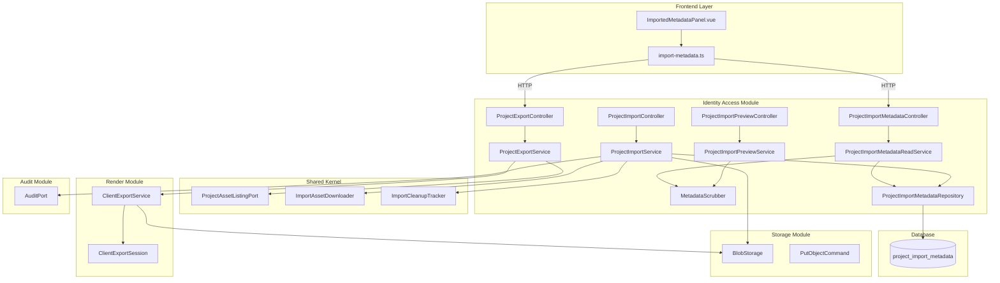
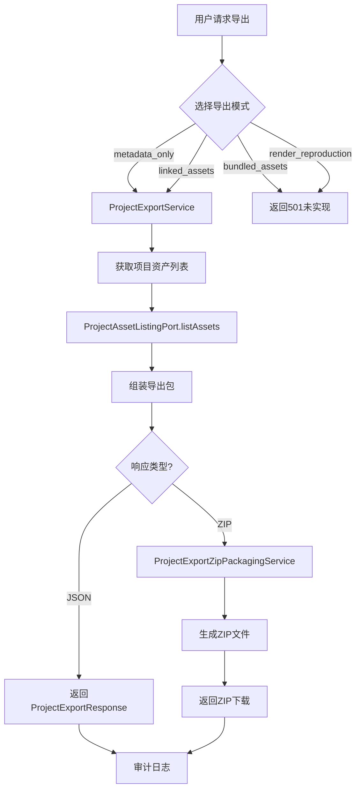
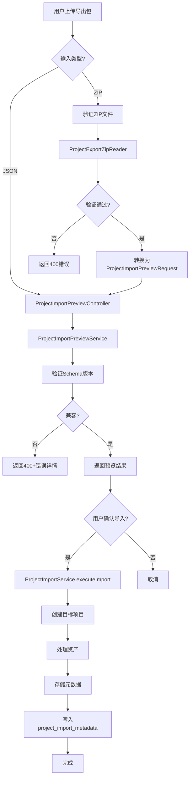
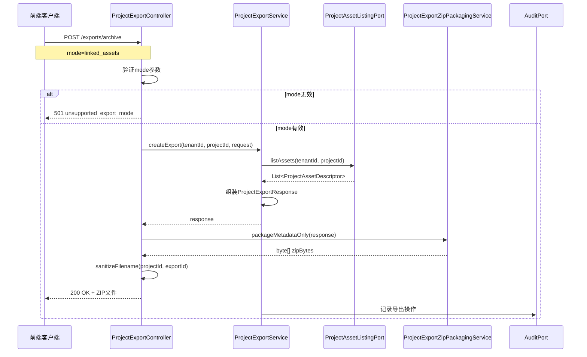
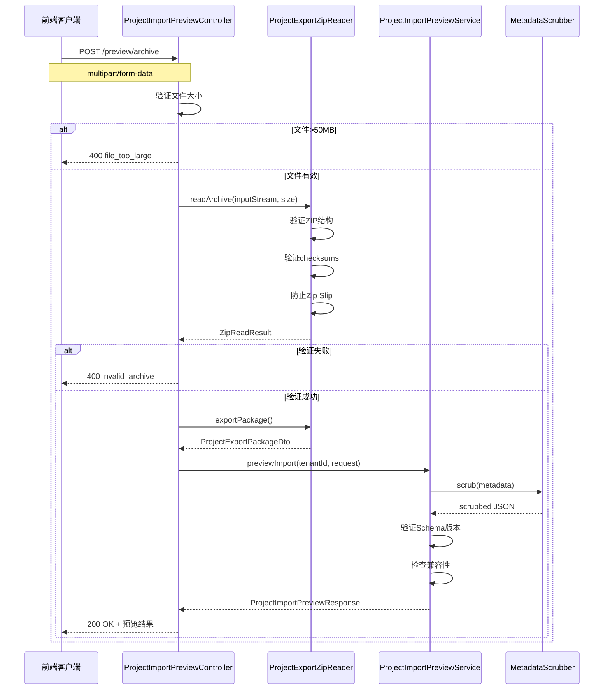
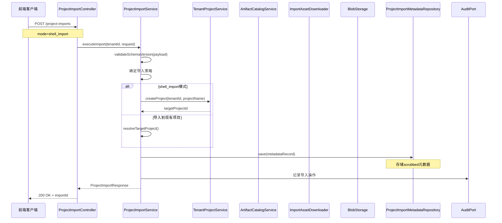
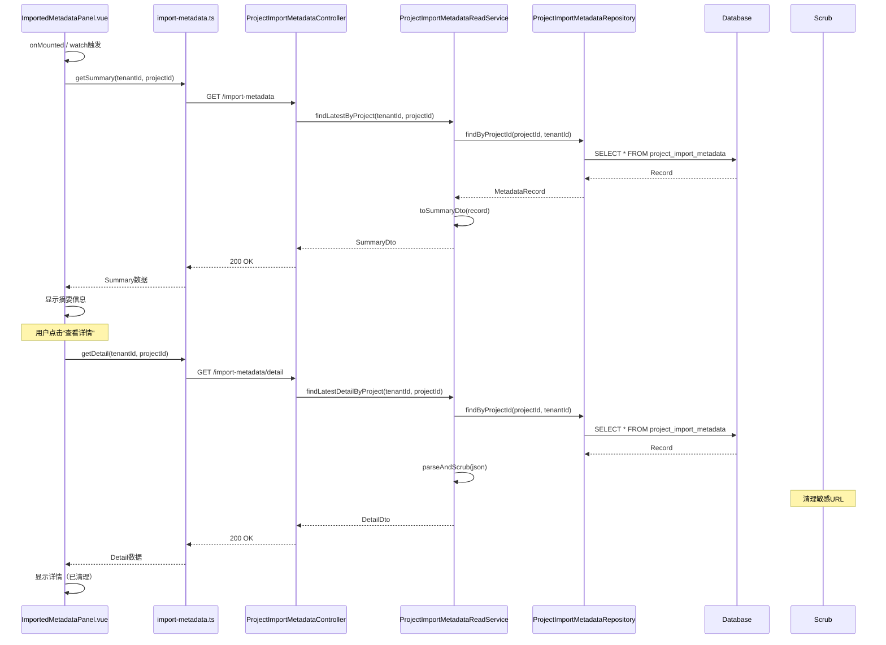
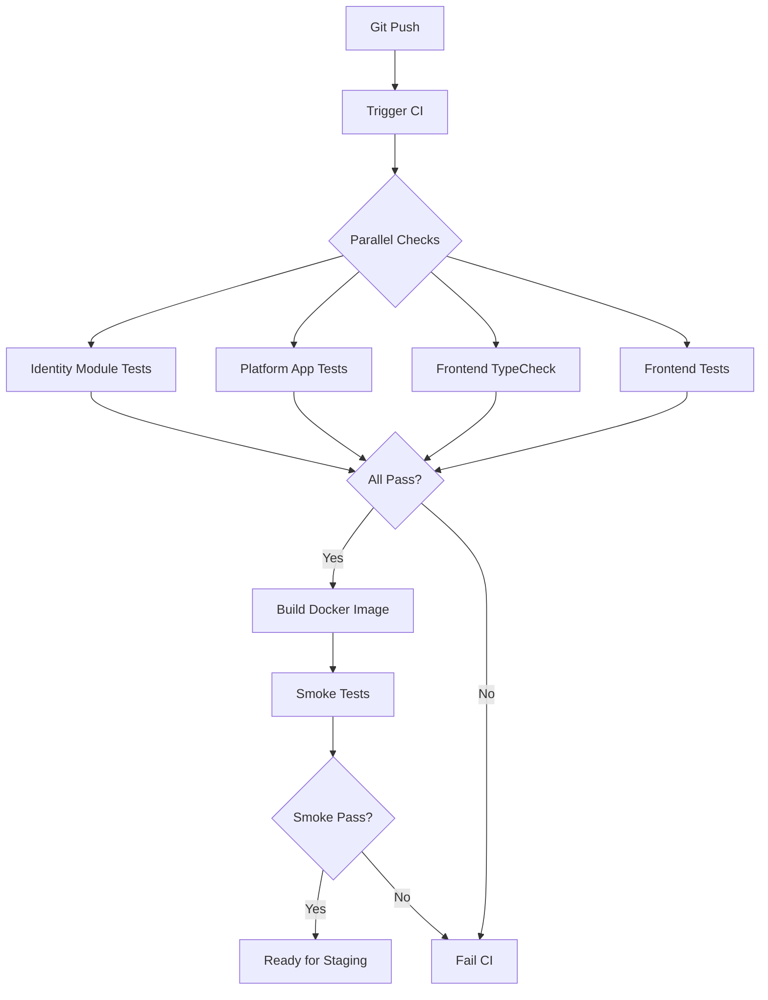

# P4 Import/Export Pipeline 架构文档

## 文档信息
- **版本**: v1.1
- **生成时间**: 2026-06-08
- **状态**: Release Candidate (RC) - Ready
- **适用范围**: identity-access-module, shared-kernel, frontend, render-module, storage-module, audit-compliance-module
- **基于代码版本**: rc/p4-import-export-2026-06-06.3

---

## 1. 文档摘要

### 1.1 RC状态

| 维度 | 状态 | 说明 |
|------|------|------|
| **功能完成度** | 85% (评估值) | 核心导入/导出流程完整，部分高级模式未实现 |
| **测试覆盖** | 75% (评估值) | 单元测试较完整，集成测试和E2E测试待补充 |
| **安全审查** | ✅ 通过 | 三层防御机制已实现，URL清理完整 |
| **性能基准** | ⚠️ 待验证 | 大文件处理和并发场景未测试 |
| **文档完整性** | 90% (评估值) | 架构文档完整，API文档待补充 |

### 1.2 主要结论

1. **架构设计合理**: 采用模块化设计，关注点分离清晰，符合Spring Modulith原则
2. **安全机制完备**: 实现了三层防御（URL清理、Tenant隔离、签名验证）
3. **技术债可控**: 识别出20项技术债，其中P0级0项，P1级5项
4. **扩展性良好**: 预留了多种扩展点（ZIP打包模式、异步处理、编辑器恢复）
5. **阻塞项明确**: Staging/Production部署有明确的阻塞项清单

**详细状态报告**: [状态报告](../releases/p4-import-export-status-report.md)

### 1.3 关键指标

- **API端点**: 9个（6个已实现，3个预留）
- **核心服务类**: 12个
- **数据库表**: 1个（project_import_metadata）
- **前端组件**: 1个主组件 + 1个API客户端
- **支持模式**: 2种（metadata_only, linked_assets）
- **代码行数**: ~2,500行（后端核心逻辑）

---

## 2. 系统总体架构

### 2.1 模块划分

P4 Import/Export Pipeline横跨多个模块，主要涉及：

```
┌─────────────────────────────────────────────────────────────┐
│                    Frontend Layer                           │
│  ┌─────────────────────────────────────────────────────┐   │
│  │  ImportedMetadataPanel.vue                           │   │
│  │  import-metadata.ts (API Client)                    │   │
│  └─────────────────────────────────────────────────────┘   │
└─────────────────────────────────────────────────────────────┘
                              │
                              ▼
┌─────────────────────────────────────────────────────────────┐
│                  Identity Access Module                     │
│  ┌─────────────────────────────────────────────────────┐   │
│  │  Controllers:                                        │   │
│  │    - ProjectExportController                         │   │
│  │    - ProjectImportController                         │   │
│  │    - ProjectImportPreviewController                  │   │
│  │    - ProjectImportMetadataController                 │   │
│  │                                                      │   │
│  │  Services:                                           │   │
│  │    - ProjectExportService                            │   │
│  │    - ProjectImportService                            │   │
│  │    - ProjectImportPreviewService                     │   │
│  │    - ProjectImportMetadataReadService                │   │
│  │    - MetadataScrubber                                │   │
│  │                                                      │   │
│  │  Infrastructure:                                     │   │
│  │    - ProjectImportMetadataRepository                 │   │
│  │    - ArtifactCatalogProjectAssetListingAdapter       │   │
│  └─────────────────────────────────────────────────────┘   │
└─────────────────────────────────────────────────────────────┘
                              │
                              ▼
┌─────────────────────────────────────────────────────────────┐
│                     Shared Kernel                           │
│  ┌─────────────────────────────────────────────────────┐   │
│  │  Export Ports:                                       │   │
│  │    - ProjectAssetListingPort                        │   │
│  │    - ProjectAssetDescriptor                         │   │
│  │    - ProjectAssetRef                                │   │
│  │                                                      │   │
│  │  Import Ports:                                       │   │
│  │    - ImportAssetDownloader                          │   │
│  │    - HttpImportAssetDownloader                      │   │
│  │    - ImportCleanupTracker                           │   │
│  │    - DownloadedAsset                                │   │
│  └─────────────────────────────────────────────────────┘   │
└─────────────────────────────────────────────────────────────┘
                              │
              ┌───────────────┼───────────────┐
              ▼               ▼               ▼
┌──────────────────┐ ┌──────────────────┐ ┌──────────────────┐
│   Render Module  │ │ Storage Module   │ │  Audit Module    │
│  ┌────────────┐  │ │  ┌────────────┐  │ │  ┌────────────┐  │
│  │ClientExport│  │ │  │BlobStorage │  │ │  │  AuditPort │  │
│  │  Service   │  │ │  │PutObjectCmd│  │ │  │            │  │
│  └────────────┘  │ │  └────────────┘  │ │  └────────────┘  │
└──────────────────┘ └──────────────────┘ └──────────────────┘
```

### 2.2 系统架构图



---

## 3. 主链路说明

### 3.1 功能清单

#### 3.1.1 导出功能

| 功能 | 端点 | 状态 | 说明 |
|------|------|------|------|
| 创建JSON导出 | `POST /tenants/{tenantId}/projects/{projectId}/exports` | ✅ 已实现 | 返回元数据JSON |
| 创建ZIP导出 | `POST /tenants/{tenantId}/projects/{projectId}/exports/archive` | ✅ 已实现 | 返回ZIP文件 |
| 获取导出状态 | `GET /tenants/{tenantId}/projects/{projectId}/exports/{exportId}` | 🔲 占位 | 预留异步导出 |

**支持的导出模式**：
- `metadata_only` - 仅元数据（已实现）
- `linked_assets` - 元数据+链接资源（已实现）
- `bundled_assets` - 元数据+资源打包（未实现，P3）
- `render_reproduction` - 渲染重现（未实现，P3）

**详细API文档**: [Project Export API](../media-rendering/project-export.md)

#### 3.1.2 导入功能

| 功能 | 端点 | 状态 | 说明 |
|------|------|------|------|
| JSON导入预览 | `POST /tenants/{tenantId}/project-imports/preview` | ✅ 已实现 | 验证兼容性 |
| ZIP导入预览 | `POST /tenants/{tenantId}/project-imports/preview/archive` | ✅ 已实现 | 验证ZIP结构 |
| 执行导入 | `POST /tenants/{tenantId}/project-imports` | ✅ 已实现 | 完整导入流程 |
| 获取元数据摘要 | `GET /tenants/{tenantId}/projects/{projectId}/import-metadata` | ✅ 已实现 | 查询导入摘要 |
| 获取元数据详情 | `GET /tenants/{tenantId}/projects/{projectId}/import-metadata/detail` | ✅ 已实现 | 查询完整元数据 |
| 按importId查询 | `GET /tenants/{tenantId}/project-imports/{importId}/metadata` | ✅ 已实现 | 按导入ID查询 |

### 3.2 主流程图

#### 3.2.1 导出流程



#### 3.2.2 导入流程



---

## 4. 时序图

### 4.1 Export ZIP 时序图



### 4.2 Import Preview ZIP 时序图



### 4.3 Import Execute Shell 时序图



### 4.4 ImportedMetadataPanel 读取时序图



---

## 5. API 端点说明

### 5.1 端点总览

| 方法 | 路径 | 功能 | 状态 |
|------|------|------|------|
| POST | `/tenants/{tenantId}/projects/{projectId}/exports` | 创建JSON导出 | ✅ |
| POST | `/tenants/{tenantId}/projects/{projectId}/exports/archive` | 创建ZIP导出 | ✅ |
| GET | `/tenants/{tenantId}/projects/{projectId}/exports/{exportId}` | 获取导出状态 | 🔲 |
| POST | `/tenants/{tenantId}/project-imports/preview` | JSON导入预览 | ✅ |
| POST | `/tenants/{tenantId}/project-imports/preview/archive` | ZIP导入预览 | ✅ |
| POST | `/tenants/{tenantId}/project-imports` | 执行导入 | ✅ |
| GET | `/tenants/{tenantId}/projects/{projectId}/import-metadata` | 获取元数据摘要 | ✅ |
| GET | `/tenants/{tenantId}/projects/{projectId}/import-metadata/detail` | 获取元数据详情 | ✅ |
| GET | `/tenants/{tenantId}/project-imports/{importId}/metadata` | 按importId查询 | ✅ |

**详细API文档**: [Project Export API](../media-rendering/project-export.md)

### 5.2 模式支持矩阵

| 模式 | 导出JSON | 导出ZIP | 导入 | 说明 |
|------|----------|---------|------|------|
| metadata_only | ✅ | ✅ | ✅ | 仅导出/导入元数据 |
| linked_assets | ✅ | ✅ | ✅ | 包含资源下载链接 |
| bundled_assets | ❌ | ❌ | ❌ | P3 Post-RC enhancement |
| render_reproduction | ❌ | ❌ | ❌ | P3 Post-RC enhancement |
| shell_import | - | - | ✅ | 仅创建项目壳 |

---

## 6. 核心服务类概述

### 6.1 服务类清单

| 类名 | 模块 | 职责 | 状态 |
|------|------|------|------|
| ProjectExportController | identity-access-module | REST API入口 | ✅ |
| ProjectImportController | identity-access-module | REST API入口 | ✅ |
| ProjectImportPreviewController | identity-access-module | REST API入口 | ✅ |
| ProjectImportMetadataController | identity-access-module | REST API入口 | ✅ |
| ProjectExportService | identity-access-module | 导出业务逻辑 | ✅ |
| ProjectImportService | identity-access-module | 导入业务逻辑 | ✅ |
| ProjectImportPreviewService | identity-access-module | 预览业务逻辑 | ✅ |
| ProjectImportMetadataReadService | identity-access-module | 元数据读取 | ✅ |
| MetadataScrubber | identity-access-module | URL清理 | ✅ |
| ProjectImportMetadataRepository | identity-access-module | 数据持久化 | ✅ |
| ClientExportService | render-module | 客户端导出 | ✅ |
| ProjectExportZipPackagingService | identity-access-module | ZIP打包 | ✅ |

---

## 7. 数据模型与 Schema

### 7.1 project_import_metadata 表

**表结构**：
```sql
create table project_import_metadata (
    id varchar(64) primary key,
    tenant_id varchar(64) not null,
    project_id varchar(64) not null,
    import_id varchar(64) not null unique,
    source_project_id varchar(64),
    source_export_id varchar(64),
    schema_version varchar(32),
    timeline_json text,
    timeline_otio_json text,
    render_plan_json text,
    spatial_plan_json text,
    export_profiles_json text,
    effect_taxonomy_json text,
    applied_effects_json text,
    asset_mapping_json text,
    created_at timestamp not null default now(),

    constraint fk_import_metadata_project
        foreign key (project_id)
        references project(id)
        on delete cascade
);
```

**字段说明**：

| 字段 | 类型 | 说明 |
|------|------|------|
| id | varchar(64) | 主键 |
| tenant_id | varchar(64) | 租户ID |
| project_id | varchar(64) | 项目ID |
| import_id | varchar(64) | 导入唯一ID |
| source_project_id | varchar(64) | 源项目ID（可选） |
| source_export_id | varchar(64) | 源导出ID（可选） |
| schema_version | varchar(32) | Schema版本 |
| timeline_json | text | 时间线JSON（已清理） |
| timeline_otio_json | text | OTIO时间线JSON（已清理） |
| render_plan_json | text | 渲染计划JSON（已清理） |
| spatial_plan_json | text | 空间计划JSON（已清理） |
| export_profiles_json | text | 导出配置JSON（已清理） |
| effect_taxonomy_json | text | 效果分类JSON（已清理） |
| applied_effects_json | text | 应用效果JSON（已清理） |
| asset_mapping_json | text | 资产映射JSON（已清理） |
| created_at | timestamp | 创建时间 |

**详细Schema策略**: [Schema管理策略](../engineering/schema-management-policy.md)

---

## 8. 安全设计

### 8.1 Tenant Isolation

**实现机制**：
```java
// Repository层强制Tenant过滤
public Optional<MetadataRecord> findByProjectId(String projectId, String tenantId) {
    Record record = dsl.select()
            .from(table("project_import_metadata"))
            .where(field("project_id").eq(projectId))
            .and(field("tenant_id").eq(tenantId))  // 强制Tenant过滤
            .fetchOne();
    return Optional.ofNullable(record).map(this::mapRecord);
}
```

### 8.2 MetadataScrubber

**敏感字段列表**：
```java
private static final Set<String> SENSITIVE_KEYS = Set.of(
        "downloadurl", "storageuri", "storageref", "bucket", "key",
        "signedurl", "url"
);
```

**三层防御**：
1. **第一层：导入时清理** - `ProjectImportService`中调用`MetadataScrubber.scrub()`
2. **第二层：读取时清理** - `ProjectImportMetadataReadService`中再次清理
3. **第三层：前端清理** - `ImportedMetadataPanel.vue`中`sanitizeForDisplay()`

### 8.3 ZIP安全验证

**验证步骤**：
1. 文件大小限制：50MB
2. ZIP炸弹防护：200MB解压后，最多100个文件
3. Zip Slip防护：路径遍历检查
4. 校验和验证：sha256sums.txt

---

## 9. 异常处理与回滚

### 9.1 异常矩阵

| 异常类型 | HTTP状态码 | 触发条件 | 回滚操作 |
|----------|-----------|----------|----------|
| IllegalArgumentException | 400 | 参数验证失败 | 无 |
| UnsupportedOperationException | 501 | 不支持的模式 | 无 |
| SecurityException | 403 | Tenant访问越权 | 无 |
| IOException | 500 | ZIP读取失败 | 无 |
| DataAccessException | 500 | 数据库错误 | 自动回滚 |
| ArtifactException | 500 | 资产处理失败 | 手动回滚 |
| StorageException | 500 | 存储错误 | 手动回滚 |
| ChecksumException | 400 | 校验和失败 | 无 |

### 9.2 回滚策略

**自动回滚场景**：
1. 数据库事务失败
2. 批量操作部分失败
3. 异步任务超时

**手动回滚场景**：
1. 资产下载失败
2. 存储写入失败
3. Artifact注册失败

---

## 10. 前端实现概述

### 10.1 ImportedMetadataPanel 组件

**文件位置**：`frontend/src/components/export/ImportedMetadataPanel.vue`

**功能**：
- 显示导入的元数据摘要
- 展开/收起详细信息
- 安全字段过滤
- 加载状态和错误处理

**组件拆分建议**：
1. **ImportMetadataSummary.vue** - 摘要展示
2. **ImportMetadataDetail.vue** - 详情展示
3. **ImportMetadataSection.vue** - 区块容器

### 10.2 API Client

**文件位置**：`frontend/src/api/import-metadata.ts`

**主要接口**：
- `getSummary(tenantId, projectId)` - 获取摘要
- `getDetail(tenantId, projectId)` - 获取详情
- `getSummaryByImportId(tenantId, importId)` - 按importId获取摘要
- `getDetailByImportId(tenantId, importId)` - 按importId获取详情

---

## 11. 渲染 Provider 总览

### 11.1 当前 Render Provider

**FFmpeg** - 当前唯一实际render provider

**能力**:
- 视频转码
- 格式转换
- 视频裁剪
- 字幕烧录
- 视频拼接

### 11.2 Future/Spike Render Providers

- **Natron**: VFX合成
- **Blender**: 3D渲染
- **Remotion**: 程序化视频
- **Cloud Render**: 云端渲染服务

### 11.3 AI Providers（非render）

- **GLM**: AI模型集成
- **Claude**: AI模型集成
- **GPT-4**: AI模型集成

**详细能力矩阵**: [Render Provider能力矩阵](../media-rendering/render-provider-capability-matrix.md)

---

## 12. CI/CD 概览

### 12.1 P4-owned Gates

| Gate | 命令 | 状态 |
|------|------|------|
| Identity Module Test | `./gradlew :identity-access-module:test` | ✅ 361/361 passing |
| Platform App Test | `./gradlew :platform-app:test` | ✅ BUILD SUCCESSFUL |
| Frontend TypeCheck | `npm run typecheck` | ✅ 0 errors |
| Frontend Unit Test | `npx vitest run src/components/export/` | ✅ 9/9 passing |

### 12.2 CI流程



**详细CI策略**: [CI测试策略](../engineering/ci-test-strategy.md)（待创建）

---

## 13. 运维部署概览

### 13.1 外部依赖

| 依赖 | 用途 | 必需 | 本地替代 |
|------|------|------|----------|
| PostgreSQL | 主数据库 | ✅ | H2 (dev) |
| S3/MinIO | 对象存储 | ✅ | MinIO (dev) |
| OIDC Provider | 认证 | ✅ | Keycloak (dev) |
| Redis | 缓存 | ❌ | 内存缓存 |

### 13.2 Smoke URL

- API: `https://platform.example.com/api/v1/health`
- Frontend: `https://platform.example.com`

---

## 14. 维护建议

### 14.1 短期（1-2周）
1. 完善错误码枚举
2. 添加请求验证注解
3. 优化日志格式
4. 拆分前端组件

### 14.2 中期（1-2月）
1. 实现bundled_assets模式（P3）
2. 实现异步导出/导入（P3）
3. 添加性能监控
4. 编写E2E测试

### 14.3 长期（3-6月）
1. 实现render_reproduction模式（P3）
2. 实现编辑器状态导入
3. 实现per-tenant配置

---

## 15. 文档索引

### 架构与设计
- [系统架构文档](./01-system-architecture.md)
- [后端架构文档](./02-backend-architecture.md)
- [模块架构文档](./03-module-architecture.md)
- [前端架构文档](./04-frontend-architecture.md)
- [数据架构文档](./06-data-architecture.md)
- [部署架构文档](./08-deployment-architecture.md)

### P4专属文档
- [Render Provider能力矩阵](../media-rendering/render-provider-capability-matrix.md)
- [Project Export API](../media-rendering/project-export.md)
- [Schema管理策略](../engineering/schema-management-policy.md)

### Release文档
- [RC状态](../releases/rc-2026-06-06.md)
- [Staging准入](../releases/staging-readiness-gate-2026-06-08.md)
- [人工复核执行](../releases/human-review-execution-2026-06-08.md)
- [人工复核跟踪](../releases/human-review-tracker-2026-06-08.md)

### 技术债
- [P4技术债报告](../releases/p4-import-export-debt-report.md)
- [Modulith债务注册](../modulith-debt-register.md)
- [状态报告](../releases/p4-import-export-status-report.md)

---

## 变更历史

| 版本 | 日期 | 变更 | 作者 |
|------|------|------|------|
| v1.0 | 2026-06-08 | 初始版本 | Kilo Code AI |
| v1.1 | 2026-06-08 | 重构文档体系，消除重复，修正状态 | Kilo Code AI |
