# 系统架构总览

> **模块：** 全部
> **最后更新：** 2026-05-18

## 高层架构

Media Platform 是一个基于 Spring Boot 4.0.4 和 Spring Modulith 2.0.4 的**模块化单体**。所有 30 模块在单个 JVM 进程中运行，模块边界由 Spring Modulith 的 `ApplicationModules.verify()` 强制执行。

```mermaid
graph TB
    subgraph Client["客户端层"]
        FE["前端 (Vue 3)"]
        EXT["外部客户端"]
    end

    subgraph API["API 网关层"]
        REST["REST API (/api/v1/*)"]
        GQL["GraphQL (/graphql)"]
        OAS["OpenAPI / Swagger UI"]
    end

    subgraph App["应用层"]
        subgraph Core["核心模块"]
            SK["shared-kernel"]
            PA["platform-app"]
            CFG["config-module"]
            SEC["secrets-config-module"]
            DS["datasource-module"]
        end

        subgraph Media["媒体处理"]
            RM["render-module"]
            WF["workflow-module"]
            AI["ai-module"]
            RRW["remote-render-worker"]
            AC["artifact-catalog-module"]
            STO["storage-module"]
        end

        subgraph Business["商务与访问控制"]
            COM["commerce-module"]
            PAY["payment-module"]
            BILL["billing-module"]
            ENT["entitlement-module"]
            QUOTA["quota-billing-module"]
            PG["policy-governance-module"]
        end

        subgraph Platform["平台服务"]
            PM["prompt-module"]
            EXT_MOD["extension-module"]
            SANDBOX["sandbox-runtime-module"]
            FQ["federation-query-module"]
            IAM["identity-access-module"]
            SCHED["scheduler-module"]
            NOTIF["notification-module"]
            OBS["observability-module"]
            AUDIT["audit-compliance-module"]
            OUTBOX["outbox-event-module"]
            UA["user-analytics-module"]
            CLOUD["cloud-resource-module"]
            MIG["compatibility-migration-module"]
        end
    end

    subgraph Infra["基础设施层"]
        DB[(PostgreSQL)]
        TEMP["Temporal Server"]
        S3["对象存储"]
        SENTRY["Sentry"]
        OR["OpenReplay"]
    end

    FE --> REST
    FE --> GQL
    EXT --> REST
    EXT --> OAS

    REST --> Core
    REST --> Media
    REST --> Business
    REST --> Platform
    GQL --> FQ

    RM --> AI
    RM --> STO
    RM --> AC
    WF --> PG
    WF --> TEMP

    COM --> PAY
    PAY --> BILL
    BILL --> ENT

    PA --> DB
    PA --> S3
    PA --> SENTRY
    PA --> OR
```

## 架构原则

1. **模块化单体** — 30 个 Gradle 模块在单个可部署单元中，边界由 Spring Modulith 强制执行
2. **共享内核** — `shared-kernel` 是唯一的 `OPEN` 模块；其他所有模块均为 `CLOSED`
3. **事件驱动解耦** — 跨模块通信通过 Spring `ApplicationEventPublisher` + Outbox
4. **端口与适配器** — 每个模块通过命名接口（`api`、`domain`）暴露跨模块访问
5. **API 版本控制** — REST API 使用 `/api/v1/*` 前缀；向后兼容演进
6. **Feature Flag** — 基于 OpenFeature 的灰度发布控制

## 技术决策

| 决策 | 选择 | 理由 |
|------|------|------|
| 模块化 | Spring Modulith | 单体中强制边界；易于后续拆服务 |
| 工作流 | Temporal + LiteFlow | Temporal 负责持久编排；LiteFlow 负责本地规则 |
| AI | Spring AI BOM | 统一的 AI 客户端抽象；多提供者 |
| API 文档 | springdoc OpenAPI 3 | Boot 4 兼容；Swagger UI |
| 插件系统 | PF4J | JVM 插件扩展，类加载器隔离 |
| 数据库 | PostgreSQL + Flyway | 可靠的 Schema 迁移；jOOQ 类型安全 SQL |
| 前端 | Vue 3 + Vite | 现代响应式框架；快速构建 |
| 监控 | Sentry + OpenReplay | 错误追踪 + 会话回放 + 用户反馈 |

## 模块依赖规则

- `shared-kernel` → 无依赖（依赖图根节点）
- `platform-app` → 依赖全部 30 个模块（扁平聚合器）
- 跨模块依赖必须通过命名接口
- 事件驱动通信用于解耦流程（render → audit、render → notification）
- 禁止：任何模块 → `platform-app`，`shared-kernel` → 任何模块

详见 `01-architecture/03-module-architecture.md` 获取完整依赖图。
