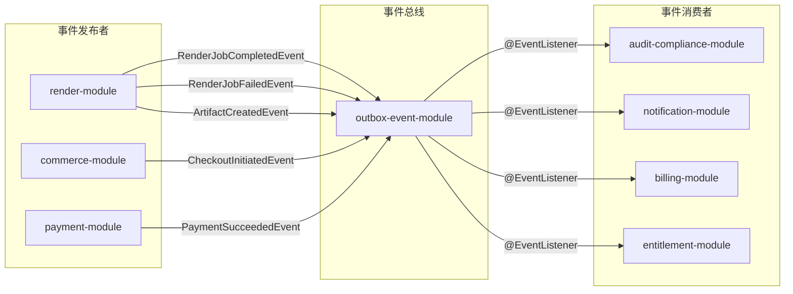
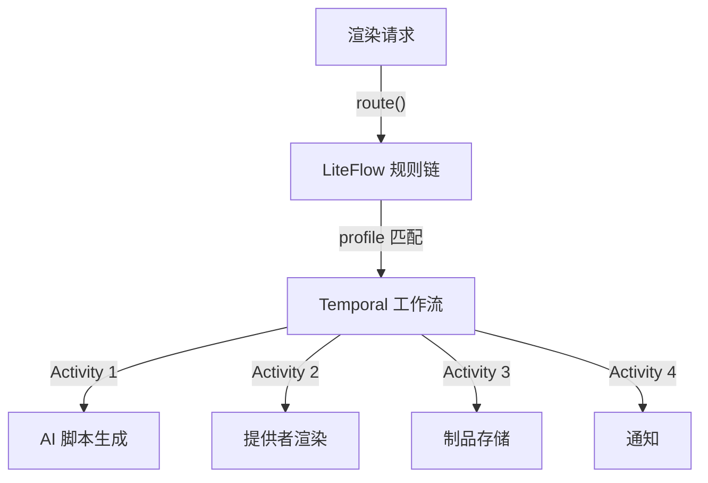

# 后端架构与技术栈

> **模块：** 全部后端模块
> **最后更新：** 2026-05-18

## 技术栈

| 组件 | 版本 | 角色 |
|------|------|------|
| Java | 25 (toolchain) | 语言运行时 |
| Spring Boot | 4.0.4 (BOM) | 核心框架 |
| Spring Modulith | 2.0.4 | 模块边界强制执行 |
| Spring AI | 2.0.0-M3 (Milestone) | AI 客户端抽象 |
| Temporal SDK | 1.33.0 | 持久化工作流编排 |
| LiteFlow | 2.15.3.2 | 本地规则链 / 路由 |
| jOOQ | 3.19.18 | 类型安全 SQL |
| Flyway | BOM 管理 | Schema 迁移 |
| H2 | runtimeOnly | 开发/测试内存数据库 |
| PostgreSQL | 16 | 生产数据库 |
| springdoc OpenAPI | 3.0.2 | API 文档 |
| PF4J | 3.15.0 | 插件系统 |

## 模块内部分层

每个业务模块遵循统一的包结构：

| 包 | 职责 | 典型内容 |
|----|------|---------|
| `*.api` | 对外边界 | Controller、DTO、请求/响应类型 |
| `*.app` | 应用服务 | 用例编排、事务边界 |
| `*.domain` | 领域模型 | 实体、值对象、领域事件 |
| `*.spi` | 端口接口 | 可插拔适配器的接口 |
| `*.infrastructure` | 适配器实现 | 外部系统、Noop/假实现、SDK 封装 |

## Spring Modulith 配置

```java
// 根应用类
@Modulith
@SpringBootApplication
public class PlatformApplication { }

// 模块声明示例（render-module）
@ApplicationModule(
    displayName = "Render",
    allowedDependencies = {"ai", "ai :: API", "ai :: domain", "shared", "storage", "storage :: API", "storage :: domain"}
)
package com.example.platform.render;
```

## 共享内核（shared-kernel）

唯一的 `ApplicationModule.Type.OPEN` 模块。包含：

| 类别 | 类型 |
|------|------|
| 错误码 | `CommonErrorCode`、`ErrorCode`、`ErrorCodeRegistry` |
| 值对象 | `Ids`（UUID 生成）、`Jsons`（Jackson 包装） |
| 日志上下文 | `TraceKeys`（traceId、requestId、tenantId、projectId） |
| 基础异常 | `PlatformException`（带 ErrorCode + details） |
| 领域事件 | `RenderJobCreatedEvent`、`RenderJobStatusChangedEvent`、`ArtifactCreatedEvent`、`RenderJobCompletedEvent`、`RenderJobFailedEvent` |
| 跨模块 SPI | `NotificationEventPublisher` |

**共享内核中禁止的内容：** 业务服务、Repository、工作流定义、提供者适配器、模块特定 DTO、业务策略、定时任务。

## 事件驱动架构



## Temporal + LiteFlow 编排

| 工具 | 适用场景 |
|------|---------|
| **Temporal** | 长时间运行、需持久化的工作流（渲染作业生命周期、计费周期） |
| **LiteFlow** | 本地、无状态的规则链（提供者选择、路由决策） |



## 多数据源架构

通过 `datasource-module` 管理命名 DataSource 和命名 jOOQ `DSLContext`：

```yaml
spring:
  datasource:
    primary:
      url: jdbc:postgresql://db:5432/platform
    analytics:
      url: jdbc:postgresql://analytics-db:5432/analytics
```

## 构建配置

```kotlin
// 根 build.gradle.kts
plugins {
    id("io.spring.dependency-management") version "1.1.7" apply false
    id("org.springframework.boot") version "4.0.4" apply false
    id("org.jooq.jooq-codegen-gradle") version "3.19.18" apply false
}

subprojects {
    apply(plugin = "java")
    apply(plugin = "io.spring.dependency-management")
    java { toolchain { languageVersion.set(JavaLanguageVersion.of(25)) } }
    dependencies {
        add("compileOnly", "org.springframework.modulith:spring-modulith-api:2.0.4")
    }
}
```
