# 模块架构与边界

> **模块：** 全部
> **最后更新：** 2026-05-18

## 模块依赖图

```mermaid
graph TD
    PA["platform-app<br/>(聚合器，依赖全部 30 模块)"]
    SK["shared-kernel<br/>(OPEN)"]

    subgraph Media["媒体处理"]
        RM["render-module"]
        AI_MOD["ai-module"]
        STO["storage-module"]
        WF["workflow-module"]
        RRW["remote-render-worker"]
        AC["artifact-catalog-module"]
    end

    subgraph Commerce["商务与访问控制"]
        COM["commerce-module"]
        PAY["payment-module"]
        BILL["billing-module"]
        ENT["entitlement-module"]
        QUOTA["quota-billing-module"]
        PG["policy-governance-module"]
    end

    subgraph Platform["平台服务"]
        PM["prompt-module"]
        EXT_MOD["extension-module"]
        SANDBOX["sandbox-runtime-module"]
        FQ["federation-query-module"]
        IAM["identity-access-module"]
        SCHED["scheduler-module"]
        NOTIF["notification-module"]
        OBS["observability-module"]
        AUDIT["audit-compliance-module"]
        OUTBOX["outbox-event-module"]
        UA["user-analytics-module"]
        CLOUD["cloud-resource-module"]
        MIG["compatibility-migration-module"]
        CFG["config-module"]
        SEC["secrets-config-module"]
        DS["datasource-module"]
    end

    %% 共享内核依赖
    RM --> SK
    AI_MOD --> SK
    STO --> SK
    WF --> SK
    COM --> SK
    PAY --> SK
    BILL --> SK
    ENT --> SK
    PM --> SK
    EXT_MOD --> SK
    IAM --> SK
    NOTIF --> SK
    OBS --> SK
    AUDIT --> SK
    OUTBOX --> SK
    UA --> SK
    CLOUD --> SK
    QUOTA --> SK
    CFG --> SK
    SEC --> SK
    DS --> SK
    RRW --> SK
    AC --> SK
    FQ --> SK
    MIG --> SK

    %% 跨模块依赖
    RM -->|"api"| AI_MOD
    RM -->|"api, domain"| STO
    WF -->|"feature-flags"| PG
    COM --> PAY
    PAY --> BILL
    BILL --> ENT
```



## 模块分类

### 按 Spring Modulith 类型

| 类型 | 模块 | 理由 |
|------|------|------|
| `OPEN` | `shared-kernel` | 跨模块共享类型 |
| `CLOSED` | 其他 29 个模块 | 边界强制访问 |

### 按命名接口

| 模块 | 命名接口 | 暴露包 |
|------|---------|--------|
| `ai-module` | `API` | `ai.api`（AiGatewayPort、AiController） |
| `ai-module` | `domain` | `ai.domain`（ChatResult、ChatRequest、ChatProvider） |
| `storage-module` | `API` | `storage.api`（StorageCatalogPort） |
| `storage-module` | `domain` | `storage.domain`（BlobStorage、StorageObjectRef） |
| `policy-governance-module` | `feature-flags` | `policy.api`（FeatureFlagEvaluator） |

## 跨模块依赖（非 shared-kernel）

| 源模块 | 目标模块 | 命名接口 | 理由 |
|--------|---------|---------|------|
| `render-module` | `ai-module` | `API`、`domain` | 通过端口进行 AI 脚本生成 |
| `render-module` | `storage-module` | `API`、`domain` | 通过端口进行制品存储 |
| `workflow-module` | `policy-governance-module` | `feature-flags` | Activity 中的 Feature Flag 评估 |

## 事件驱动的解耦依赖

| 源模块 | 目标模块 | 事件 | 机制 |
|--------|---------|------|------|
| `render-module` | `audit-compliance-module` | `RenderJobCompletedEvent`、`RenderJobFailedEvent` | `@EventListener` |
| `render-module` | `notification-module` | `RenderJobCreatedEvent`、`RenderJobStatusChangedEvent`、`ArtifactCreatedEvent` | `@EventListener` |
| `commerce-module` | `payment-module` | `CheckoutInitiatedEvent` | `@EventListener` |
| `payment-module` | `billing-module` | `PaymentSucceededEvent` | `@EventListener` |
| `billing-module` | `entitlement-module` | `BillingStateChangedEvent` | `@EventListener` |

## 禁止的依赖

| # | 禁止依赖 | 原因 |
|---|---------|------|
| 1 | 任何 → `platform-app` | 聚合器 only |
| 2 | `shared-kernel` → 任何 | 依赖图根节点 |
| 3 | `observability-module` → 业务模块 | 基础设施独立性 |
| 4 | `audit-compliance-module` → 业务模块 | 基础设施独立性 |
| 5 | `outbox-event-module` → `notification-module` | 使用事件 |
| 6 | `outbox-event-module` → `audit-compliance-module` | 使用事件 |
| 7 | `entitlement-module` → `payment-module` | 消费计费状态，非支付状态 |
| 8 | `entitlement-module` → `commerce-module` | 无直接依赖 |
| 9 | `billing-module` → `entitlement-module` | 计费驱动权益 |
| 10 | `quota-billing-module` → `entitlement-module` | 配额是权益的输入 |
| 11 | `sandbox-runtime-module` | 任何业务模块 | 按设计隔离 |
| 12 | `render-module` → `audit-compliance-module`（直接注入） | 必须通过事件 |

## ModularityTest

```java
// platform-app/src/test/java/.../ModularityTest.java
class ModularityTest {
    @Test
    void verifiesModuleStructure() {
        ApplicationModules.of(PlatformApplication.class).verify();
    }
}
```

**状态：** 通过 — 确认全部 30 个模块遵守 Spring Modulith 边界约束。
