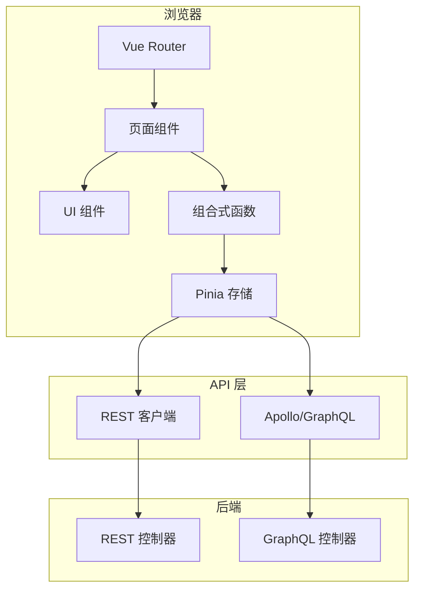

# 前端架构

> **模块：** `frontend/`
> **最后更新：** 2026-05-18

## 技术栈

| 组件 | 角色 |
|------|------|
| Vue 3 | UI 框架 |
| Vite | 构建工具 |
| Vitest | 测试框架 |
| Vue Router | 客户端路由 |
| Pinia | 状态管理 |
| Apollo Client | GraphQL 客户端 |

## 前端结构

```
frontend/src/
├── App.vue                    # 根组件
├── main.ts                    # 入口
├── router/                    # Vue Router 配置
├── pages/                     # 页面组件
│   ├── EditorPage.vue         # 主视频编辑器
│   ├── admin/                 # 管理控制台页面（30+）
│   │   ├── AdminConsole.vue
│   │   ├── AdminDashboard.vue
│   │   ├── FeatureFlagManagementPage.vue
│   │   ├── FeatureFlagEditor.vue
│   │   ├── FeatureFlagRuleEditor.vue
│   │   ├── FeatureFlagEvaluationPreview.vue
│   │   ├── PolicyManagementPage.vue
│   │   ├── PolicySimulationPanel.vue
│   │   ├── RouteManagementPage.vue
│   │   ├── EntitlementManagementPage.vue
│   │   ├── ExtensionManagement.vue
│   │   ├── MonitoringFeedbackPage.vue
│   │   └── ... (20+ 更多)
│   ├── user/                  # 用户门户页面（10+）
│   │   ├── UserDashboardPage.vue
│   │   ├── MyCapabilitiesPage.vue
│   │   ├── MyUsagePage.vue
│   │   ├── MyBillingPage.vue
│   │   ├── MyCreditsPage.vue
│   │   ├── MyFeedbackPage.vue
│   │   ├── BetaFeaturesPanel.vue
│   │   └── ... (5 更多)
│   ├── analytics/             # 分析页面
│   │   ├── AnalyticsAssistantPage.vue
│   │   └── MyReportsPage.vue
│   ├── entitlement/           # 权益页面
│   │   ├── BillingHistoryPage.vue
│   │   ├── CurrentPlanPanel.vue
│   │   └── ... (5 更多)
│   └── workspace/             # 工作空间页面
│       ├── WorkspaceMembersPage.vue
│       └── ... (5 更多)
├── components/                # 可复用组件
│   ├── timeline/              # 时间线组件
│   ├── export/                # 导出面板
│   ├── effects/               # 特效面板
│   ├── subtitle/              # 字幕组件
│   ├── feedback/              # 反馈与监控
│   └── ... (20+ 更多)
├── composables/               # Vue 组合式函数
│   ├── usePlayback.ts
│   ├── useSaveProject.ts
│   ├── useExportValidation.ts
│   ├── useRenderJob.ts
│   ├── useArtifact.ts
│   └── useI18nError.ts
├── stores/                    # Pinia 存储
├── api/                       # API 客户端层
├── graphql/                   # GraphQL 查询
├── utils/                     # 工具函数
│   ├── sentry.ts              # Sentry 集成
│   ├── openreplay.ts          # OpenReplay 集成
│   └── subtitleParser.ts      # 字幕解析
└── types/                     # TypeScript 类型
```

## 应用流程



## 关键页面与路由

### 用户门户

| 路由 | 组件 | 用途 |
|------|------|------|
| `/` | `UserDashboardPage` | 仪表盘概览 |
| `/me/projects` | `MyProjectsPage` | 项目列表 |
| `/me/capabilities` | `MyCapabilitiesPage` | 功能能力 |
| `/me/usage` | `MyUsagePage` | 使用统计 |
| `/me/billing` | `MyBillingPage` | 计费概览 |
| `/me/credits` | `MyCreditsPage` | 信用钱包 |
| `/me/feedback` | `MyFeedbackPage` | 提交反馈 |
| `/me/settings` | `MySettingsPage` | 用户设置 |
| `/me/beta` | `BetaFeaturesPanel` | Beta 功能访问 |
| `/me/analytics` | `AnalyticsAssistantPage` | NLQ 分析 |
| `/me/reports` | `MyReportsPage` | 保存的报告 |

### 管理控制台

| 路由 | 组件 | 用途 |
|------|------|------|
| `/admin` | `AdminDashboard` | 管理概览 |
| `/admin/feature-flags` | `FeatureFlagManagementPage` | 管理 Feature Flag |
| `/admin/policies` | `PolicyManagementPage` | 策略管理 |
| `/admin/entitlements` | `EntitlementManagementPage` | 权益管理 |
| `/admin/extensions` | `ExtensionManagement` | 扩展管理 |
| `/admin/routes` | `RouteManagementPage` | 导航路由配置 |
| `/admin/monitoring` | `MonitoringFeedbackPage` | 监控状态 |
| `/admin/analytics/datasets` | `DatasetCatalogPage` | NLQ 数据集目录 |

### 编辑器

| 路由 | 组件 | 用途 |
|------|------|------|
| `/editor` | `EditorPage` | 主视频编辑器 |

## 状态管理

Pinia 存储管理：
- **项目状态** — 当前项目、时间线、片段
- **用户状态** — 认证、偏好设置
- **UI 状态** — 面板可见性、选中片段
- **渲染状态** — 作业状态、制品、进度

## 监控集成

| 服务 | 集成方式 | 状态 |
|------|---------|------|
| Sentry | `frontend/src/utils/sentry.ts` | ✅ 已实现 |
| OpenReplay | `frontend/src/utils/openreplay.ts` | ✅ 已实现 |

两者均通过环境变量配置，默认禁用。
