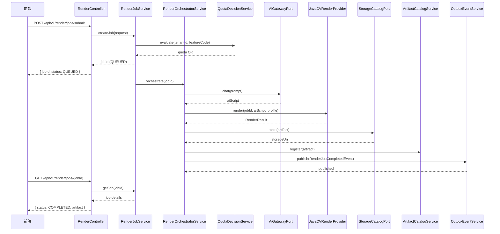
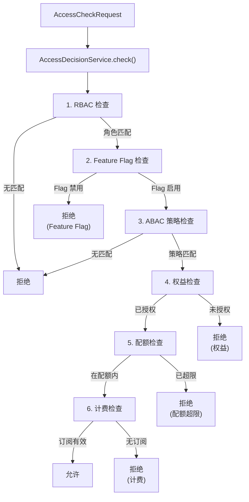
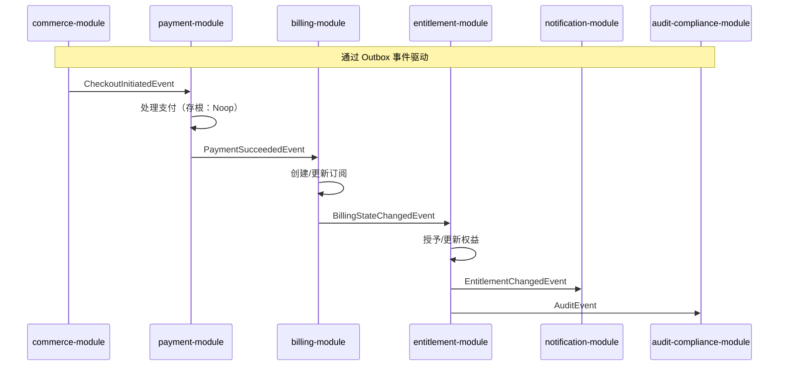
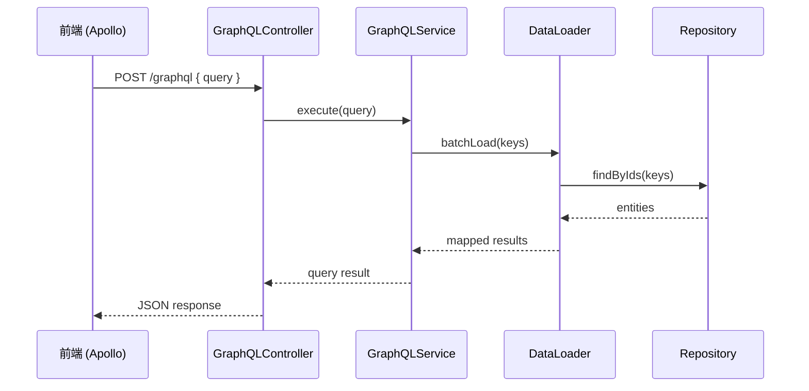
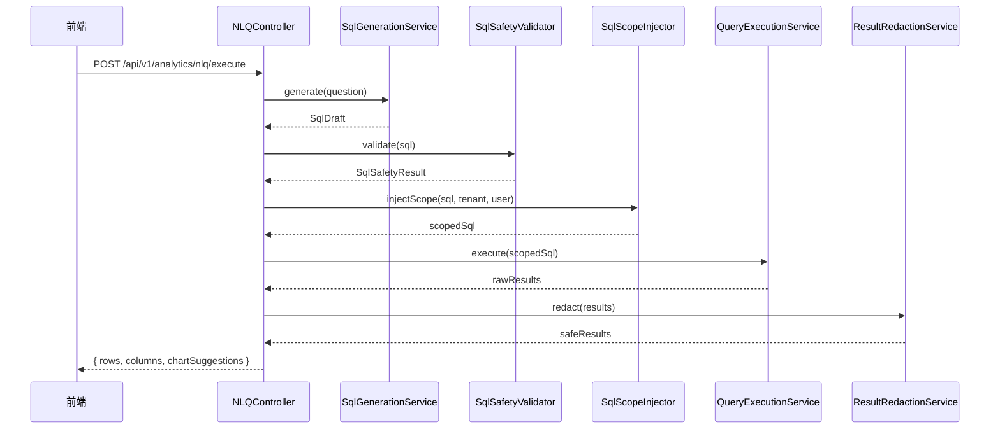
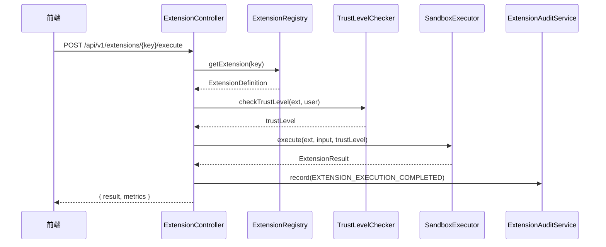
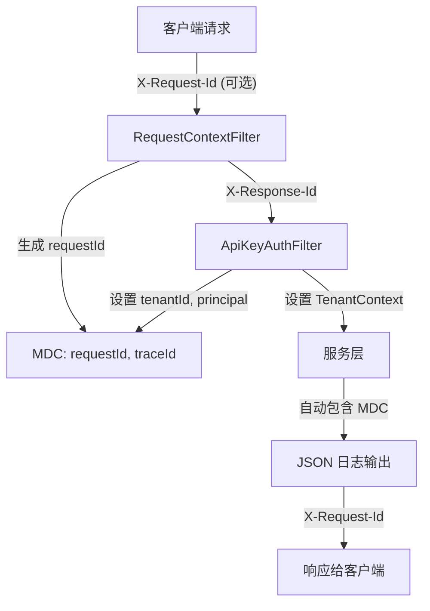

# 请求流与数据流

> **模块：** 全部
> **最后更新：** 2026-05-18

## 渲染作业请求流

```mermaid
sequenceDiagram
    participant FE as 前端
    participant RC as RenderController
    participant RS as RenderJobService
    participant RO as RenderOrchestratorService
    participant QS as QuotaDecisionService
    participant AI as AiGatewayPort
    participant RP as JavaCVRenderProvider
    participant SC as StorageCatalogPort
    participant AC as ArtifactCatalogService
    participant OUT as OutboxEventService

    FE->>RC: POST /api/v1/render/jobs/submit
    RC->>RS: createJob(request)
    RS->>QS: evaluate(tenantId, featureCode)
    QS-->>RS: quota OK
    RS-->>RC: jobId (QUEUED)
    RC-->>FE: { jobId, status: QUEUED }

    RS->>RO: orchestrate(jobId)
    RO->>AI: chat(prompt)
    AI-->>RO: aiScript
    RO->>RP: render(jobId, aiScript, profile)
    RP-->>RO: RenderResult
    RO->>SC: store(artifact)
    SC-->>RO: storageUri
    RO->>AC: register(artifact)
    RO->>OUT: publish(RenderJobCompletedEvent)
    OUT-->>RO: published

    FE->>RC: GET /api/v1/render/jobs/{jobId}
    RC->>RS: getJob(jobId)
    RS-->>RC: job details
    RC-->>FE: { status: COMPLETED, artifact }
```

## 访问决策流

```mermaid
graph TB
    REQ["AccessCheckRequest"] --> AD["AccessDecisionService.check()"]

    AD --> RBAC["1. RBAC 检查"]
    RBAC -->|"角色匹配"| FF["2. Feature Flag 检查"]
    RBAC -->|"无匹配"| DENY["拒绝"]

    FF -->|"Flag 启用"| ABAC["3. ABAC 策略检查"]
    FF -->|"Flag 禁用"| FF_DENY["拒绝<br/>(Feature Flag)"]

    ABAC -->|"策略匹配"| ENT["4. 权益检查"]
    ABAC -->|"无匹配"| DENY

    ENT -->|"已授权"| QUOTA["5. 配额检查"]
    ENT -->|"未授权"| ENT_DENY["拒绝<br/>(权益)"]

    QUOTA -->|"在配额内"| BILL["6. 计费检查"]
    QUOTA -->|"已超限"| Q_DENY["拒绝<br/>(配额超限)"]

    BILL -->|"订阅有效"| ALLOW["允许"]
    BILL -->|"无订阅"| B_DENY["拒绝<br/>(计费)"]
```

## 商务 → 支付 → 计费 → 权益流

```mermaid
sequenceDiagram
    participant COM as commerce-module
    participant PAY as payment-module
    participant BILL as billing-module
    participant ENT as entitlement-module
    participant NOT as notification-module
    participant AUD as audit-compliance-module

    Note over COM, AUD: 通过 Outbox 事件驱动

    COM->>PAY: CheckoutInitiatedEvent
    PAY->>PAY: 处理支付（存根：Noop）
    PAY->>BILL: PaymentSucceededEvent
    BILL->>BILL: 创建/更新订阅
    BILL->>ENT: BillingStateChangedEvent
    ENT->>ENT: 授予/更新权益
    ENT->>NOT: EntitlementChangedEvent
    ENT->>AUD: AuditEvent
```

## GraphQL 查询流

```mermaid
sequenceDiagram
    participant FE as 前端 (Apollo)
    participant GC as GraphQLController
    participant GS as GraphQLService
    participant DL as DataLoader
    participant REPO as Repository

    FE->>GC: POST /graphql { query }
    GC->>GS: execute(query)
    GS->>DL: batchLoad(keys)
    DL->>REPO: findByIds(keys)
    REPO-->>DL: entities
    DL-->>GS: mapped results
    GS-->>GC: query result
    GC-->>FE: JSON response
```

## NLQ 查询流

```mermaid
sequenceDiagram
    participant FE as 前端
    participant NLQ as NLQController
    participant SQL as SqlGenerationService
    participant SAF as SqlSafetyValidator
    participant SCOPE as SqlScopeInjector
    participant EXEC as QueryExecutionService
    participant REDACT as ResultRedactionService

    FE->>NLQ: POST /api/v1/analytics/nlq/execute
    NLQ->>SQL: generate(question)
    SQL-->>NLQ: SqlDraft
    NLQ->>SAF: validate(sql)
    SAF-->>NLQ: SqlSafetyResult
    NLQ->>SCOPE: injectScope(sql, tenant, user)
    SCOPE-->>NLQ: scopedSql
    NLQ->>EXEC: execute(scopedSql)
    EXEC-->>NLQ: rawResults
    NLQ->>REDACT: redact(results)
    REDACT-->>NLQ: safeResults
    NLQ-->>FE: { rows, columns, chartSuggestions }
```

## 扩展执行流

```mermaid
sequenceDiagram
    participant FE as 前端
    participant EXT as ExtensionController
    participant REG as ExtensionRegistry
    participant TRUST as TrustLevelChecker
    participant SANDBOX as SandboxExecutor
    participant AUDIT as ExtensionAuditService

    FE->>EXT: POST /api/v1/extensions/{key}/execute
    EXT->>REG: getExtension(key)
    REG-->>EXT: ExtensionDefinition
    EXT->>TRUST: checkTrustLevel(ext, user)
    TRUST-->>EXT: trustLevel
    EXT->>SANDBOX: execute(ext, input, trustLevel)
    SANDBOX-->>EXT: ExtensionResult
    EXT->>AUDIT: record(EXTENSION_EXECUTION_COMPLETED)
    EXT-->>FE: { result, metrics }
```

## 请求关联流

```mermaid
graph TB
    CLIENT["客户端请求"] -->|"X-Request-Id (可选)"| FILTER["RequestContextFilter"]
    FILTER -->|"生成 requestId"| MDC["MDC: requestId, traceId"]
    FILTER -->|"X-Response-Id"| AUTH["ApiKeyAuthFilter"]
    AUTH -->|"设置 tenantId, principal"| MDC
    AUTH -->|"设置 TenantContext"| SERVICE["服务层"]
    SERVICE -->|"自动包含 MDC"| LOG["JSON 日志输出"]
    LOG -->|"X-Request-Id"| RESPONSE["响应给客户端"]
```
