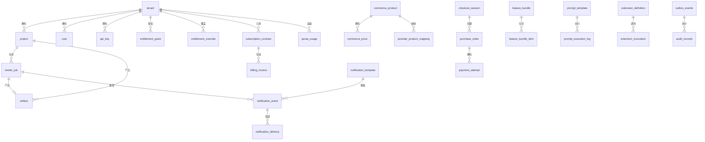

# 数据架构与 Schema

> **模块：** 所有持久化模块
> **最后更新：** 2026-05-18

## 数据库：PostgreSQL 16

所有表位于 **public** schema。Schema 迁移由 **Flyway** 独家管理。

## Flyway 迁移历史

| 版本 | 文件 | 新增表 | 用途 |
|------|------|--------|------|
| V1 | `V1__init.sql` | `render_job`、`notification_event`、`notification_template`、`notification_delivery`、`config_item` | 核心表 |
| V2 | `V2__platform_v2.sql` | `storage_object`、`prompt_template`、`prompt_execution_log`、`cloud_resource_definition`、`secret_ref`、`extension_definition`、`extension_invocation`、`app_datasource` | 平台扩展 |
| V3 | `V3__platform_v3.sql` | `outbox_events`、`audit_records`、`schedules`、`quota_definitions` | 运营表 |
| V4 | `V4__commerce_billing_entitlement.sql` | `commerce_product`、`commerce_price`、`provider_product_mapping`、`checkout_session`、`purchase_order`、`payment_attempt`、`provider_webhook_event`、`subscription_contract`、`billing_invoice`、`feature_definition`、`feature_bundle`、`feature_bundle_item`、`entitlement_grant`、`entitlement_override` | 商务域 |
| V5 | `V5__outbox_audit_enhancements.sql` | (修改) `outbox_events`、`audit_records` | 增强 |
| V6 | `V6__indexes_and_constraints.sql` | (索引) ~40 个索引 | 性能 |
| V7 | `V7__identity_render_artifact.sql` | `tenant`、`project`、`user`、`api_key`、`artifact`、`notification_record` | 身份与制品 |
| V8 | `V8__quota_usage_and_render_history.sql` | `quota_usage` | 配额追踪 |
| V9 | `V9__outbox_enhancements.sql` | (修改) `outbox_events` | Outbox 增强 |
| V10 | `V10__render_job_status_history.sql` | (新表) | 状态历史 |
| V11 | `V11__prompt_engineering_tables.sql` | (新表) | Prompt 工程 |
| V12 | `V12__problematic_data_tables.sql` | `problematic_data_record`、`quarantined_render_jobs`、`quarantined_prompt_executions`、`quarantined_provider_workers`、`problematic_data_rule_config` | 问题数据 |
| V13 | `V13__extension_platform_upgrade.sql` | `extension_routing_rule`、`extension_resource_limit`、`extension_rollback_point`、`extension_audit_event`、`sandbox_execution_job` | 扩展 v2 |
| V14 | `V14__rbac_workspace.sql` | (新表) | RBAC 与工作空间 |
| V15 | `V15__entitlement_upgrade.sql` | (修改) | 权益升级 |
| V16 | `V16__navigation.sql` | (新表) | 可配置导航 |
| V17 | `V17__billing_models.sql` | (新表) | 计费模型 |

## ER 关系图



## 命名规范

| 类别 | 规范 | 示例 |
|------|------|------|
| 表名 | 小写 + 下划线 | `render_job` |
| 列名 | 小写 + 下划线 | `created_at` |
| 主键 | `id varchar(64)` | — |
| 时间戳 | `created_at timestamp not null` | — |
| 状态列 | `status varchar(32) not null` | — |
| 外键 | `<entity>_id varchar(64) not null` | `tenant_id` |
| 索引 | `ix_<table>_<column>` | `ix_render_job_tenant_id` |

## 连接池（HikariCP）

```yaml
spring:
  datasource:
    hikari:
      maximum-pool-size: 20
      minimum-idle: 5
      connection-timeout: 30000
      idle-timeout: 600000
      max-lifetime: 1800000
```

## 容量估算

| 场景 | 数据量 | 说明 |
|------|--------|------|
| 最小（开发/测试） | < 10 MB | 仅种子数据 |
| 小型（< 100 租户） | ~100 MB | 中等渲染量 |
| 中型（< 1 万租户） | ~1 GB | 高渲染 + 事件量 |
| 大型（< 10 万租户） | ~10 GB | 需要分区 |

## 测试数据库

H2 内存数据库用于测试，使用 PostgreSQL 兼容模式。
