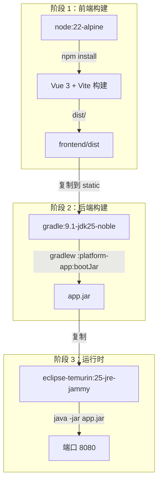
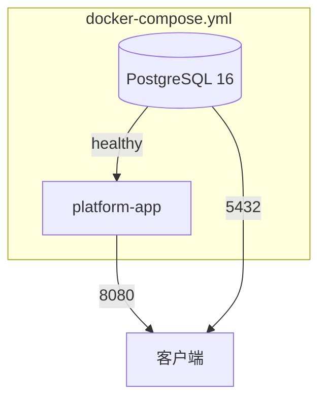
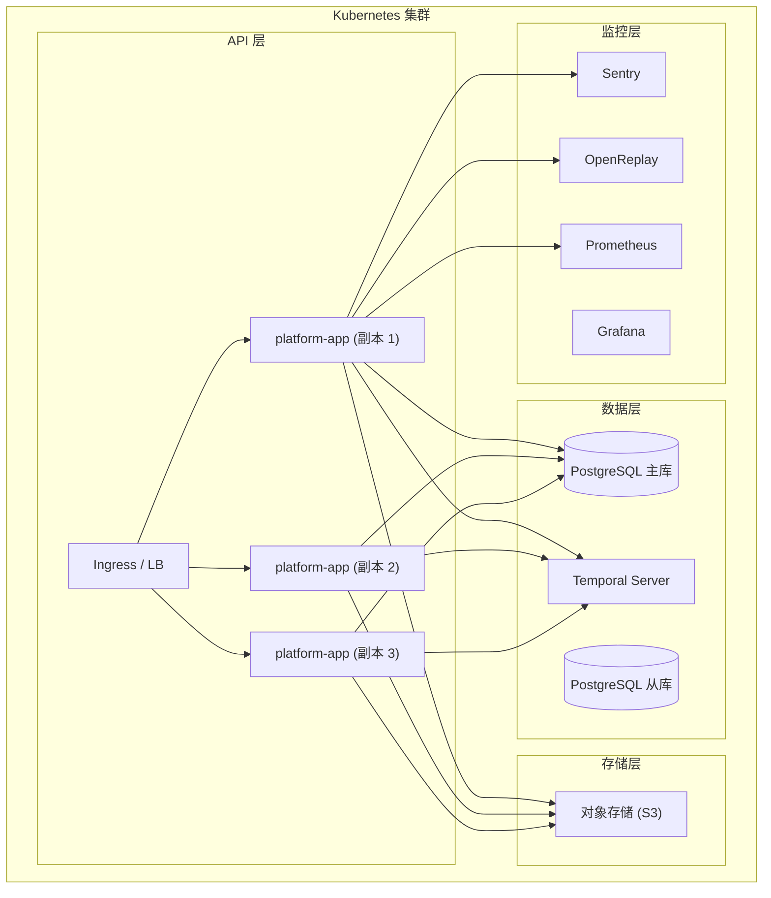

# 部署架构

> **模块：** `platform-app`、`frontend`、基础设施
> **最后更新：** 2026-05-18

## Docker 构建流水线



## Docker Compose（本地开发）



### 服务

| 服务 | 镜像 | 端口 | 用途 |
|------|------|------|------|
| `db` | postgres:16-alpine | 5432 | 数据库 |
| `app` |（从 Dockerfile 构建） | 8080 | 应用 |

### 卷

| 卷 | 用途 |
|----|------|
| `pgdata` | PostgreSQL 数据持久化 |
| `app-storage` | 制品文件存储 |

## 生产部署拓扑



## 渲染执行模式

| 模式 | 适配器 | 需要 Temporal | 使用场景 |
|------|--------|-------------|---------|
| `local` | `LocalRenderExecutionAdapter` | 否 | 开发、测试、简单部署 |
| `temporal` | `TemporalRenderExecutionAdapter` | 是 | 生产、分布式系统 |

```yaml
# 本地模式（默认）
render:
  execution:
    mode: local

# Temporal 模式（生产）
render:
  execution:
    mode: temporal
```

## Temporal Server 要求

| 组件 | 最低 | 推荐 |
|------|------|------|
| Temporal Server | 1.22 | 1.24+ |
| Temporal SDK (Java) | 1.22 | 1.33 |
| CPU | 2 核 | 4 核 |
| 内存 | 4 GB | 8 GB |
| 磁盘 | 50 GB SSD | 100 GB SSD |

## 健康检查端点

| 端点 | 用途 |
|------|------|
| `GET /actuator/health` | 整体健康 |
| `GET /actuator/health/liveness` | K8s 存活探针 |
| `GET /actuator/health/readiness` | K8s 就绪探针 |
| `GET /actuator/metrics` | Micrometer 指标 |
| `GET /actuator/prometheus` | Prometheus 抓取端点 |

## 环境配置

| 环境 | Temporal | 数据库 | 监控 |
|------|----------|--------|------|
| 本地开发 | 不需要 | H2 内存 | 禁用 |
| CI/CD 测试 | 不需要 | H2 内存 | 禁用 |
| 预发布 | 可选 | PostgreSQL | 可选 |
| 生产 | 必需 | PostgreSQL | 必需 |

## 资源需求

| 资源 | 最低 | 推荐 |
|------|------|------|
| CPU | 2 核 | 4 核 |
| 内存 | 4 GB | 8 GB |
| 磁盘 | 20 GB SSD | 50 GB SSD |
| 网络 | 100 Mbps | 1 Gbps |
