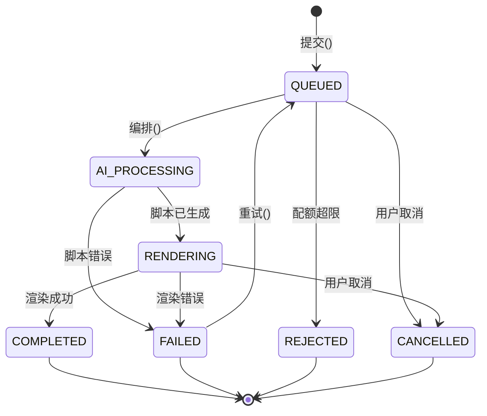
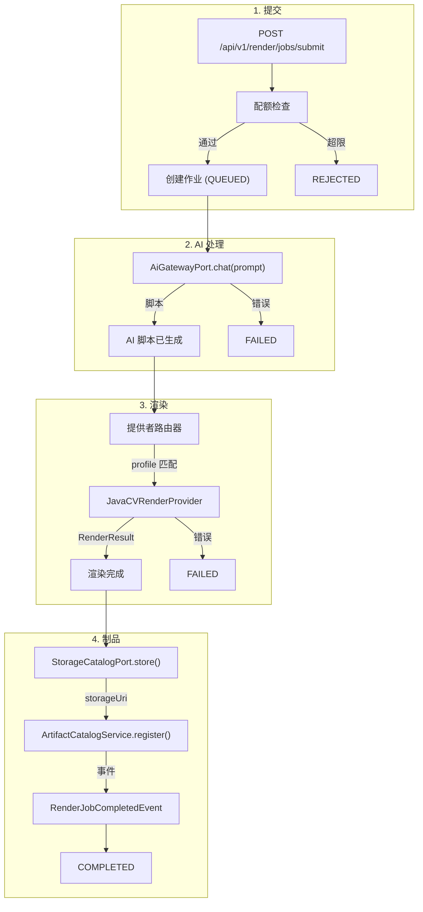

# 渲染管线

> **模块：** `render-module`
> **最后更新：** 2026-05-18

## 概述

渲染管线是一个多阶段视频处理系统。它管理渲染作业从提交到 AI 脚本生成、提供者渲染、制品存储的完整生命周期。

## 作业生命周期状态机

## 管线阶段

## 渲染提供者

| 提供者 | 类型 | 能力 | 状态 |
|--------|------|------|------|
| JavaCV | 转码 | 裁剪、转码、字幕、水印 | ✅ 主要 |
| OFX | 特效 | 特效、转场、滤镜 | ✅ |
| GPAC | 封装 | DASH/HLS、CMAF、MP4 faststart | ✅ |
| MLT | 渲染 | XML 生成、melt 命令 | ✅ |
| GStreamer | 渲染 | 管线处理、字幕叠加 | ✅ |
| FFMPEG | 转码 | 通用转码 | ✅ |

## 支持的 Profile

| Profile | 分辨率 | 用途 |
|---------|--------|------|
| `default_1080p` | 1920x1080 | 标准高清 |
| `default_720p` | 1280x720 | Web 高清 |
| `social_1080p` | 1920x1080 | 社交媒体 |
| `social_720p` | 1280x720 | 社交媒体（轻量） |
| `mobile_480p` | 854x480 | 移动端 |
| `4k_2160p` | 3840x2160 | 4K |
| `free_720p_watermarked` | 1280x720 | 免费层 |
| `pro_1080p` | 1920x1080 | 专业层 |
| `team_4k` | 3840x2160 | 团队层 |

## GPU 预设

| 预设 | 编码器 | 层级访问 |
|------|--------|---------|
| GPU_H264 | NVENC H.264 | TEAM+ |
| GPU_H265 | NVENC HEVC | TEAM+ |
| GPU_VP9 | VAAPI VP9 | TEAM+ |

## 错误码

| 错误码 | HTTP | 描述 |
|--------|------|------|
| RENDER-500-001 | 500 | 通用渲染失败 |
| RENDER-409-001 | 409 | 配额超限 |
| RENDER-404-001 | 404 | 作业未找到 |

## 当前限制

| 限制 | 状态 | 说明 |
|------|------|------|
| 多轨道合成 | ❌ 不支持 | 仅处理第一个轨道 |
| 复杂转场 | ❌ 不支持 | 仅基础淡入淡出 |
| 完整字幕烧录 | ⚠️ 部分 | 框架已就绪 |
| GPU 加速 | ❌ 不支持 | 仅 CPU |
| 远程 Worker | ❌ 不支持 | 全部进程内渲染 |
| H.265 编码 | ❌ 不支持 | 尚未实现 |
| HDR 视频 | ❌ 不支持 | 尚未实现 |
