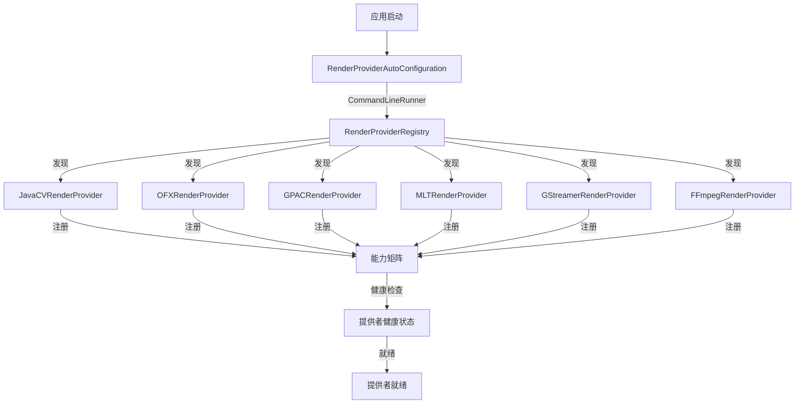

# 渲染提供者注册

> **模块：** `render-module`
> **最后更新：** 2026-05-18

## 提供者如何注册

渲染提供者在应用启动时通过 `RenderProviderAutoConfiguration` 自动注册。



## 提供者接口

```java
public interface RenderProvider {
    String getProviderKey();
    Set<String> getCapabilities();
    boolean supportsProfile(String profile);
    RenderResult render(String jobId, String aiScript, String profile);
    HealthStatus checkHealth();
}
```

## 添加新提供者

1. 创建实现 `RenderProvider` 的类
2. 添加 `@Component` 注解
3. 实现必要方法
4. 提供者将在启动时自动发现

## 提供者能力矩阵

| 提供者 | 转码 | 特效 | 封装 | 字幕 | 水印 | GPU |
|--------|------|------|------|------|------|-----|
| JavaCV | ✅ | ❌ | ❌ | ✅ | ✅ | ❌ |
| OFX | ❌ | ✅ | ❌ | ❌ | ❌ | ❌ |
| GPAC | ❌ | ❌ | ✅ | ❌ | ❌ | ❌ |
| MLT | ✅ | ❌ | ❌ | ❌ | ❌ | ❌ |
| GStreamer | ✅ | ❌ | ❌ | ✅ | ❌ | ❌ |
| FFMPEG | ✅ | ❌ | ❌ | ❌ | ❌ | ❌ |

## 已弃用的包装类

以下已弃用的包装类为向后兼容而存在：

| 已弃用类 | 规范替换 |
|---------|---------|
| `FfmpegRenderProvider` | `FFmpegRenderProvider` |
| `GpacRenderProvider` | `GPACRenderProvider` |
| `MeltCommandFactory` | `MLTCommandFactory` |

详见 `12-review/02-technical-debt.md` 获取移除标准。
