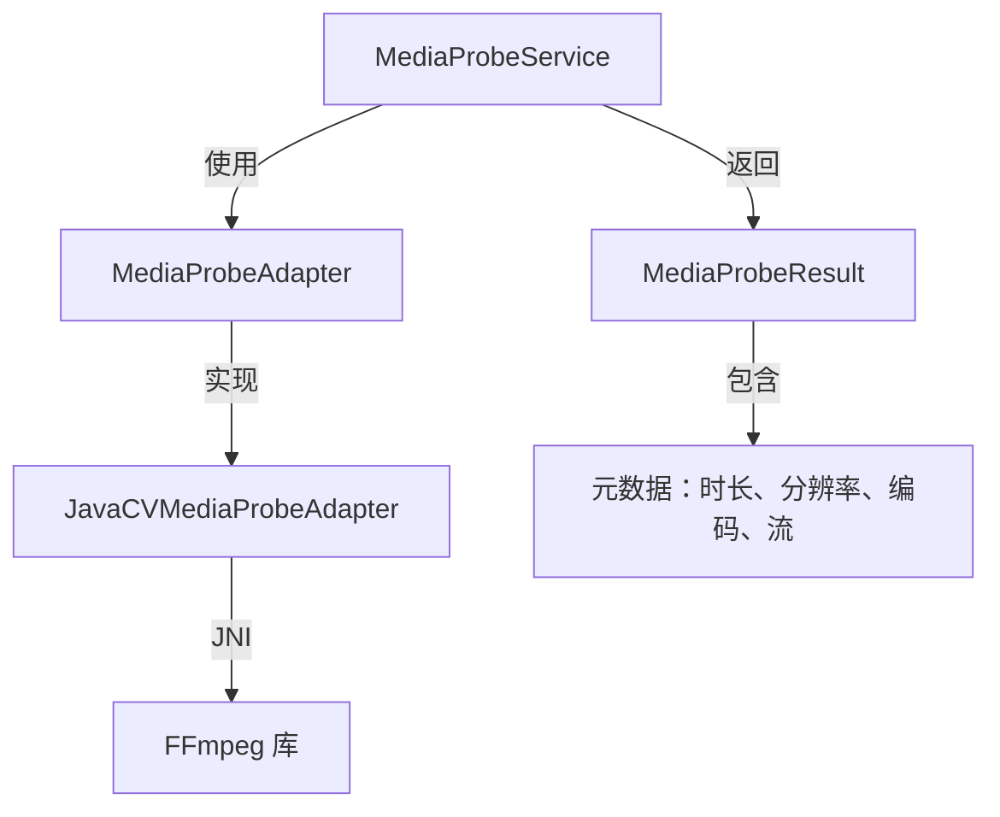

# 媒体探测服务

> **模块：** `render-module`
> **最后更新：** 2026-05-18

## 概述

媒体探测服务从媒体文件中提取元数据（时长、分辨率、编码、流）。它使用适配器模式支持多种探测实现。

## 架构



## 适配器接口

```java
public interface MediaProbeAdapter {
    MediaProbeResult probe(String storageUri);
}
```

## 当前实现

| 组件 | 状态 | 说明 |
|------|------|-------|
| `MediaProbeService` | ✅ | 主入口 |
| `MediaProbeAdapter` | ✅ | 接口 |
| `JavaCVMediaProbeAdapter` | ✅ | 主要实现（替代 FFprobe） |
| `MediaProbeResult` | ✅ | 类型化结果 DTO |
| `MediaValidationReport` | ⚠️ 已弃用 | 旧类型，保留向后兼容 |
| `FFmpegProbeService` | ⚠️ 已弃用 | 被 JavaCVMediaProbeAdapter 替代 |

## 迁移说明

- `FFmpegProbeService` 已被 `JavaCVMediaProbeAdapter` 替代，后者使用 JavaCV JNI 绑定而非调用 FFprobe CLI
- `MediaValidationReport` 已被 `MediaProbeResult` 弃用
- `MediaProbeService.probeLegacy()` 为向后兼容返回 `MediaValidationReport`
