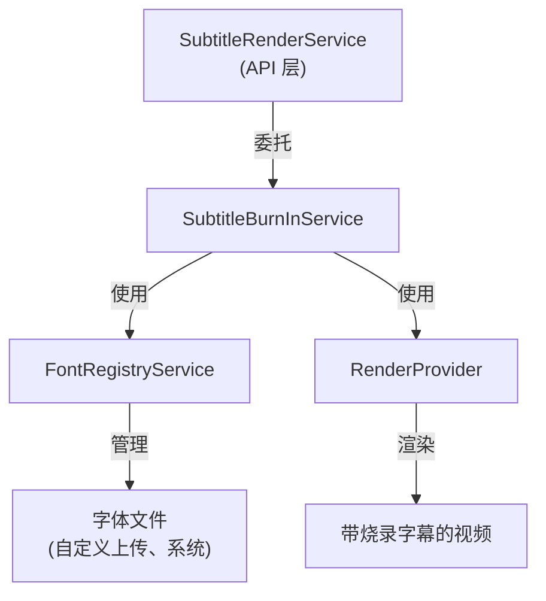

# 字幕烧录服务

> **模块：** `render-module`
> **最后更新：** 2026-05-18

## 概述

字幕烧录服务将字幕文本渲染到视频帧上。它支持多种字幕格式和字体管理。

## 架构

## 组件

| 组件 | 用途 | 状态 |
|------|------|------|
| `SubtitleRenderService` | API 层分离 | ✅ |
| `SubtitleBurnInService` | 核心烧录逻辑 | ✅ |
| `FontRegistryService` | 字体管理 | ✅ |
| `SubtitleTrack` / `SubtitleCue` | 领域记录 | ✅（未被烧录服务使用） |

## 支持的格式

| 格式 | 状态 |
|------|------|
| SRT | ✅ |
| ASS/SSA | ✅ |
| VTT | ✅ |

## 字体管理

| 功能 | 状态 | 说明 |
|------|------|------|
| 自定义字体上传 | ✅ | 用户可上传字体 |
| 字体嵌入 | ✅ | 字体嵌入输出 |
| 字体子集生成 | 🔧 占位 | 复制原始字体（非真正子集） |
| 多语言字体 | ✅ | CJK、拉丁等 |

## 已知限制

- `SubtitleBurnInService` 是具体的 `@Service`（无适配器接口）
- 字幕轨道以 `List<Map<String, Object>>` 传递（无类型化 DTO）
- 字体子集生成是占位实现
- `SubtitleTrack` 和 `SubtitleCue` 记录存在于领域包中但未被烧录服务使用

详见 `12-review/02-technical-debt.md` 获取详情。
