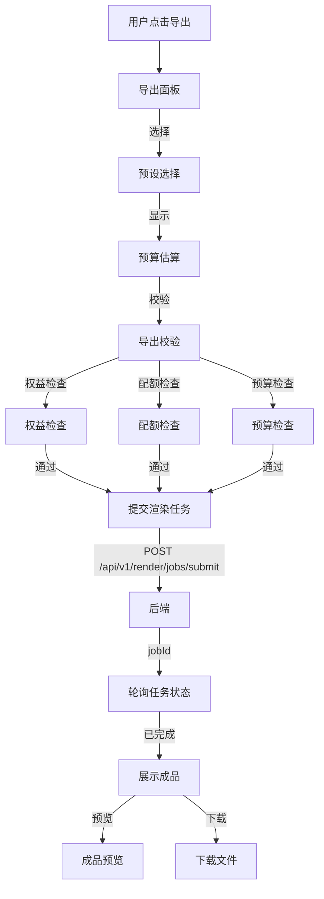

# 导出流程

> **模块：** `frontend/src/components/export/`
> **最后更新：** 2026-05-18

## 导出面板

导出面板允许用户配置渲染设置并提交渲染任务。



## 导出预设

| 预设 | 分辨率 | 格式 | 套餐 |
|------|--------|------|------|
| `free_720p_watermarked` | 720p | MP4 | 免费版 |
| `default_720p` | 720p | MP4 | 免费+ |
| `default_1080p` | 1080p | MP4 | 专业版+ |
| `social_1080p` | 1080p | MP4 | 专业版+ |
| `social_720p` | 720p | MP4 | 专业版+ |
| `mobile_480p` | 480p | MP4 | 免费+ |
| `4k_2160p` | 4K | MP4 | 团队版+ |
| `pro_1080p` | 1080p | MP4 | 专业版+ |
| `team_4k` | 4K | MP4 | 团队版+ |

## 校验链


## 渲染任务轮询

```typescript
// 轮询流程
const pollJobStatus = async (jobId: string) => {
  const response = await fetch(`/api/v1/render/jobs/${jobId}`);
  const job = await response.json();

  if (job.status === 'COMPLETED') {
    showArtifact(job.artifact);
  } else if (job.status === 'FAILED') {
    showError(job.errorCode, job.errorMessage);
  } else {
    setTimeout(() => pollJobStatus(jobId), 2000);
  }
};
```

## 错误处理

| 错误代码 | 描述 | 界面操作 |
|----------|------|----------|
| `RENDER-409-001` | 配额已用完 | 显示升级建议 |
| `ENTITLEMENT-403-001` | 功能不可用 | 显示套餐升级 |
| `RENDER-500-001` | 渲染失败 | 显示重试按钮 |
| `AI-500-001` | AI 生成失败 | 显示重试按钮 |
