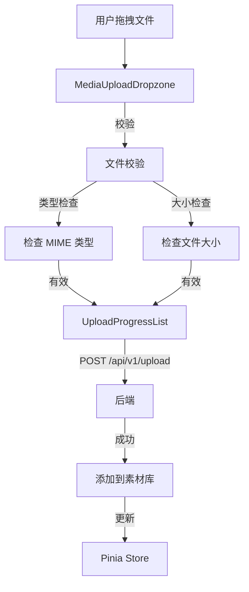
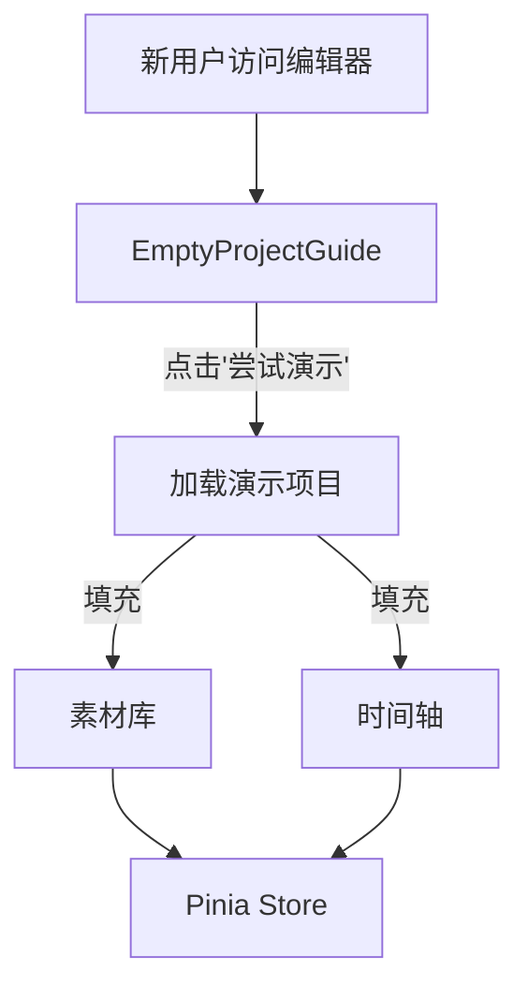

# 上传与演示项目

> **模块：** `frontend/src/components/`
> **最后更新：** 2026-05-18

## 上传工作流

## 演示项目

演示项目为新用户提供预填充的项目：

## 上传组件

| 组件 | 用途 | 状态 |
|------|------|------|
| `MediaUploadDropzone` | 拖拽上传文件 | ✅ |
| `UploadProgressList` | 上传进度显示 | ✅ |
| `EmptyProjectGuide` | 空状态引导上传/演示 | ✅ |

## 支持的文件类型

| 类型 | 扩展名 |
|------|--------|
| 视频 | `.mp4`, `.webm`, `.mov`, `.ogg` |
| 音频 | `.mp3`, `.wav`, `.aac` |
| 图片 | `.jpg`, `.png`, `.gif`, `.webp` |
| 字幕 | `.srt`, `.ass`, `.vtt` |
| 字体 | `.ttf`, `.otf`, `.woff`, `.woff2` |

## 上传限制

| 限制 | 值 |
|------|-----|
| 最大文件大小 | 可配置（默认 500MB） |
| 最大并发上传数 | 3 |
| 允许类型 | 可配置白名单 |
