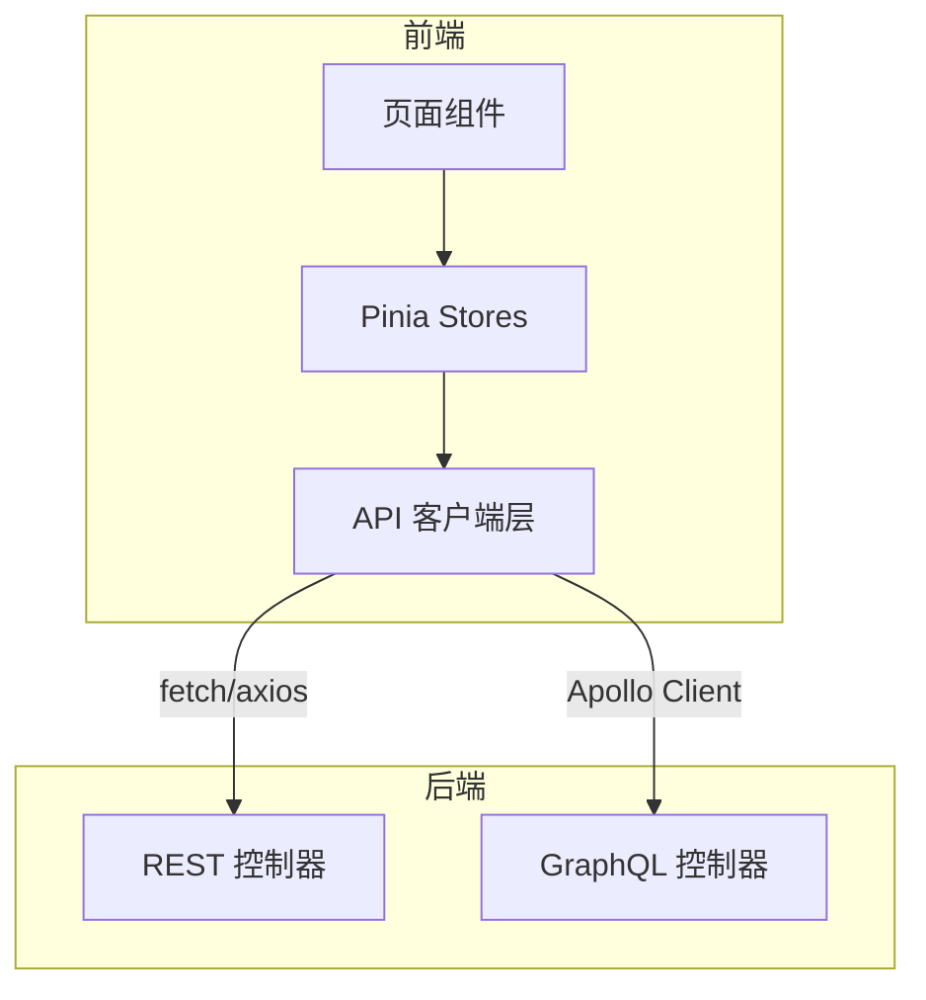

# 前端 API 使用

> **模块：** `frontend/src/api/`、`frontend/src/graphql/`
> **最后更新：** 2026-05-18

## API 客户端层

前端通过 REST 和 GraphQL API 与后端通信。



## REST API 客户端

```typescript
// 示例：提交渲染任务
const submitRenderJob = async (request: SubmitRenderJobRequest) => {
  const response = await fetch('/api/v1/render/jobs/submit', {
    method: 'POST',
    headers: { 'Content-Type': 'application/json' },
    body: JSON.stringify(request),
  });
  return response.json() as Promise<{ jobId: string; status: string }>;
};
```

## GraphQL 客户端

```typescript
// 示例：Apollo Client 查询
const GET_PROJECTS = gql`
  query GetProjects($tenantId: String!) {
    projects(tenantId: $tenantId) {
      id
      name
      status
      createdAt
    }
  }
`;

const { data } = useQuery(GET_PROJECTS, { variables: { tenantId } });
```

## API 模块

| 模块 | REST 端点 | GraphQL 查询 |
|------|-----------|-------------|
| 渲染 | `/api/v1/render/*` | `renderJob`、`renderJobs` |
| 项目 | `/api/v1/projects/*` | `project`、`projects` |
| 权益 | `/api/v1/entitlements/*` | `entitlement`、`capabilities` |
| Feature Flags | `/api/v1/feature-flags/*` | `featureFlag`、`featureFlags` |
| 分析 | `/api/v1/analytics/nlq/*` | `analyticsQuery` |
| 提示词 | `/api/v1/prompts/*` | `prompt`、`prompts` |
| 扩展 | `/api/v1/extensions/*` | `extension`、`extensions` |
| 通知 | `/api/v1/notifications/*` | `notification`、`notifications` |

## 错误处理

```typescript
// 全局错误处理器
const handleApiError = (error: ApiError) => {
  const { errorCode, message, details } = error;

  // 查找 i18n 消息
  const i18nMessage = t(`errors.${errorCode}`, message);

  // 显示错误状态
  showError({
    code: errorCode,
    message: i18nMessage,
    details,
  });
};
```

## 认证

```typescript
// API Key 认证（当前）
const apiClient = axios.create({
  baseURL: '/api/v1',
  headers: {
    'X-API-Key': apiKey,
    'X-Tenant-ID': tenantId,
  },
});
```
