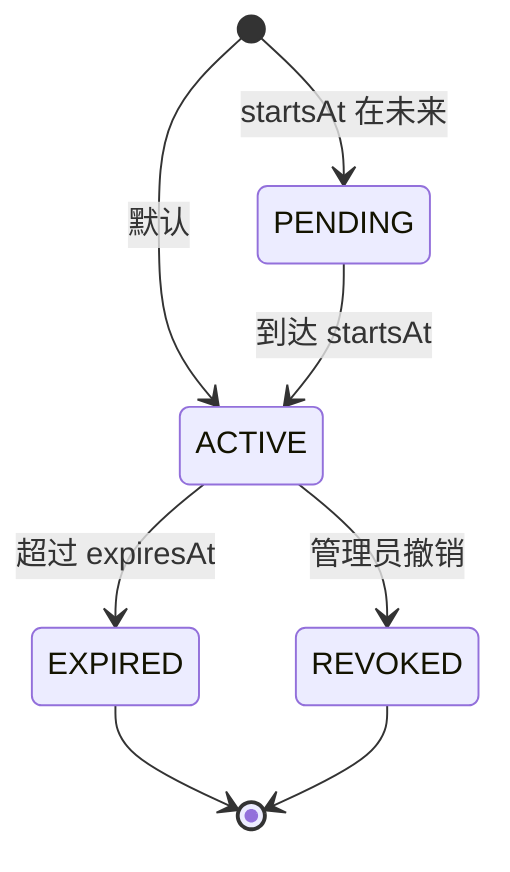

# 权益系统

> **模块：** `entitlement-module`
> **最后更新：** 2026-05-19

## 概述

权益系统是**功能访问的最终平台真相来源**。它基于分层决策链确定用户、租户、工作区或群组可以访问的内容。系统结合基于套餐的策略、覆盖授权、工作区池和 ABAC 规则。

## 实现状态

| 组件 | 状态 |
|------|------|
| `EntitlementService` | ✅ 已实现 |
| `EntitlementDecisionService` | ✅ 已实现 |
| `EntitlementPolicyService` | ✅ 已实现 |
| `AccessDecisionService` | ✅ 已实现 |
| `AccessDecisionFeatureFlagService` | ✅ 已实现 |
| `QuotaDecisionService` | ✅ 已实现 |
| `QuotaPolicyService` | ✅ 已实现 |
| `QuotaProfileService` | ✅ 已实现 |
| `QuotaUsageService` | ✅ 已实现 |
| `WorkspaceEntitlementPoolService` | ✅ 已实现 |
| `WorkspaceQuotaAllocationService` | ✅ 已实现 |
| `ExportCapabilityPolicy` | ✅ 已实现 |
| `ProviderAccessPolicy` | ✅ 已实现 |
| `EntitlementGrantController` | ✅ 已实现 |
| `EntitlementBundleController` | ✅ 已实现 |
| `EntitlementOverrideController` | ✅ 已实现 |
| `WorkspaceEntitlementPoolController` | ✅ 已实现 |
| 数据库持久化 | ⚠️ 通过可选的 repository bean（优雅降级为内存存储） |

## 固定套餐体系

| 字段 | 免费版 | 专业版 | 团队版 | 企业版 | 实验版 |
|------|--------|--------|--------|--------|--------|
| 最大分辨率 | 1280x720 | 1920x1080 | 3840x2160 | 3840x2160 | 3840x2160 |
| 每月渲染分钟数 | 60 | 300 | 1,200 | 6,000 | 999,999 |
| 水印 | 有 | 无 | 无 | 无 | 无 |
| 允许 GPU | 否 | 否 | 是 | 是 | 是 |
| 远程 Worker | 否 | 否 | 是 | 是 | 是 |
| 最大字幕轨道数 | 2 | 5 | 10 | 20 | 50 |
| 自定义字体 | 否 | 是 | 是 | 是 | 是 |
| 最大并发任务数 | 1 | 3 | 10 | 50 | 100 |
| Effect Packs | basic | basic, pro | basic, pro, team | all | all |
| 导出格式 | mp4, webm | +mov | +dash, hls | +cmaf | +cmaf |
| 提供商 | javacv, mlt, gstreamer | +ofx, gpac | +remote | +remote | +remote |

## 权益范围

```
GLOBAL, TENANT, WORKSPACE, USER, GROUP, FEATURE, PROVIDER, EXPORT_PRESET, ROUTE, BILLING_METER
```

## 决策优先级链

`EntitlementDecisionService.evaluate()` 实现此链。**首次匹配即生效。**

```
1.  EntitlementOverride      （租户级覆盖，最高优先级）
2.  WorkspaceMemberGrant     （工作区范围的成员授权）
3.  WorkspaceEntitlementPool （有剩余配额的工作区池）
4.  EntitlementGrant         （来自仓库的用户/群组授权）
5.  Tier Policy              （EntitlementPolicy.forTier(tenantTier)）
6.  Default Deny             （无匹配策略）
```

每一步都优雅处理 null repository bean——如果某个仓库不可用，该步骤将被跳过并记录警告日志。

## 领域模型

### EntitlementPolicy

```java
public record EntitlementPolicy(
    String policyId,
    String tier,
    int maxResolutionWidth,
    int maxResolutionHeight,
    long monthlyRenderMinutes,
    boolean watermark,
    Set<String> allowedProviders,
    boolean gpuAllowed,
    boolean remoteWorkerAllowed,
    int maxSubtitleTracks,
    boolean customFontsAllowed,
    Set<String> effectPacksAllowed,
    Set<String> exportFormats,
    int maxConcurrentJobs,
    Map<String, String> extra
) {}
```

静态工厂方法：`freeTier()`、`proTier()`、`teamTier()`、`enterpriseTier()`、`experimentalTier()`、`forTier(String)`。

### ExportCapabilityPolicy

```java
public record ExportCapabilityPolicy(
    String policyId,
    String tier,
    Set<String> allowedFormats,
    Set<String> allowedPresets,
    int maxResolutionWidth,
    int maxResolutionHeight,
    boolean watermarkRequired,
    boolean gpuExportAllowed,
    boolean remoteExportAllowed,
    int maxConcurrentExports
) {}
```

### ProviderAccessPolicy

```java
public record ProviderAccessPolicy(
    String policyId,
    String tier,
    Set<String> allowedProviders,
    boolean gpuAllowed,
    boolean remoteWorkerAllowed,
    Set<String> allowedGpuPresets
) {}
```

### EntitlementGrant

```java
public record EntitlementGrant(
    String grantId,
    String tenantId,
    String workspaceId,
    String subjectType,       // TENANT | WORKSPACE | USER | GROUP
    String subjectId,
    String featureKey,
    String bundleKey,
    String quotaProfileKey,
    String source,
    String reason,
    String grantedBy,
    Instant startsAt,
    Instant expiresAt,
    Instant revokedAt,
    String revokedBy,
    String revokeReason,
    EntitlementGrantStatus status,
    Instant createdAt,
    Instant updatedAt
) {}
```

### EntitlementDecision

```java
public record EntitlementDecision(
    boolean allowed,
    String decision,              // "ALLOW" | "DENY"
    String reasonCode,            // EntitlementDecisionReason 名称
    String userFriendlyMessage,
    String currentTier,
    List<String> matchedPolicies, // 例如 ["override:abc", "tier:PRO"]
    String matchedGrantId,
    String matchedOverrideId,
    String matchedWorkspacePoolId,
    Long quotaRemaining,
    String recommendedAlternative,
    List<String> upgradeOptions,
    Instant expiresAt,
    boolean requiresReview
) {}
```

## EntitlementDecisionReason 枚举

```java
public enum EntitlementDecisionReason {
    TIER,                    // 由套餐策略匹配
    TENANT_OVERRIDE,         // 由租户覆盖匹配
    WORKSPACE_OVERRIDE,      // 由工作区覆盖匹配
    WORKSPACE_POOL,          // 由工作区池匹配
    WORKSPACE_MEMBER_GRANT,  // 由工作区成员授权匹配
    USER_GRANT,              // 由用户授权匹配
    GROUP_GRANT,             // 由群组授权匹配
    QUOTA_POLICY,            // 由配额策略匹配
    EXPIRED,                 // 授权已过期
    REVOKED,                 // 授权已被撤销
    ABAC_RULE,               // 由 ABAC 规则匹配
    DEFAULT_DENY             // 无匹配策略
}
```

## 授权生命周期



## 按套餐的提供商访问权限

| 套餐 | 提供商 |
|------|--------|
| 免费版 | javacv, mlt, gstreamer |
| 专业版 | javacv, ofx, mlt, gstreamer, gpac |
| 团队版+ | javacv, ofx, mlt, gstreamer, gpac, remote-javacv |

## REST API

### 用户端

| 方法 | 路径 | 描述 |
|------|------|------|
| GET | `/api/v1/entitlements/me/capabilities` | 当前用户的能力 |
| POST | `/api/v1/render/export/validate` | 校验导出请求 |
| GET | `/api/v1/entitlements/subjects/{id}` | 获取权益快照 |

### 管理端

| 方法 | 路径 | 描述 |
|------|------|------|
| POST | `/api/v1/admin/entitlements/grants` | 创建授权 |
| POST | `/api/v1/admin/entitlements/grants/{id}/revoke` | 撤销授权 |
| POST | `/api/v1/admin/entitlements/grants/{id}/extend` | 延长授权 |
| POST | `/api/v1/admin/entitlements/overrides` | 创建覆盖 |
| POST | `/api/v1/admin/entitlements/bundles` | 创建捆绑包 |

## 错误代码

| 代码 | HTTP | 描述 |
|------|------|------|
| `ENTITLEMENT-403-001` | 403 | 当前套餐不支持此功能 |
| `ENTITLEMENT-403-002` | 403 | 当前套餐不允许使用该提供商 |
| `ENTITLEMENT-403-003` | 403 | 不允许该导出预设 |
| `ENTITLEMENT-403-004` | 403 | 不允许该导出格式 |
| `ENTITLEMENT-404-001` | 404 | 未找到权益授权 |
| `ENTITLEMENT-409-001` | 409 | 权益已授权 |
| `ENTITLEMENT-422-001` | 422 | 无效的权益请求 |

## 审计追踪

所有权益操作均被审计：
- `grantEntitlement()` → `audit("entitlement.granted", ...)`
- `revokeEntitlement()` → `audit("entitlement.revoked", ...)`
- `extendGrant()` → `audit("entitlement.extended", ...)`

审计事件通过 `AuditPort.record()` 记录，包含操作者、动作、资源类型、资源 ID 和载荷。
