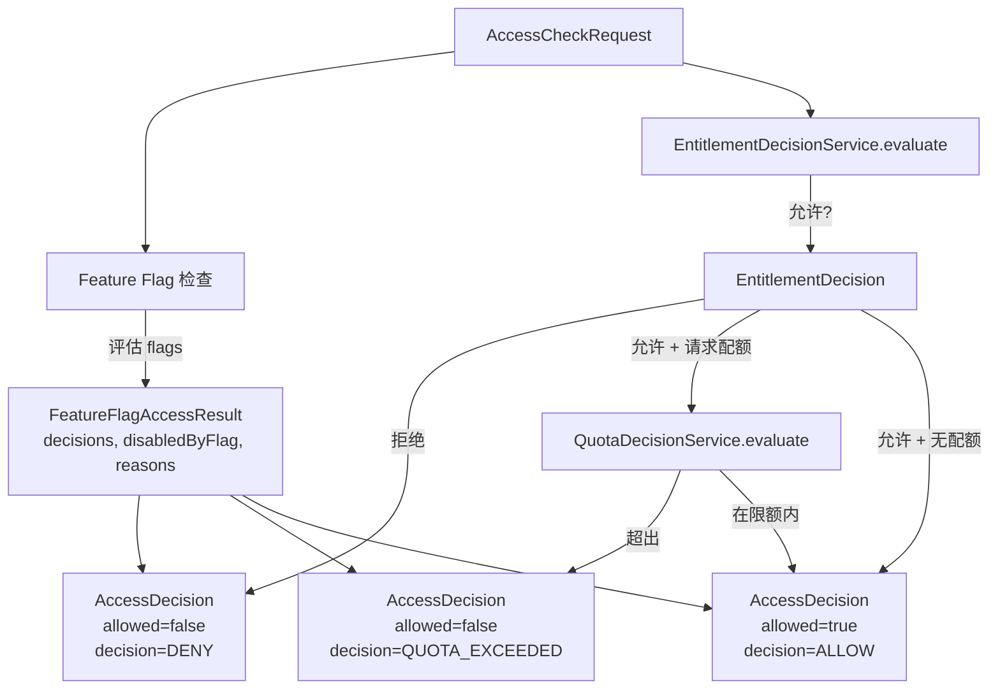

# 访问决策服务

> **模块：** `entitlement-module`
> **最后更新：** 2026-05-19

## 概述

`AccessDecisionService` 是中央访问控制编排器。它将 Feature Flag 评估、权益决策和配额检查合并为单一的 `AccessDecision` 结果。

## 实现状态

| 组件 | 状态 |
|------|------|
| `AccessDecisionService` | ✅ 已实现 |
| `AccessDecisionFeatureFlagService` | ✅ 已实现 |
| `EntitlementDecisionService` | ✅ 已实现 |
| `QuotaDecisionService` | ✅ 已实现 |
| `AccessDecision` 记录 | ✅ 已实现（17 个字段） |
| `NavigationDecisionService` | ✅ 已实现 |
| 账单集成到决策链 | ⚠️ 部分实现（BillingDecisionService 存在但未接入 AccessDecisionService） |
| 异常检查集成到决策链 | 🔴 未接入 AccessDecisionService |

## 决策流程



## AccessDecision 记录

```java
public record AccessDecision(
    boolean allowed,                              // 最终允许/拒绝
    String decision,                              // "ALLOW" | "DENY" | "QUOTA_EXCEEDED"
    String reasonCode,                            // 例如 "TIER"、"TENANT_OVERRIDE"、"DEFAULT_DENY"
    String userFriendlyMessage,                   // 人类可读的消息
    String currentTier,                           // 例如 "FREE"、"PRO"、"TEAM"、"ENTERPRISE"
    List<String> matchedPolicies,                 // 例如 ["override:abc", "tier:PRO"]
    String matchedGrantId,                        // 匹配的权益授权 ID
    String matchedOverrideId,                     // 匹配的覆盖 ID
    String matchedWorkspacePoolId,                // 匹配的工作区池 ID
    Long quotaRemaining,                          // 请求后的剩余配额
    String recommendedAlternative,                // 建议的替代功能
    List<String> upgradeOptions,                  // 升级建议
    Instant expiresAt,                            // 权益过期时间
    boolean requiresReview,                       // 是否需要人工审核
    List<FeatureFlagDecision> matchedFeatureFlags, // 所有 FF 评估结果
    boolean disabledByFeatureFlag,                // 是否有 FF 阻止了访问
    List<String> featureFlagReasons               // 被禁用 flag 的原因
) {}
```

## AccessCheckRequest

```java
public record AccessCheckRequest(
    String tenantId,
    String workspaceId,
    String userId,
    String subjectType,
    String subjectId,
    String action,
    String resourceType,
    String resourceId,
    String featureKey,
    String requestedPreset,
    String providerKey,
    String requestSource,
    Long requestedQuota,
    Map<String, Object> context
) {}
```

## 权益决策优先级链

`EntitlementDecisionService.evaluate()` 实现此链。**首次匹配即生效。**

```
1.  EntitlementOverride      （最高优先级 - 租户级覆盖）
2.  WorkspaceMemberGrant     （工作区范围的成员授权）
3.  WorkspacePool            （有剩余配额的工作区权益池）
4.  EntitlementGrant         （来自仓库的用户/群组授权）
5.  Tier Policy              （EntitlementPolicy.forTier）
6.  Default Deny             （无匹配策略）
```

## EntitlementDecisionReason 枚举

```java
public enum EntitlementDecisionReason {
    TIER,                    // 由套餐策略匹配
    TENANT_OVERRIDE,         // 由租户覆盖匹配
    WORKSPACE_OVERRIDE,      // 由工作区覆盖匹配
    WORKSPACE_POOL,          // 由工作区池匹配
    WORKSPACE_MEMBER_GRANT,  // 由工作区成员授权匹配
    USER_GRANT,              // 由用户授权匹配
    GROUP_GRANT,             // 由群组授权匹配
    QUOTA_POLICY,            // 由配额策略匹配
    EXPIRED,                 // 授权已过期
    REVOKED,                 // 授权已被撤销
    ABAC_RULE,               // 由 ABAC 规则匹配
    DEFAULT_DENY             // 无匹配策略
}
```

## 配额决策

```java
public record QuotaDecision(
    String subjectId,
    String quotaCode,
    boolean allowed,
    double limitValue,
    double usedValue
) {}
```

`QuotaDecisionService` 支持：
- `evaluate(subjectId, featureCode, requestedAmount)` — 基本配额检查
- `evaluateWithProfile(subjectId, featureCode, profile, requestedAmount)` — 基于配置文件的配额检查
- `recordUsage(subjectId, featureCode, amount)` — 记录消耗量
- `getRemaining(subjectId, featureCode)` — 获取剩余配额

## Feature Flag 集成

`AccessDecisionFeatureFlagService` 为请求上下文评估所有活跃、未归档的 feature flags：

1. 从 `AccessCheckRequest` 构建 `FeatureFlagContext`
2. 通过 `FeatureFlagService.getFlagsForContext()` 获取所有 flags
3. 通过 `FeatureFlagService.evaluate()` 评估每个 flag
4. 通过 `FeatureFlagAuditService.auditEvaluated()` 审计每次评估
5. 返回包含所有决策、是否有 flag 阻止以及原因的 `FeatureFlagAccessResult`

## 导航决策

`NavigationDecisionService`（位于 `platform-app`）扩展了 UI 路由可见性的访问决策：

```java
public record RouteVisibilityDecision(
    String routeKey,
    String path,
    String title,
    String menuGroup,
    int order,
    boolean visible,           // 路由是否可见
    boolean enabled,           // 路由是否可点击
    String reasonCode,         // 例如 "NAV-403-TIER"、"NAV-404-HIDDEN"
    String userFriendlyMessage,
    String requiredTier,
    String requiredPermission,
    String requiredEntitlement,
    List<String> upgradeOptions,
    List<RouteVisibilityDecision> children,
    Map<String, Boolean> matchedFeatureFlags,
    boolean beta,
    boolean rollout,
    boolean disabledByFeatureFlag
) {}
```

导航评估检查（按顺序）：
1. 来源兼容性
2. 所需角色
3. 所需权限
4. 所需套餐等级
5. 所需功能
6. 所需权益
7. 所需 feature flags
8. Beta flag
9. 灰度发布 flag
10. 导航策略（HIDE / DISABLE 效果）

## 错误代码

| 代码 | HTTP | 描述 |
|------|------|-------------|
| `ENTITLEMENT-403-001` | 403 | 当前套餐不支持此功能 |
| `ENTITLEMENT-403-002` | 403 | 当前套餐不允许使用该提供商 |
| `ENTITLEMENT-403-003` | 403 | 不允许该导出预设 |
| `ENTITLEMENT-403-004` | 403 | 不允许该导出格式 |
| `ENTITLEMENT-404-001` | 404 | 未找到权益授权 |
| `ENTITLEMENT-409-001` | 409 | 权益已授权 |
| `ENTITLEMENT-422-001` | 422 | 无效的权益请求 |
| `FF-403-001` | 403 | 功能被 flag 禁用 |
| `FF-403-002` | 403 | 套餐中功能不可用 |
| `FF-403-003` | 403 | 导航被 flag 禁用 |
| `FF-403-004` | 403 | 导出被 flag 禁用 |

## 审计追踪

每次访问决策都通过以下方式产生审计追踪：
- `FeatureFlagAuditService.auditEvaluated()` — 记录每次 flag 评估
- `EntitlementService.audit()` — 记录授权/撤销/延期操作
- `AuditPort.record()` — 所有决策事件的共享审计接口

`AccessDecision` 记录本身携带完整的决策上下文（`matchedPolicies`、`matchedFeatureFlags`、`featureFlagReasons`），用于事后审计分析。

## 集成点

| 检查 | 模块 | 服务 | 状态 |
|------|------|------|------|
| Feature Flag | `policy-governance-module` | `AccessDecisionFeatureFlagService` | ✅ 已接入 |
| 权益 | `entitlement-module` | `EntitlementDecisionService` | ✅ 已接入 |
| 配额 | `entitlement-module` | `QuotaDecisionService` | ✅ 已接入 |
| 账单 | `billing-module` | `BillingDecisionService` | ⚠️ 独立运行，未接入 AccessDecisionService |
| ABAC 策略 | `policy-governance-module` | `PolicyEvaluationService` | ⚠️ 独立运行，未接入 AccessDecisionService |
| 异常 | `audit-compliance-module` | `AnomalyDetectionService` | 🔴 未接入 AccessDecisionService |
