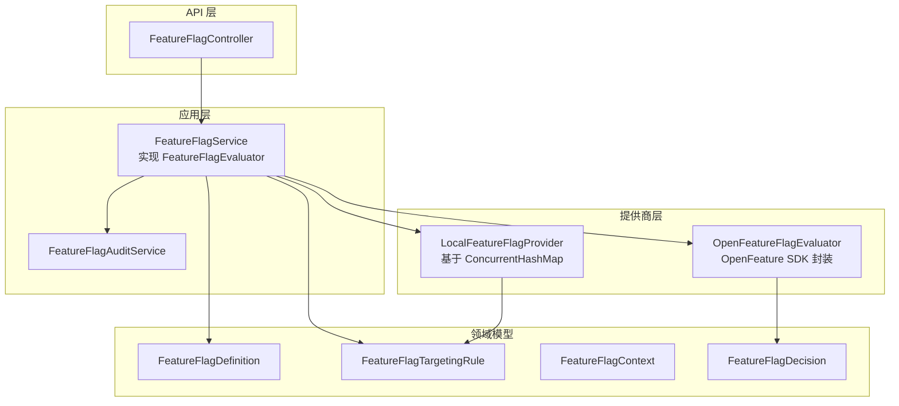

# Feature Flag 治理

> **模块：** `policy-governance-module`
> **最后更新：** 2026-05-19

## 概述

Feature flag 系统为功能、UI 元素、实验和灰度发布提供开关信号。它同时支持本地内存提供商和 OpenFeature 标准 SDK。

## 实现状态

| 组件 | 状态 |
|------|------|
| `FeatureFlagService` | ✅ 已实现 |
| `LocalFeatureFlagProvider` | ✅ 已实现 |
| `OpenFeatureFlagEvaluator` | ✅ 已实现 |
| `FeatureFlagAuditService` | ✅ 已实现 |
| `FeatureFlagController` | ✅ 已实现 |
| `OpenFeatureContextMapper` | ✅ 已实现 |
| `OpenFeatureFlagsConfiguration` | ✅ 已实现 |
| 远程提供商（Unleash/LaunchDarkly） | ⚠️ 可通过 `app.features.unleash.*` 配置但未默认配置 |
| 状态持久化 | 🔧 仅内存存储（重启后丢失） |

## 架构



## 关键设计决策

1. **Feature Flag ≠ 权益**：Feature flags 提供开关信号。权益定义每个套餐的产品能力。两者都输入到 `AccessDecisionService`。

2. **LocalFeatureFlagProvider 作为默认**：OpenFeature 远程提供商为可选。本地提供商支持百分比灰度、租户/工作区/用户/角色/群组/套餐/区域定向和时间窗口。

3. **决策流程**：Feature flags 作为 `AccessDecisionService.check()` → `AccessDecisionFeatureFlagService.evaluateForAccessDecision()` 的一部分进行评估。

## Feature Flag 领域模型

### FeatureFlagDefinition

```java
public record FeatureFlagDefinition(
    String flagKey,                          // 唯一标识符
    String name,                             // 显示名称
    String description,                      // 描述
    FeatureFlagType flagType,                // BOOLEAN | STRING | NUMBER | JSON
    Object defaultValue,                     // 无规则匹配时的默认值
    List<FeatureFlagVariant> variants,       // A/B 测试变体
    List<FeatureFlagTargetingRule> targetingRules,  // 有序的定向规则
    boolean enabled,                         // 主开关
    String owner,                            // 团队或人员
    List<String> tags,                       // 例如 ["ui", "beta"]
    Instant createdAt,
    Instant updatedAt,
    boolean archived                         // 软删除
) {}
```

### FeatureFlagTargetingRule

```java
public record FeatureFlagTargetingRule(
    String ruleId,
    String flagKey,
    Integer priority,          // 越低越先评估
    boolean enabled,
    String tenantId,           // 匹配特定租户
    String workspaceId,        // 匹配特定工作区
    String userId,             // 匹配特定用户
    String role,               // 匹配特定角色
    String group,              // 匹配特定群组
    String tier,               // 匹配特定套餐
    Double percentage,         // 0-100 百分比灰度
    String region,             // 匹配特定区域
    String requestSource,      // 匹配请求来源
    String environment,        // 匹配环境
    Instant startAt,           // 时间窗口开始
    Instant endAt              // 时间窗口结束
) {}
```

### FeatureFlagContext

```java
public record FeatureFlagContext(
    String tenantId,
    String workspaceId,
    String userId,
    List<String> roles,
    List<String> groups,
    String tier,
    String requestSource,
    String environment,
    String region,
    String riskLevel,
    Map<String, Object> attributes
) {}
```

### FeatureFlagDecision

```java
public record FeatureFlagDecision(
    String flagKey,
    boolean enabled,
    String variant,                    // "enabled" | "disabled" | 自定义变体键
    String reasonCode,                 // "RULE_MATCHED" | "NO_MATCHING_RULE" | "FLAG_DISABLED" | "FLAG_ARCHIVED" | "FLAG_NOT_DEFINED" | "ERROR"
    FeatureFlagProviderType providerType,  // LOCAL | OPENFEATURE
    String matchedRule,                // 匹配的规则 ID
    String tenantId,
    String workspaceId,
    String userId,
    Instant evaluatedAt,
    Map<String, Object> details
) {}
```

## 本地评估逻辑

`LocalFeatureFlagProvider.evaluate()` 遵循以下算法：

1. 如果 flag 未找到、已禁用或已归档 → 返回默认值并附带相应原因
2. 加载按优先级排序的活跃定向规则
3. 对于每条规则：
   - 如果已过期（在 startAt/endAt 窗口之外）→ 跳过
   - 检查所有条件（租户、工作区、用户、角色、群组、套餐、区域、请求来源、环境）
   - 如果设置了百分比，基于哈希计算灰度
   - 如果所有条件匹配 → 返回规则结果
4. 如果没有规则匹配 → 返回默认值并附带 "NO_MATCHING_RULE"

## REST API

| 方法 | 路径 | 描述 |
|------|------|------|
| GET | `/api/v1/feature-flags` | 列出所有 flags |
| POST | `/api/v1/feature-flags` | 创建 flag |
| GET | `/api/v1/feature-flags/{id}` | 获取 flag 详情 |
| PUT | `/api/v1/feature-flags/{id}` | 更新 flag |
| DELETE | `/api/v1/feature-flags/{id}` | 删除 flag |
| POST | `/api/v1/feature-flags/{id}/evaluate` | 评估 flag |
| GET | `/api/v1/feature-flags/{id}/audit` | 审计日志 |

## 审计事件（15+ 种类型）

| 事件 | 触发条件 | 方法 |
|------|----------|------|
| `FLAG_CREATED` | 创建新 flag | `auditFlagCreated()` |
| `FLAG_UPDATED` | 修改 flag | `auditFlagUpdated()` |
| `FLAG_ENABLED` | 启用 flag | `auditFlagEnabled()` |
| `FLAG_DISABLED` | 禁用 flag | `auditFlagDisabled()` |
| `FLAG_ARCHIVED` | 归档 flag | `auditFlagArchived()` |
| `FLAG_EVALUATED` | 评估 flag | `auditEvaluated()` |
| `FLAG_EVALUATION_FAILED` | 评估出错 | `auditEvaluationFailed()` |
| `RULE_CREATED` | 添加定向规则 | `auditRuleCreated()` |
| `RULE_UPDATED` | 修改定向规则 | `auditRuleUpdated()` |
| `RULE_DELETED` | 删除定向规则 | `auditRuleDeleted()` |
| `ROLLOUT_CHANGED` | 更改百分比 | `auditRolloutChanged()` |
| `VARIANT_CHANGED` | 更改变体 | `auditVariantChanged()` |
| `POLICY_EVALUATED_WITH_FEATURE_FLAG` | 策略 + FF 评估 | `auditPolicyEvaluatedWithFeatureFlag()` |
| `ACCESS_DENIED_BY_FEATURE_FLAG` | FF 拒绝访问 | `auditAccessDeniedByFeatureFlag()` |
| `NAVIGATION_DISABLED_BY_FEATURE_FLAG` | FF 禁用导航 | `auditNavigationDisabledByFeatureFlag()` |

审计事件存储在内存中（上限 10,000 条）并转发到 `AuditPort` 进行持久化审计记录。

## 错误代码（13 个 FF- 代码）

| 代码 | HTTP | 描述 |
|------|------|-------------|
| `FF-404-001` | 404 | 未找到 feature flag |
| `FF-404-002` | 404 | 未找到 feature flag 变体 |
| `FF-403-001` | 403 | 功能被 flag 禁用 |
| `FF-403-002` | 403 | 套餐中功能不可用 |
| `FF-403-003` | 403 | 导航被 flag 禁用 |
| `FF-403-004` | 403 | 导出被 flag 禁用 |
| `FF-403-005` | 403 | 扩展运行时 flag 已禁用 |
| `FF-403-006` | 403 | GraphQL 功能已禁用 |
| `FF-403-007` | 403 | 错误码功能已禁用 |
| `FF-409-001` | 409 | 功能开关已存在 |
| `FF-422-001` | 422 | 无效的开关配置 |
| `FF-500-001` | 500 | OpenFeature 评估错误 |
| `FF-EVAL-OPENFEATURE-001` | 500 | OpenFeature SDK 异常 |

## OpenFeature 集成

- `OpenFeatureFlagEvaluator` 封装 OpenFeature Java SDK
- 支持布尔值、字符串、数字和 JSON flag 类型
- SDK 异常时回退到默认值
- `OpenFeatureContextMapper` 将 `FeatureFlagContext` 映射到 OpenFeature `EvaluationContext`
- 远程提供商（LaunchDarkly、flagd、Unleash）可通过 `app.features.unleash.*` 配置

## 🔴 生产阻塞项

远程提供商未配置；状态在重启后不持久。所有 feature flags 通过 `ConcurrentHashMap` 存储在内存中。重启将丢失所有 flag 定义和定向规则。
