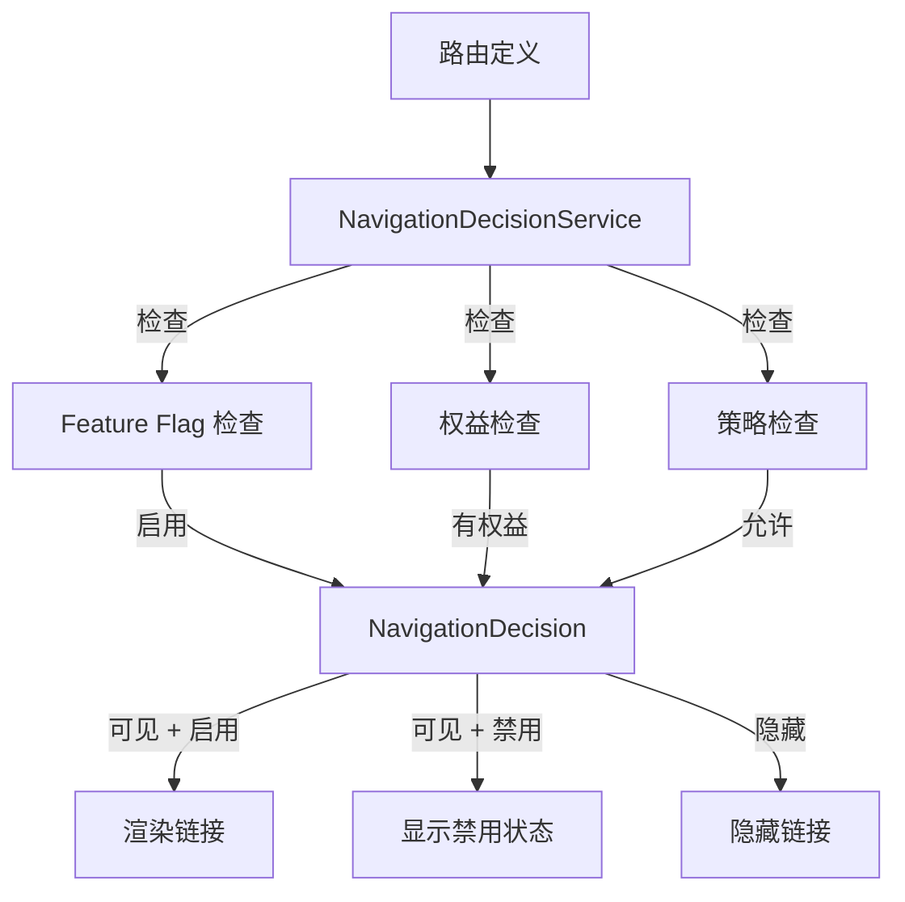

# 可配置导航

> **模块：** `policy-governance-module`
> **最后更新：** 2026-05-18

## 概述

可配置导航系统允许基于 feature flags、权益和策略动态控制 UI 路由的可见性和可访问性。

## 架构



## 路由定义

```java
public record RouteDefinition(
    String routeId,
    String path,
    String label,
    String requiredFeatureFlag,
    String requiredEntitlement,
    String requiredRole,
    boolean betaOnly
) {}
```

## 导航决策

```java
public record NavigationDecision(
    boolean visible,
    boolean enabled,
    String disabledReason,
    String upgradePrompt
) {}
```

## V16 迁移

`V16__navigation.sql` 迁移添加了以下表：
- 路由定义
- 导航策略
- 路由-feature flag 映射
