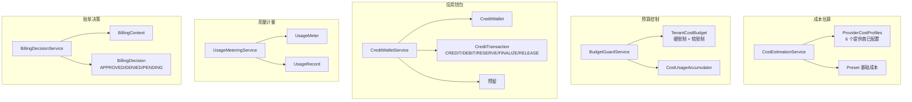

# 成本控制

> **模块：** `billing-module`
> **最后更新：** 2026-05-19

## 概述

成本控制系统为渲染操作提供计量、预算编制、成本预留和信用钱包管理。

## 实现状态

| 组件 | 状态 |
|------|------|
| `CostEstimationService` | ✅ 已实现 |
| `BudgetGuardService` | ✅ 已实现 |
| `CostReservationService` | ✅ 已实现 |
| `CreditWalletService` | ✅ 已实现 |
| `UsageMeteringService` | ✅ 已实现 |
| `BillingDecisionService` | ✅ 已实现 |
| `BillingDecisionService` 集成到 `AccessDecisionService` | 🔴 未接入 |
| `BudgetGuardService` 集成到 `EntitlementPolicyService` | ⚠️ 通过可选的 `BudgetGuardPort` 接入 |

## 架构



## 成本估算

`CostEstimationService` 基于以下因素估算渲染任务成本：

- **提供商成本配置文件**（6 个提供商）：javacv、ofx、gpac、mlt、gstreamer、remote-javacv
- **预设乘数**：例如 `default_1080p` = 1.0x、`4k_2160p` = 3.5x、`preview_720p` = 0.3x
- **计算成本**：`小时数 * cpuCostPerHour * 乘数`（GPU 使用 `gpuCostPerHour`）
- **存储成本**：`storageCostPerGbMonth * 0.001 * 乘数`
- **API 调用成本**：每个提供商固定费用

默认提供商配置文件：

| 提供商 | CPU/小时 | GPU/小时 | 存储/GB/月 | API 调用 |
|--------|----------|----------|------------|----------|
| javacv | $0.05 | $0.00 | $0.02 | $0.08 |
| ofx | $0.08 | $0.00 | $0.02 | $0.08 |
| gpac | $0.03 | $0.00 | $0.02 | $0.12 |
| mlt | $0.04 | $0.00 | $0.02 | $0.08 |
| gstreamer | $0.04 | $0.00 | $0.02 | $0.08 |
| remote-javacv | $0.06 | $0.25 | $0.02 | $0.08 |

## 预算守卫

`BudgetGuardService` 管理每个租户的成本预算：

```java
public record BudgetCheckResult(
    boolean allowed,
    boolean warning,
    double currentSpend,
    double budgetLimit,
    double remainingBudget,
    String message
) {}
```

预算状态：
- **未配置预算** → 允许（无限制）
- **低于软限制（80%）** → 允许
- **超过软限制** → 允许但警告
- **超过硬限制** → 拒绝

## 成本预留

`CreditWalletService` 支持预留模式：
1. `reserve(walletId, amount, ...)` → 创建预留，返回 `reservationId`
2. `finalize(walletId, reservationId, actualAmount, ...)` → 扣除实际金额，释放预留
3. `release(walletId, reservationId, ...)` → 释放预留但不扣款

## 信用钱包

```java
public record CreditWallet(
    String walletId,
    String tenantId,
    String workspaceId,
    String userId,
    long balanceMinor,      // 以次要货币单位（分）计价的余额
    String currencyCode,
    String status,          // ACTIVE | SUSPENDED | CLOSED
    Instant createdAt,
    Instant updatedAt
) {}
```

交易类型：`CREDIT`、`DEBIT`、`RESERVE`、`FINALIZE`、`RELEASE`

## 用量计量

`UsageMeteringService` 通过幂等性支持记录用量：
- 重复的 `idempotencyKey` → 返回已有记录（防止重复计数）
- 按租户和按计量器查询
- 活跃计量器注册表

## 账单决策

`BillingDecisionService` 产生账单决策：

```java
public record BillingDecision(
    String decisionId,
    String action,
    String tenantId,
    String userId,
    String pricingModel,
    long estimatedAmountMinor,
    String currencyCode,
    boolean useCredits,
    Map<String, Object> details,
    String status           // APPROVED | DENIED | PENDING
) {}
```

## 异常检测规则

| 规则 ID | 类型 | 严重级别 | 描述 |
|---------|------|----------|------|
| CST-001 | COST_ANOMALY | 高 | 成本 > 预估的 2 倍 |
| SLA-001 | SLA_BREACH | 严重 | 超过 SLA 时间 |
| RJB-001 | MISSING_FIELD | 高 | 完成但无成品 |
| RJB-002 | INVALID_STATE | 中 | 卡住 > 30 分钟 |
| RJB-003 | DUPLICATE | 低 | 相同项目+配置+时间轴 |
| PMT-001 | SENSITIVE_DATA | 严重 | 记录中包含敏感数据 |
| PMT-002 | OUTPUT_MISMATCH | 高 | 输出格式不匹配 |
| PMT-003 | LOGIC_CONFLICT | 高 | 风险等级升级 |

## 分级缓解

| 严重级别 | 操作 |
|----------|------|
| 严重 | 阻止 + Sentry 告警 |
| 高 | 警告 + 需要确认 |
| 中 | 记录警告 |
| 低 | 记录信息 |

## 错误代码

| 代码 | HTTP | 描述 |
|------|------|-------------|
| `BILLING-403-001` | 403 | 超出预算限制 |
| `BILLING-403-002` | 403 | 余额不足 |
| `BILLING-404-001` | 404 | 未找到钱包 |
| `BILLING-409-001` | 409 | 重复交易（幂等键） |
| `BILLING-422-001` | 422 | 无效的账单请求 |
