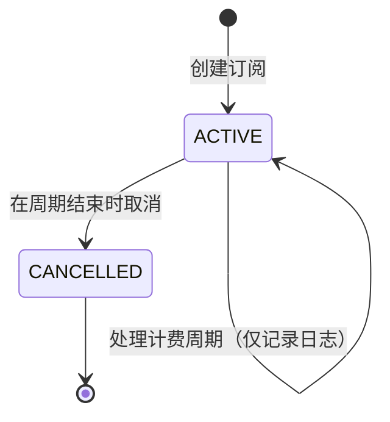
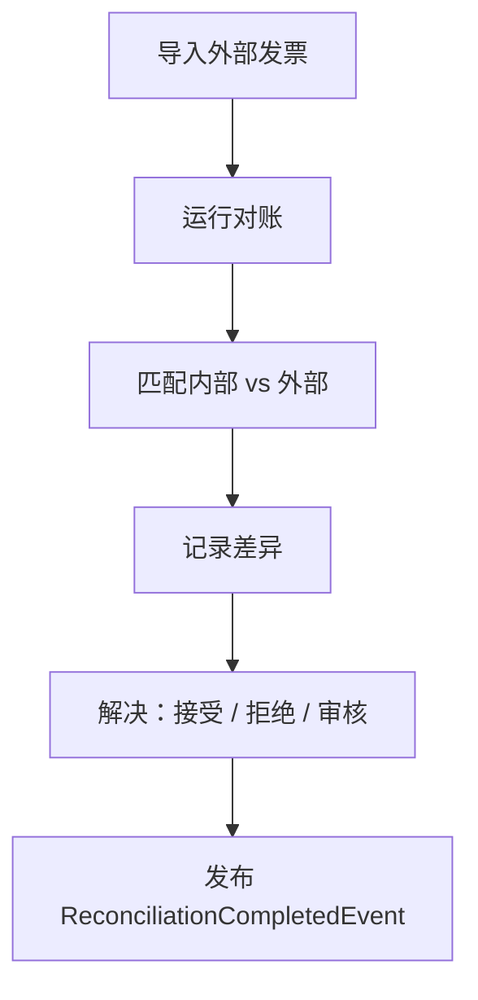

# 计费模型

> **模块：** `billing-module`、`quota-billing-module`
> **最后更新：** 2026-05-19

## 概述

计费引擎提供定价模型、订阅生命周期、评级、对账和信用钱包管理。

## 实现状态

| 组件 | 状态 |
|------|------|
| `PricingRuleService` | ✅ 已实现 |
| `RatingEngine` | ✅ 已实现 |
| `SubscriptionBillingService` | ✅ 已实现 |
| `BillingLedgerService` | ✅ 已实现 |
| `BillingProjectionService` | ✅ 已实现 |
| `ReconciliationService` | ✅ 已实现 |
| `CreditWalletService` | ✅ 已实现 |
| `BillingDecisionService` | ✅ 已实现 |
| `CostEstimationService` | ✅ 已实现 |
| `BudgetGuardService` | ✅ 已实现 |
| `CostReservationService` | ✅ 已实现 |
| `UsageMeteringService` | ✅ 已实现 |
| `BillingEngine` SPI | ✅ 接口已定义 |
| `NoopKillBillBillingEngine` | 🔧 存根（仅返回预计状态） |
| 支付处理 | 🔧 无操作（无真实支付提供商） |
| 订阅计费周期 | 🔧 仅记录日志，不实际扣费 |

## 定价模型

| 模型 | 描述 | 状态 |
|------|------|------|
| 按分钟计费 | 按渲染分钟收费 | ✅ |
| 按任务计费 | 每个任务固定费用 | ✅ |
| 订阅制 | 月/年套餐 | ✅ |
| 按用量计费 | 分层用量定价 | ✅ |
| 自定义定价 | 租户特定覆盖 | ✅ |
| 积分钱包 | 预付积分 | ✅ |
| 企业版 | 定制合同定价 | ✅ |

## 评级引擎

`RatingEngine` 将用量记录转换为已评级金额：

```java
public record RatedUsageRecord(
    String ratedUsageId,
    String usageRecordId,
    String pricingRuleId,
    long ratedAmountMinor,
    String currencyCode,
    Map<String, Object> details,
    Instant ratedAt
) {}
```

支持：
- **固定费率**：`quantity * unitPriceMinor`
- **阶梯定价**：渐进阶梯，每阶梯含固定费用

## 定价规则服务

`PricingRuleService` 管理：
- **PricingRule**：带可选阶梯费率的基础定价
- **CustomPricingRule**：租户/工作区级别的覆盖，含折扣百分比
- **DiscountPolicy**：百分比或固定金额折扣，含条件

```java
public record PricingRule(
    String ruleId,
    String ruleKey,
    String name,
    String description,
    PricingModel pricingModel,    // USAGE_BASED | PER_JOB | SUBSCRIPTION | CUSTOM
    String meterKey,
    long unitPriceMinor,
    String currencyCode,
    List<PricingTier> tiers,      // 可选阶梯费率
    String status,
    Instant effectiveFrom,
    Instant effectiveTo,
    Instant createdAt,
    Instant updatedAt
) {}
```

### 定价预览

`PricingRuleService.pricingPreview()` 计算完整的定价明细：
1. 查找计量键的活跃定价规则
2. 计算基础金额（固定或阶梯）
3. 应用租户自定义定价覆盖（如有）
4. 应用折扣策略（如条件匹配）
5. 返回包含完整明细的 `PricingPreviewResult`

## 订阅生命周期



`SubscriptionBillingService`：
- 使用 `billingInterval`、`basePriceMinor`、`includedQuota` 创建套餐
- 创建带周期跟踪的订阅
- 支持 `changePlan()` 和 `cancelAtPeriodEnd()`
- `processBillingCycle()` 仅记录日志，不实际扣费（🔧 存根）

```java
public record SubscriptionPlan(
    String planId,
    String planKey,
    String name,
    String description,
    String billingInterval,       // MONTHLY | ANNUAL
    long basePriceMinor,
    String currencyCode,
    Map<String, Long> includedQuota,
    String status,
    Instant createdAt,
    Instant updatedAt
) {}

public record SubscriptionContract(
    String contractId,
    String tenantId,
    String userId,
    String planKey,
    Instant periodStartAt,
    Instant periodEndAt,
    String lifecycleState,        // ACTIVE | CANCELLED
    long basePriceMinor,
    String currencyCode,
    Map<String, Long> includedQuota,
    Map<String, Long> includedQuotaUsed
) {}
```

## 信用钱包

| 功能 | 状态 | 备注 |
|------|------|------|
| 钱包创建 | ✅ | 每个租户 |
| 充值（充值） | ✅ | 仅内存中（无真实支付） |
| 扣款 | ✅ | 扣款前检查余额 |
| 预留 | ✅ | 预留 → 完成/释放模式 |
| 交易历史 | ✅ | 所有交易按时间倒序记录 |
| 管理员管理 | ✅ | 管理员可调整余额 |

## 对账

`ReconciliationService` 对内部成本记录与外部发票进行对账：



对账流程：
1. 导入外部发票（CSV/JSON 模拟）
2. 按周期运行对账
3. 匹配内部 `CostLedgerEntry` 与外部 `ThirdPartyInvoiceImport`
4. 为未匹配的记录记录 `ReconciliationDifference`
5. 解决差异（ACCEPTED / REJECTED / NEEDS_REVIEW）
6. 发布 `ReconciliationCompletedEvent`

## 计费引擎 SPI

```java
public interface BillingEngine {
    // 外部账单系统集成的 SPI（例如 Kill Bill）
}
```

当前实现：`NoopKillBillBillingEngine` — 仅返回预计状态。

## V17 迁移

`V17__billing_models.sql` 添加了以下表：
- 灵活计费配置
- 自定义定价规则
- 订阅增强

## 🔧 存根实现说明

- `NoopKillBillBillingEngine` — 仅返回预计状态
- `NoopStripePaymentProvider` — 无操作支付处理
- 订阅计费周期记录日志但不实际扣费
- 所有账单状态通过 `ConcurrentHashMap` 存储在内存中

## 错误代码

| 代码 | HTTP | 描述 |
|------|------|-------------|
| `BILLING-403-001` | 403 | 超出预算限制 |
| `BILLING-403-002` | 403 | 余额不足 |
| `BILLING-404-001` | 404 | 未找到钱包 |
| `BILLING-404-002` | 404 | 未找到订阅 |
| `BILLING-409-001` | 409 | 重复交易 |
| `BILLING-422-001` | 422 | 无效的账单请求 |
| `BILLING-500-001` | 500 | 账单引擎错误 |
