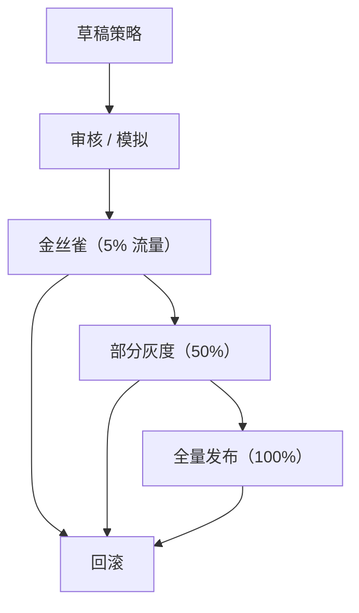

# 未来扩展方向

> **最后更新：** 2026-05-19

## 概述

本文档描述外部策略引擎（Casbin、OpenFGA）的计划集成路径以及 ABAC/访问决策系统的其他未来扩展。

## 当前架构

平台当前实现了一个自定义 ABAC 系统：

```
PolicyEvaluationService    → 带 Feature Flag 条件匹配的自定义规则
AccessDecisionService      → 编排 FF + 权益 + 配额
EntitlementDecisionService → 基于套餐 + 授权 + 覆盖
NavigationDecisionService  → 带套餐/角色/FF 检查的路由可见性
```

所有策略状态通过 `ConcurrentHashMap` 存储在内存中。没有外部策略引擎集成。

## Casbin 集成 📋

### 目的

Casbin 提供标准化的、配置驱动的策略引擎，支持 RBAC、ABAC 和多种访问模型。它可以作为：

1. **RBAC 层**：用 Casbin 的 RBAC 模型替换当前的手动角色/权限检查
2. **轻量 ABAC**：用于简单的基于属性的规则（例如 `user.tier == "ENTERPRISE"`）
3. **策略管理**：非开发人员可以通过 Casbin 的配置文件或管理 API 管理策略

### 集成点

```java
@Service
public class CasbinPolicyBridge {

    private final Enforcer casbinEnforcer;
    private final PolicyEvaluationService existingPolicyService;

    public PolicyDecision evaluateWithCasbin(PolicyContext context) {
        // 1. 通过 Casbin 评估 RBAC/轻量 ABAC
        boolean casbinAllowed = casbinEnforcer.enforce(
            context.userId(), context.role(), context.resourceType(), context.action());

        if (!casbinAllowed) {
            return new PolicyDecision(PolicyEffect.DENY,
                "被 Casbin 策略拒绝", "casbin-deny");
        }

        // 2. 回退到现有 ABAC 处理复杂属性条件
        return existingPolicyService.evaluate(context);
    }
}
```

### Casbin 模型配置示例

```ini
[request_definition]
r = sub, dom, obj, act

[policy_definition]
p = sub, dom, obj, act, eft

[role_definition]
g = _, _, _

[policy_effect]
e = some(where (p.eft == allow)) && !some(where (p.eft == deny))

[matchers]
m = g(r.sub, p.sub, r.dom) && r.dom == p.dom && r.obj == p.obj && r.act == p.act
```

### 优势
- 标准化的策略语言（CONF 格式）
- 通过数据库适配器（JDBC、JPA）持久化策略
- 运行时策略管理的管理 API
- 社区支持和文档

### 迁移路径
1. 与现有 `PolicyEvaluationService` 并行部署 Casbin
2. 使用当前 RBAC 规则配置 Casbin
3. 首先通过 Casbin 路由 RBAC 检查
4. 将复杂 ABAC 条件保留在 `PolicyEvaluationService` 中
5. 逐步将 ABAC 规则迁移到 Casbin 的 ABAC 模型

## OpenFGA 集成 📋

### 目的

OpenFGA（由 Okta 开发）基于 Google 的 Zanzibar 论文提供细粒度授权。它支持复杂的资源关系：

```
user:alice   → viewer → document:report1
team:eng     → member → user:alice
document:report1 → parent → folder:engineering
```

在本平台中的使用场景：
- **扩展市场**：`user → publisher → extension → version`
- **工作区层级**：`user → member → workspace → project → render_job`
- **共享资源**：`user → viewer → project`（工作区之间的项目共享）
- **多租户隔离**：`tenant → owns → workspace → contains → resource`

### 集成点

```java
@Service
public class OpenFGAPolicyBridge {

    private final Client fgaClient;
    private final PolicyEvaluationService existingPolicyService;

    public boolean checkResourceAccess(String userId, String relation, String objectType, String objectId) {
        try {
            CheckResponse response = fgaClient.check(CheckRequest.builder()
                .user("user:" + userId)
                .relation(relation)
                .object(objectType + ":" + objectId)
                .build()).get();

            return response.getAllowed();
        } catch (Exception e) {
            // 回退到现有 ABAC
            return fallbackToExistingABAC(userId, relation, objectType, objectId);
        }
    }
}
```

### OpenFGA 模型示例

```yaml
type user
type tenant
  relations
    define owner: [user]
    define admin: [user]
    define member: [user]
type workspace
  relations
    define tenant: [tenant]
    define owner: [user]
    define editor: [user]
    define viewer: [user]
    define member: [user] or editor or viewer
type project
  relations
    define workspace: [workspace]
    define owner: [user]
    define editor: [user]
    define viewer: [user]
    define can_view: [user] or viewer or editor or owner
    define can_edit: [user] or editor or owner
    define can_delete: [user] or owner
type render_job
  relations
    define project: [project]
    define owner: [user]
    define can_view: [user] or owner from project or can_view from project
    define can_cancel: [user] or owner from project
```

### 优势
- 资源级别的细粒度授权
- 基于关系的访问控制（ReBAC）
- 可扩展（基于 Google Zanzibar）
- 关系变更的审计追踪

### 迁移路径
1. 在平台旁部署 OpenFGA 服务
2. 定义授权模型（类型、关系）
3. 从现有数据种子化初始关系元组
4. 为资源级操作添加 OpenFGA 检查
5. 将套餐/权益检查保留在现有服务中（OpenFGA 是补充而非替代）

## 统一决策链 📋

未来的统一决策链：

```
身份验证
  → RBAC（Casbin）                    📋 未来
  → ABAC（PolicyEvaluationService）    ✅ 当前
  → Feature Flag（FeatureFlagService） ✅ 当前
  → 权益（EntitlementDecision）        ✅ 当前
  → 配额（QuotaDecisionService）       ✅ 当前
  → 账单（BillingDecisionService）     ✅ 当前
  → 资源关系（OpenFGA）                📋 未来
  → AccessDecision（最终结果）
```

## 策略评估的策略模式 📋

为支持多个策略引擎，引入策略接口：

```java
public interface PolicyEvaluationStrategy {
    PolicyDecision evaluate(PolicyContext context);
    int priority();  // 评估顺序
}

@Component
public class CasbinEvaluationStrategy implements PolicyEvaluationStrategy { ... }

@Component
public class CustomABACEvaluationStrategy implements PolicyEvaluationStrategy { ... }

@Component
public class CompositePolicyEvaluator {
    private final List<PolicyEvaluationStrategy> strategies;

    public PolicyDecision evaluate(PolicyContext context) {
        for (PolicyEvaluationStrategy strategy : strategies.stream()
                .sorted(Comparator.comparingInt(PolicyEvaluationStrategy::priority))
                .toList()) {
            PolicyDecision decision = strategy.evaluate(context);
            if (decision.effect() == PolicyEffect.DENY) {
                return decision;  // 首个拒绝即生效
            }
        }
        return new PolicyDecision(PolicyEffect.ALLOW, "所有策略通过", "composite");
    }
}
```

## 策略版本控制与灰度发布 📋

### 当前状态

`PolicyVersion` 记录存在但未主动使用：
```java
public record PolicyVersion(String id, String policyId, int version, String content) {}
```

### 未来增强



实现方法：
1. 存储带状态的策略版本（DRAFT、CANARY、ACTIVE、ROLLED_BACK）
2. 为 `PolicyEvaluationService` 添加基于百分比的路由
3. 跟踪每个版本的评估指标
4. 添加版本管理和回滚的管理 UI

## 策略审计增强 📋

### 当前状态

审计事件记录在内存中（上限 10,000 条）并转发到 `AuditPort`。

### 未来增强

- 持久化审计日志存储（数据库表）
- 带过滤功能的审计日志查询 API（按用户、租户、时间范围、决策）
- 审计日志导出（CSV/JSON）
- 实时审计流（WebSocket/SSE）
- 决策解释 API：给定一个 `AccessDecision`，返回完整的评估链
