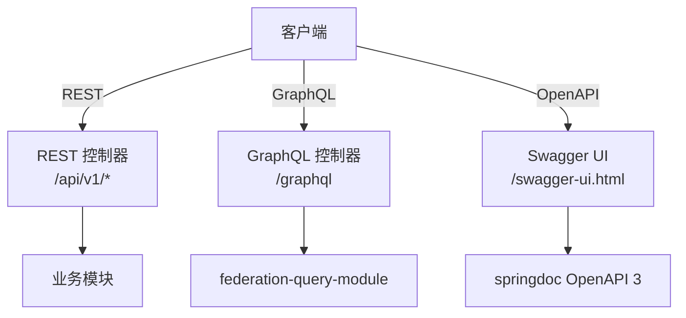

# API 策略

> **模块：** 所有包含 API 端点的模块
> **最后更新：** 2026-05-18

## 多协议 API 架构



## REST API 规范

| 规范 | 规则 |
|------|------|
| 基础路径 | `/api/v1/*` |
| 版本控制 | URL 路径版本控制 |
| 错误格式 | 包含 `errorCode`、`message`、`details` 的 `ProblemDetail` |
| 分页 | `page`、`size`、`sort` 参数 |
| 过滤 | 查询参数 |
| 响应格式 | JSON |

## API 版本控制策略

| 方法 | 用途 |
|------|------|
| URL 路径 | `/api/v1/`、`/api/v2/`（主要） |
| 请求头 | `Accept: application/vnd.platform.v1+json`（可选） |
| 弃用 | `@Deprecated` 注解 + 响应头 |

## 错误响应格式

```json
{
  "errorCode": "RENDER-409-001",
  "message": "租户 tenant-123 配额已用完",
  "details": {
    "tenantId": "tenant-123",
    "featureCode": "render.1080p",
    "limit": 60,
    "used": 60
  },
  "timestamp": "2026-05-18T10:00:00Z"
}
```

## 速率限制

| 套餐 | 请求/分钟 | 突发 |
|------|-----------|------|
| 免费版 | 30 | 10 |
| 专业版 | 120 | 30 |
| 团队版 | 600 | 100 |
| 企业版 | 无限制 | 无限制 |

## CORS 配置

| 环境 | 允许的来源 |
|------|-----------|
| 开发环境 | `*` |
| 生产环境 | 可配置白名单 |

## API Key 认证

| 请求头 | 用途 |
|--------|------|
| `X-API-Key` | 服务间认证的 API 密钥 |
| `X-Tenant-ID` | 租户标识 |
| `X-User-ID` | 用户标识 |
| `X-Request-Id` | 请求关联 ID |
