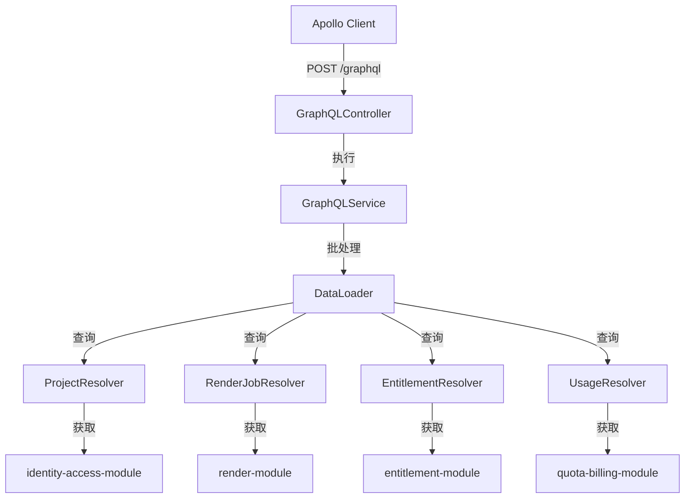

# GraphQL 查询聚合

> **模块：** `federation-query-module`
> **最后更新：** 2026-05-18

## 概述

GraphQL 模块提供只读查询聚合层，将多个后端模块的数据统一到单个 GraphQL 端点之后。

## 架构



## 架构概览

### 查询

| 查询 | 返回值 | 源模块 |
|------|--------|--------|
| `project(id)` | Project | identity-access-module |
| `projects(tenantId)` | [Project] | identity-access-module |
| `renderJob(id)` | RenderJob | render-module |
| `renderJobs(projectId)` | [RenderJob] | render-module |
| `entitlement(subjectId)` | Entitlement | entitlement-module |
| `capabilities(userId)` | Capabilities | entitlement-module |
| `usage(tenantId, feature)` | Usage | quota-billing-module |
| `featureFlag(key)` | FeatureFlag | policy-governance-module |
| `featureFlags` | [FeatureFlag] | policy-governance-module |
| `prompt(id)` | PromptTemplate | prompt-module |
| `prompts(tenantId)` | [PromptTemplate] | prompt-module |
| `analytics(query)` | AnalyticsResult | federation-query-module |

## DataLoader 批处理

DataLoader 用于批量处理 N+1 查询：

```typescript
// 无 DataLoader：N+1 次查询
for (const job of jobs) {
  await fetchProject(job.projectId); // N 次查询
}

// 使用 DataLoader：1 次批量查询
const projectLoader = new DataLoader(async (ids) => {
  return await fetchProjectsByIds(ids); // 1 次查询
});
```

## 查询限制

| 限制 | 值 | 描述 |
|------|-----|------|
| 最大深度 | 5 | 防止深度嵌套查询 |
| 最大复杂度 | 1000 | 防止高成本查询 |
| 最大分页大小 | 100 | 默认分页限制 |
| 超时 | 30 秒 | 查询执行超时 |

## 安全性

- 所有查询均为只读（无 mutations）
- 租户范围自动注入
- 敏感字段被脱敏
- 所有查询均被审计
- 强制执行查询深度和复杂度限制

## REST 回退

每个 GraphQL 查询都有 REST 回退端点，供偏好 REST 的客户端使用。

## 未来演进

| 阶段 | 功能 | 状态 |
|------|------|------|
| 第 1 阶段 | 只读查询、DataLoader | ✅ |
| 第 2 阶段 | 持久化查询 | 📋 |
| 第 3 阶段 | 代码生成 | 📋 |
| 第 4 阶段 | Mutations | 📋 |
| 第 5 阶段 | Federation | 📋 |
