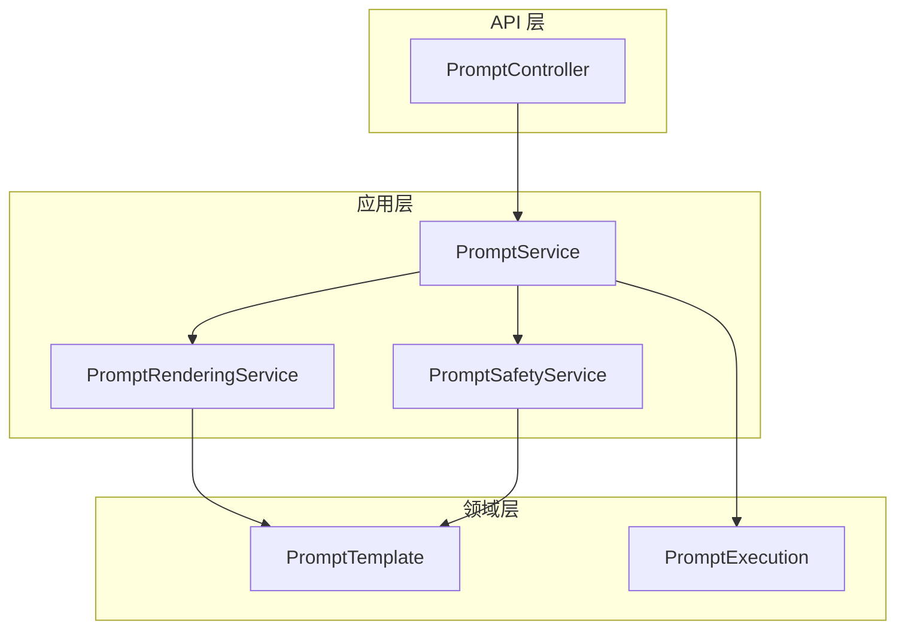
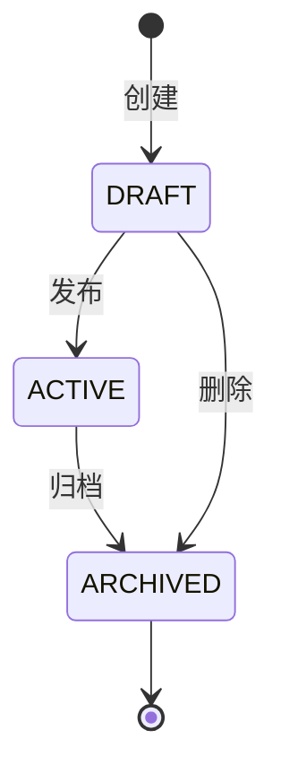

# 提示词工程平台

> **模块：** `prompt-module`
> **最后更新：** 2026-05-18

## 概述

提示词工程平台管理提示词模板，提供生命周期管理、版本控制、变量替换、渲染和安全治理功能。

## 架构



## 模板模型

```java
public record PromptTemplate(
    String id,
    String tenantId,
    String name,
    String description,
    String content,
    List<String> variables,
    int version,
    String status,
    String createdBy,
    Instant createdAt,
    Instant updatedAt
) {}
```

## 变量替换

模板使用 `{{variable}}` 语法：

```
创建一个关于 {{topic}} 的 {{duration}} 秒视频，风格为 {{style}}。
```

## 模板生命周期



## 安全治理

| 检查 | 描述 |
|------|------|
| 内容安全 | 扫描有害内容 |
| 变量校验 | 确保所有变量已声明 |
| 输出校验 | 校验渲染输出 |
| 风险等级 | 为执行分配风险等级 |

## REST API

| 方法 | 路径 | 描述 |
|------|------|------|
| GET | `/api/v1/prompts` | 列出模板 |
| POST | `/api/v1/prompts` | 创建模板 |
| GET | `/api/v1/prompts/{id}` | 获取模板 |
| PUT | `/api/v1/prompts/{id}` | 更新模板 |
| DELETE | `/api/v1/prompts/{id}` | 删除模板 |
| POST | `/api/v1/prompts/{id}/render` | 渲染模板 |
| POST | `/api/v1/prompts/{id}/execute` | 执行模板 |

## 🔧 内存存储

提示词模板存储在 `ConcurrentHashMap` 中。重启后数据丢失。数据库持久化已规划（V11 迁移添加表）。
