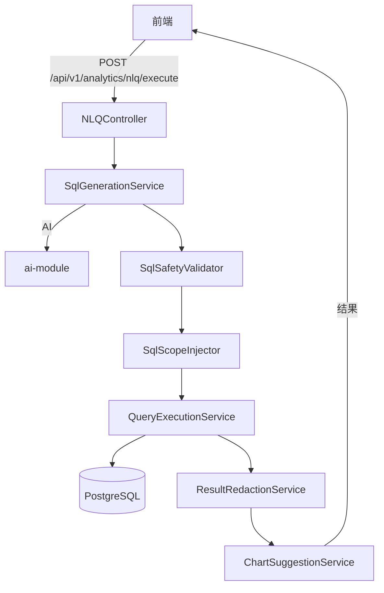

# 自然语言查询（NLQ）助手

> **模块：** `federation-query-module`
> **最后更新：** 2026-05-18

## 概述

NLQ 助手使用户能够使用自然语言问题查询平台分析数据。系统将问题转换为 SQL，验证安全性，强制执行作用域隔离，执行只读查询，并返回结果和图表建议。

## 架构

## REST API

### NLQ 端点

| 方法 | 路径 | 描述 |
|------|------|------|
| POST | `/api/v1/analytics/nlq/preview` | 生成 SQL 预览 |
| POST | `/api/v1/analytics/nlq/execute` | 执行查询 |
| POST | `/api/v1/analytics/nlq/explain` | 解释 SQL |
| POST | `/api/v1/analytics/nlq/chart-suggestions` | 图表建议 |
| GET | `/api/v1/analytics/nlq/datasets` | 列出数据集 |
| GET | `/api/v1/analytics/nlq/datasets/{key}` | 数据集详情 |

### 报告端点

| 方法 | 路径 | 描述 |
|------|------|------|
| POST | `/api/v1/analytics/reports` | 创建报告 |
| GET | `/api/v1/analytics/reports` | 列出报告 |
| GET | `/api/v1/analytics/reports/{id}` | 获取报告 |
| PUT | `/api/v1/analytics/reports/{id}` | 更新报告 |
| POST | `/api/v1/analytics/reports/{id}/execute` | 执行报告 |
| POST | `/api/v1/analytics/reports/{id}/archive` | 归档报告 |

## SQL 安全规则

1. 必须以 `SELECT` 或 `WITH` 开头
2. 禁止 DDL（CREATE、DROP、ALTER、TRUNCATE）
3. 禁止 DML（INSERT、UPDATE、DELETE、MERGE）
4. 禁止多语句查询
5. 禁止 `SELECT *`
6. 必须包含 `LIMIT`
7. 禁止 `CROSS JOIN`
8. 时间序列必须包含时间范围
9. 禁止访问敏感字段
10. 仅限已注册的数据集

## 作用域隔离

| 作用域 | 条件 | 应用于 |
|--------|------|--------|
| 租户 | `tenant_id = :tenant_id` | 所有查询 |
| 工作区 | `workspace_id = :workspace_id` | 所有查询 |
| 用户 | `created_by = :user_id` | 非管理员用户 |
| 管理员绕过 | 跳过注入 | `analytics.global.query` 权限 |

## 脱敏策略

| 策略 | 字段 | 示例 |
|------|------|------|
| `email_mask` | email | `u***r@example.com` |
| `phone_mask` | phone | `****1234` |
| `user_id_hash` | user_id | `h_A1B2C3D4` |
| `ip_mask` | ip_address | `192.168.1.*` |
| `full_redact` | password、token | `***REDACTED***` |
| `partial_redact` | name、address | `J***n` |

## 意图分类

| 意图 | 关键词 | 默认图表 |
|------|--------|----------|
| 聚合 | total、sum、count | metric_card、pie_chart |
| 趋势 | trend、over time | line_chart、area_chart |
| 比较 | compare、versus | bar_chart |
| 排名 | top、bottom | bar_chart |
| 分布 | breakdown、by | pie_chart |
| 详情 |（默认）| table |

## 错误代码

| 代码 | HTTP | 描述 |
|------|------|------|
| NLQ-400-001 | 400 | NLQ 功能未启用 |
| NLQ-400-002 | 400 | SQL 安全校验失败 |
| NLQ-400-003 | 400 | SQL 操作不允许 |
| NLQ-400-004 | 400 | 缺少作用域条件 |
| NLQ-400-005 | 400 | 需要 LIMIT 子句 |
| NLQ-400-006 | 400 | 查询过于复杂 |
| NLQ-402-001 | 402 | 查询成本超过阈值 |
| NLQ-403-001 | 403 | 数据集访问被拒绝 |
| NLQ-404-001 | 404 | 报告未找到 |
| NLQ-408-001 | 408 | 查询超时 |
| NLQ-503-001 | 503 | AI 提供商不可用 |
