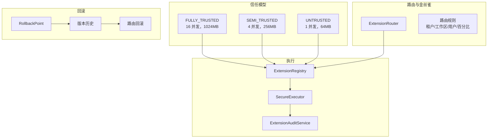

# 动态扩展平台

> **模块：** `extension-module`
> **最后更新：** 2026-05-18

## 概述

动态扩展平台支持运行时插件加载，提供基于信任的资源控制、金丝雀路由、回滚和全面的审计功能。

## 架构



## 信任级别

| 级别 | 并发数 | 内存 | CPU | 超时 | 沙箱 | 用例 |
|------|--------|------|-----|------|------|------|
| FULLY_TRUSTED | 16 | 1024MB | 100% | 120s | 可选 | PF4J 插件、内部 |
| SEMI_TRUSTED | 4 | 256MB | 50% | 30s | 必需 | 第三方、脚本 |
| UNTRUSTED | 1 | 64MB | 25% | 10s | 严格 | 用户脚本 |

## 路由与金丝雀发布

```java
// 将租户-1 的 10% 流量路由到 v2.0.0
router.createRule("canary-10%", "ext-1", "1.0.0", "2.0.0",
    "tenant-1", null, null, 100, 10, "admin");
```

## 资源限制

| 限制 | 默认值 | 描述 |
|------|--------|------|
| maxConcurrency | 4 | 最大并行执行数 |
| maxMemoryMb | 256 | 内存上限 |
| maxCpuPercent | 50 | CPU 份额 |
| maxQueueSize | 100 | 最大排队请求数 |
| maxInputBytes | 10MB | 最大输入载荷 |
| maxOutputBytes | 4MB | 最大输出载荷 |
| timeoutMs | 30s | 执行超时 |

## 回滚

```java
// 升级前创建回滚点
POST /api/v1/extensions/{key}/rollback-point?createdBy=admin

// 回滚到上一版本
POST /api/v1/extensions/{key}/rollback
{ "targetVersion": "1.0.0", "rolledBackBy": "admin" }

// 回滚路由规则
router.rollbackRules("ext-1", "admin");
```

## 审计事件（15+ 种类型）

| 事件 | 触发条件 |
|------|----------|
| EXTENSION_REGISTERED | 新扩展注册 |
| EXTENSION_UNLOADED | 扩展卸载 |
| EXTENSION_UPGRADE | 版本升级 |
| EXTENSION_ROLLED_BACK | 版本回滚 |
| EXTENSION_EXECUTION_STARTED | 执行开始 |
| EXTENSION_EXECUTION_COMPLETED | 执行成功 |
| EXTENSION_EXECUTION_TIMEOUT | 执行超时 |
| EXTENSION_EXECUTION_FAILED | 执行失败 |
| ROUTING_RULE_CREATED | 创建新规则 |
| ROUTING_RULE_UPDATED | 规则变更 |
| ROUTING_RULE_DELETED | 规则删除 |
| RESOURCE_LIMIT_EXCEEDED | 配额超限 |
| SECURITY_VIOLATION | 阻止的操作 |

## CLI 工具执行

扩展模块支持配置驱动的 CLI 工具执行：

```yaml
app:
  cli-tools:
    executables:
      ffmpeg: /usr/bin/ffmpeg
      ffprobe: /usr/bin/ffprobe
    tools:
      probe:
        executableKey: ffprobe
        args: ["-v", "quiet", "-print_format", "json", "{input}"]
        timeoutMillis: 30000
```

## 安全性

- 可执行文件白名单强制执行
- 路径遍历保护
- 空字节注入防护
- 输出大小限制（4MB）
- 禁止 shell 拼接（List<String> args）
- 业务代码中禁止使用 `ProcessBuilder`

## ⚠️ Apache Commons Exec

Apache Commons Exec 仍存在于扩展模块中，用于 CLI 工具执行。JavaCV 迁移已从渲染管道中移除 FFmpeg CLI，但扩展模块保留了 Commons Exec 用于非视频工具。
