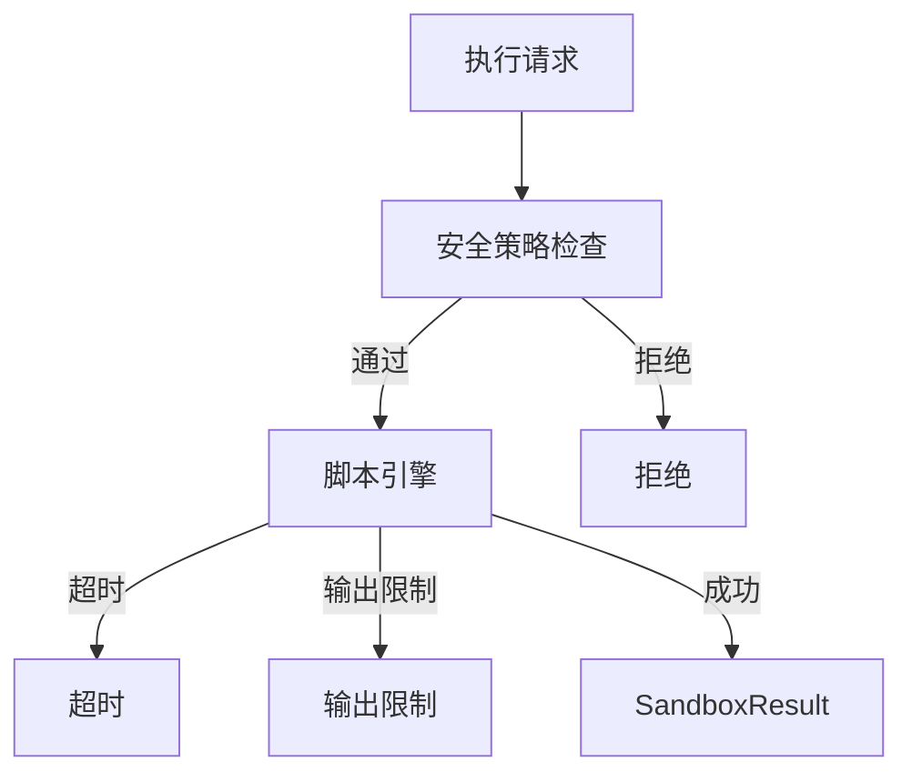

# 沙箱运行时

> **模块：** `sandbox-runtime-module`
> **最后更新：** 2026-05-18

## 概述

沙箱运行时提供用于不受信任脚本的隔离执行环境。默认情况下禁用，必须显式启用。

## 支持的语言

| 语言 | 引擎 | 状态 |
|------|------|------|
| Groovy | javax.script (Groovy) | ✅ 如果在类路径中 |
| JavaScript | Nashorn / GraalJS | ✅ 如果在类路径中 |
| Python | GraalVM Python / Jython | ✅ 如果在类路径中 |
| Wasm | Wasmtime / Wasmer | 📋 未来 |

## 安全策略

`DefaultSandboxSecurityPolicy` 阻止：

| 类别 | 阻止的类 |
|------|----------|
| 进程 | `Runtime.getRuntime`、`ProcessBuilder` |
| 文件 | `java.io.File`、`java.nio.file.*` |
| 网络 | `Socket`、`ServerSocket`、`URL` |
| 反射 | `ClassLoader`、`reflect.*`、`Unsafe` |
| 系统 | `System.setProperty`、`System.getenv` |

## 执行模型



## REST API

| 方法 | 路径 | 描述 |
|------|------|------|
| GET | `/api/v1/sandbox/runtime/overview` | 模块状态 |
| POST | `/api/v1/sandbox/execute` | 执行脚本 |

## 配置

```yaml
app:
  sandbox:
    enabled: false  # 必须显式启用
    default-timeout-millis: 10000
    max-output-bytes: 4194304  # 4MB
    allowed-languages:
      - groovy
      - javascript
```

## ⚠️ 默认禁用

沙箱运行时在脚本/插件治理成熟之前有意禁用。启用需要：
1. 显式配置（`app.sandbox.enabled: true`）
2. 允许脚本的安全审查
3. 资源限制配置
