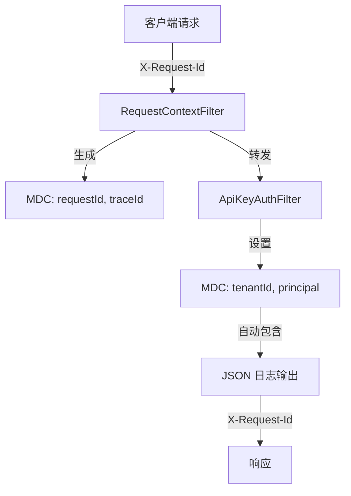

# 可观测性

> **模块：** `observability-module`
> **最后更新：** 2026-05-18

## 概述

可观测性系统为平台提供结构化日志、指标、健康检查和分布式追踪。

## 结构化日志

所有日志输出使用 JSON 格式和 MDC 字段：

| 字段 | 来源 | 示例 |
|------|------|------|
| `traceId` | `TraceCorrelationFilter` | `abc123def456` |
| `requestId` | `RequestContextFilter` | `req_789xyz` |
| `tenantId` | `ApiKeyAuthFilter` → `TenantContext` | `ten_abc123` |
| `projectId` | 请求路径 / 请求体 | `prj_def456` |
| `principal` | `ApiKeyAuthFilter` | `service-account-1` |

## 请求关联流程



## 指标（Micrometer）

| 指标名称 | 类型 | 描述 | 模块 |
|----------|------|------|------|
| `render.jobs.created` | Counter | 提交的任务数 | render-module |
| `render.jobs.completed` | Counter | 完成的任务数 | render-module |
| `render.jobs.failed` | Counter | 失败的任务数 | render-module |
| `outbox.events.processed` | Counter | 分发的事件数 | outbox-event-module |
| `outbox.events.failed` | Counter | 失败的事件数 | outbox-event-module |
| `notifications.sent` | Counter | 已投递的通知数 | notification-module |
| `notifications.failed` | Counter | 失败的通知数 | notification-module |

## 指标端点

| 端点 | 用途 |
|------|------|
| `GET /actuator/metrics` | 所有指标 |
| `GET /actuator/metrics/render.jobs.created` | 特定指标 |
| `GET /actuator/prometheus` | Prometheus 抓取 |

## 健康检查

| 端点 | 用途 |
|------|------|
| `GET /actuator/health` | 整体健康状态 |
| `GET /actuator/health/liveness` | K8s 存活探针 |
| `GET /actuator/health/readiness` | K8s 就绪探针 |
| `GET /actuator/info` | 应用信息 |

## 自定义健康指示器

| 指示器 | 检查内容 | 模块 |
|--------|----------|------|
| `DataSourceHealthIndicator` | 数据库连接 | datasource-module |
| `OutboxHealthIndicator` | Outbox 分发状态 | outbox-event-module |

## OpenTelemetry（计划中）

| 功能 | 状态 |
|------|------|
| OTel 依赖 | 📋 尚未添加 |
| 追踪关联 | ✅ 通过 MDC |
| 结构化日志 | ✅ JSON 格式就绪 |
| OTel 配置 | 📋 已规划 |

## 模块概览端点

```
GET /api/v1/observability/overview
```

返回：
```json
{
  "module": "observability-module",
  "status": "active",
  "traceCorrelation": "enabled",
  "structuredLogging": "json",
  "otel": "prepared"
}
```
