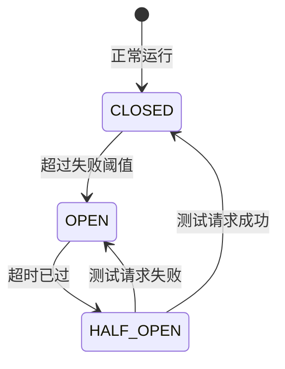

# 第三方服务监控

> **模块：** `observability-module`
> **最后更新：** 2026-05-18

## 概述

平台监控第三方服务的健康状况，包括渲染提供商、支付网关、通知服务和外部 API。

## 监控的服务

| 服务 | 类型 | 监控方式 |
|------|------|----------|
| PostgreSQL | 数据库 | 连接池健康 |
| Temporal Server | 工作流 | gRPC 健康检查 |
| 对象存储 | 存储 | 上传/下载成功率 |
| Sentry | 监控 | SDK 健康 |
| OpenReplay | 反馈 | SDK 健康 |
| 支付提供商 | 支付 | 交易成功率 |
| 通知提供商 | 通知 | 投递成功率 |
| AI 提供商 | AI | 响应延迟、错误率 |

## 熔断器

每个外部服务都有熔断器：

## SLA 指标

| 指标 | 目标 | 告警阈值 |
|------|------|----------|
| 渲染成功率 | > 99% | < 95% |
| API 响应时间（p99）| < 500ms | > 1000ms |
| 通知投递率 | > 99.9% | < 99% |
| 支付成功率 | > 99.5% | < 99% |
| AI 响应时间（p95）| < 2s | > 5s |
