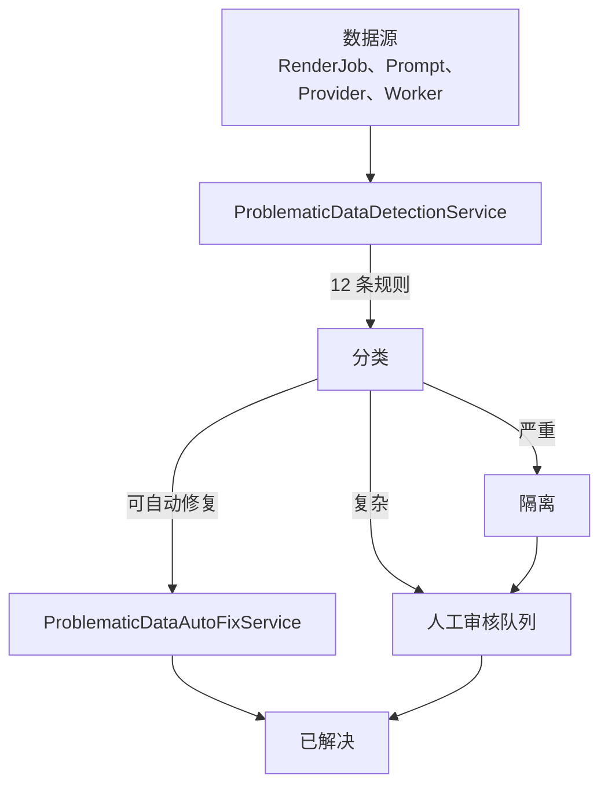

# 问题数据处理

> **模块：** `audit-compliance-module`
> **最后更新：** 2026-05-18

## 概述

问题数据处理系统自动识别由缺陷导致的数据问题和行为异常。它提供统一的管道：检测 → 隔离 → 自动修复 → 人工审核 → 解决。

## 架构

## 检测规则

### RenderJob 规则

| 规则 ID | 类型 | 严重级别 | 自动修复 | 描述 |
|---------|------|----------|----------|------|
| RJB-001 | MISSING_FIELD | 高 | 否 | 完成但无输出成品 |
| RJB-002 | INVALID_STATE | 中 | 是 | 卡在非终止状态 >30 分钟 |
| RJB-003 | DUPLICATE | 低 | 是 | 相同项目+配置+时间轴 |
| SLA-001 | SLA_BREACH | 严重 | 否 | 超过 SLA 时间限制 |
| CST-001 | COST_ANOMALY | 高 | 否 | 成本 > 预估的 2 倍 |

### PromptExecution 规则

| 规则 ID | 类型 | 严重级别 | 自动修复 | 描述 |
|---------|------|----------|----------|------|
| PMT-001 | MISSING_FIELD | 严重 | 否 | 执行记录中包含敏感数据 |
| PMT-002 | OUTPUT_MISMATCH | 高 | 否 | 输出与预期格式不匹配 |
| PMT-003 | LOGIC_CONFLICT | 高 | 否 | 执行后风险等级升级 |

### Provider/Worker 规则

| 规则 ID | 类型 | 严重级别 | 自动修复 | 描述 |
|---------|------|----------|----------|------|
| PRV-001 | ERROR_RATE_SPIKE | 高 | 否 | 错误率 > 20% |
| WRK-001 | PERFORMANCE_ANOMALY | 中 | 是 | 心跳过期 > 5 分钟 |

## 自动修复能力

| 问题 | 修复操作 |
|------|----------|
| 缺失字段 | 填充默认值 |
| 格式错误 | 转换为预期格式 |
| 重复条目 | 标记为重复，保留原始 |
| 卡住的任务 | 重置为 QUEUED 以重试 |
| 过期的工作器心跳 | 标记为离线，重新分配任务 |

## 隔离策略

| 严重级别 | 操作 |
|----------|------|
| 严重 | 立即隔离 + Sentry 告警 |
| 高 | 隔离 + 通知 |
| 中 | 标记审核 |
| 低 | 记录并自动修复 |

## 数据库表（V12）

| 表 | 用途 |
|----|------|
| `problematic_data_record` | 主检测记录 |
| `quarantined_render_jobs` | 隔离的渲染任务 |
| `quarantined_prompt_executions` | 隔离的提示词执行 |
| `quarantined_provider_workers` | 隔离的提供商/工作器数据 |
| `problematic_data_rule_config` | 检测规则配置 |
