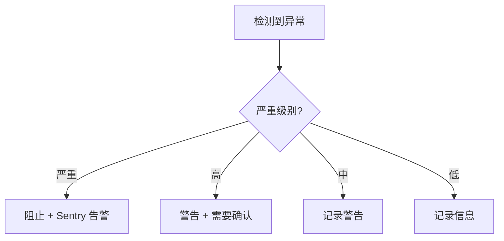

# 异常检测

> **模块：** `audit-compliance-module`
> **最后更新：** 2026-05-18

## 概述

异常检测系统识别平台行为中的异常模式，包括成本峰值、用量异常和性能下降。

## 检测规则

| 规则 ID | 类别 | 严重级别 | 描述 |
|---------|------|----------|------|
| CST-001 | 成本 | 高 | 成本 > 预估的 2 倍 |
| SLA-001 | 性能 | 严重 | 超过 SLA 时间限制 |
| PRV-001 | 提供商 | 高 | 错误率 > 20% |
| WRK-001 | 工作器 | 中 | 心跳过期 > 5 分钟 |
| USA-001 | 用量 | 高 | 用量 > 日均值的 3 倍 |
| USA-002 | 用量 | 中 | 异常的时间段模式 |
| USA-003 | 用量 | 低 | 新租户峰值 |
| USA-004 | 用量 | 中 | 地理位置异常 |

## 分级缓解

## UX 保护

UX 保护提供分级的用户端响应：

| 级别 | 用户体验 |
|------|----------|
| 正常 | 完全访问 |
| 警告 | 警告横幅，可继续 |
| 受限 | 功能受限，升级提示 |
| 阻止 | 操作被阻止，联系支持 |

## 集成

- 异常事件通过 Outbox 发布
- 所有异常检测的审计追踪
- 严重异常的 Sentry 告警
- 管理员仪表盘异常审核
