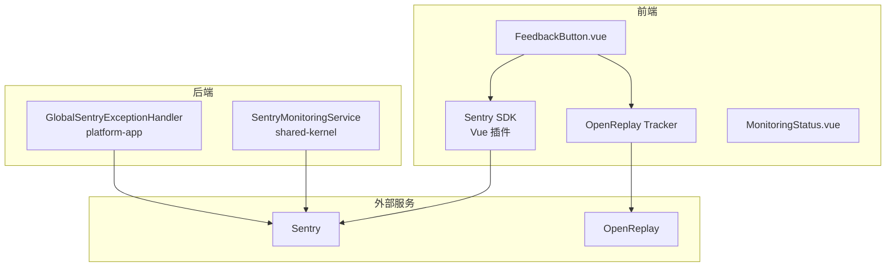

# 反馈与监控

> **模块：** `shared-kernel`、`platform-app`、`frontend/`
> **最后更新：** 2026-05-18

## 概述

平台集成 **Sentry**（错误监控 + 会话回放）和 **OpenReplay**（用户反馈 + 会话回放）以实现全面的可观测性。

## 架构

## 前端集成

### Sentry

| 功能 | 实现 |
|------|------|
| 初始化 | `frontend/src/utils/sentry.ts` 中的 `initSentry()` |
| 用户上下文 | `setSentryUser()` |
| 异常捕获 | `captureSentryException()` |
| 会话回放 | 自动 |
| 数据脱敏 | 请求头、请求体、堆栈跟踪 |

**环境变量：**
- `VITE_SENTRY_DSN` — Sentry DSN
- `VITE_SENTRY_ENVIRONMENT` — 环境名称

### OpenReplay

| 功能 | 实现 |
|------|------|
| 初始化 | `frontend/src/utils/openreplay.ts` 中的 `initOpenReplay()` |
| 用户元数据 | `setOpenReplayUser()` |
| 反馈 | `submitOpenReplayFeedback()` |
| 会话录制 | 自动 |
| 数据脱敏 | 文本、输入、网络 |

**环境变量：**
- `VITE_OPENREPLAY_PROJECT_KEY` — 项目密钥
- `VITE_OPENREPLAY_INGEST` — 接入端点

## 后端集成

### SentryMonitoringService

| 方法 | 用途 |
|------|------|
| `captureException()` | 带上下文的异常 |
| `captureMessage()` | 带级别的消息 |
| `setUserContext()` | 用户上下文 |
| `setTag()` | 事件标签 |
| `captureRenderPipelineException()` | 渲染上下文 |
| `captureProviderException()` | 提供商上下文 |
| `capturePromptExecutionException()` | 提示词上下文 |

### GlobalSentryExceptionHandler

- 捕获所有未处理的异常
- 发送带模块上下文的异常到 Sentry
- 返回结构化的 `ProblemDetail` 响应
- 无需 Sentry 也可工作（可选依赖）

## 数据脱敏

| 服务 | 脱敏内容 |
|------|----------|
| Sentry | 请求头：`authorization`、`cookie`、`x-api-key` → `[REDACTED]` |
| Sentry | 请求体：API 密钥、密码 → `[REDACTED]` |
| OpenReplay | 文本输入脱敏 |
| OpenReplay | 网络请求脱敏 |

## 错误代码

| 代码 | 描述 |
|------|------|
| MONITORING-500-001 | 监控服务错误 |
| MONITORING-503-001 | 会话回放不可用 |
| FEEDBACK-400-001 | 无效反馈 |
| FEEDBACK-500-001 | 反馈提交失败 |
