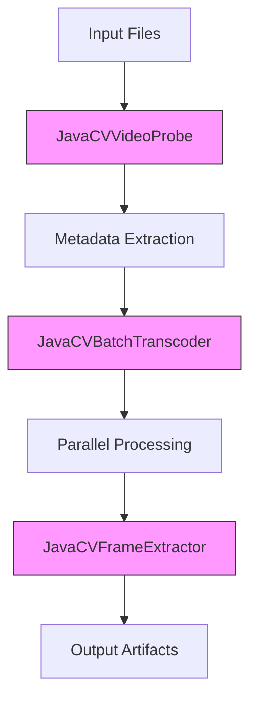

# Media Processing Module

> **Last updated**: 2026-05-12
> **Status**: ❌ **Module Does Not Exist**
> **Reference**: Mentioned in prompts/MANIFEST.md but not found in repository

## Critical Finding

**The `media-processor-module` is referenced in project documentation but does not exist in the repository.**

### Evidence

**From prompts/MANIFEST.md:**
```
- JavaCVTranscodeService implementation
- Media processing capabilities
- Batch transcoding features
```

**From Repository Structure:**
```bash
ls -la media-platform/ | grep media-processor
# No output - directory does not exist
```

## Required Action

### Option 1: Create the Module
If media processing functionality is required:

```bash
# Create module structure
mkdir -p media-processor-module/src/main/java/com/example/platform/mediaprocessor
mkdir -p media-processor-module/src/test/java/com/example/platform/mediaprocessor
```

**build.gradle.kts:**
```kotlin
plugins {
    id("java")
    id("org.springframework.boot.module")
}

dependencies {
    implementation(project(":shared-kernel"))
    implementation(project(":render-module"))
    
    implementation("org.bytedeco:javacv:1.5.10")
    implementation("org.bytedeco:ffmpeg:6.1.1-1.5.10")
    
    implementation("org.springframework.boot:spring-boot-starter")
    testImplementation("org.springframework.boot:spring-boot-starter-test")
}
```

**JavaCVTranscodeService.java:**
```java
package com.example.platform.mediaprocessor;

import org.bytedeco.javacv.FFmpegFrameGrabber;
import org.bytedeco.javacv.FFmpegFrameRecorder;
import org.springframework.stereotype.Service;

@Service
public class JavaCVTranscodeService {
    
    public void transcode(String input, String output, String preset) {
        // Transcoding logic
    }
    
    public void batchTranscode(List<String> inputs, String outputDir) {
        // Batch processing logic
    }
}
```

### Option 2: Remove from Documentation
If module is not needed:

```bash
# Update prompts/MANIFEST.md to remove references
# Remove JavaCVTranscodeService mentions from docs
```

## Current Capabilities (Where They Exist)

### Video Processing in Current Codebase

**1. JavaCVRenderProvider (render-module)**
- ✅ Single file transcoding
- ✅ Basic clipping
- ✅ Format conversion
- ❌ Batch processing (not implemented)

**2. Extension Module CLI Tools (if enabled)**
- ✅ ffprobe media inspection
- ✅ ffmpeg transcoding
- ❌ Deprecated (should be removed)

**3. Missing Functionality**
- ❌ JavaCVVideoProbe (not in shared-kernel)
- ❌ JavaCVFrameExtractor (not implemented)
- ❌ JavaCVBatchTranscoder (not implemented)

## Recommended Architecture

### If Creating Media Processor Module



### Component Responsibilities

**JavaCVVideoProbe:**
- Media file inspection
- Codec detection
- Duration calculation
- Resolution extraction
- Frame rate determination

**JavaCVFrameExtractor:**
- Thumbnail generation
- Keyframe extraction
- Frame sampling
- Image format conversion

**JavaCVBatchTranscoder:**
- Queue management
- Parallel processing
- Progress tracking
- Error aggregation

## Integration with Render Module

### Clear Boundaries

**render-module:**
- Timeline-based rendering
- Multi-track composition
- Effect application
- Final artifact generation

**media-processor-module:**
- Individual file processing
- Format conversion
- Metadata extraction
- Batch operations

### API Design

```java
// In media-processor-module
public interface MediaProcessor {
    MediaProbeResult probe(String filePath);
    void extractFrames(String input, String outputPattern, int interval);
    void batchTranscode(List<String> inputs, String outputDir, String preset);
}

// In render-module
public interface RenderProvider {
    RenderResult render(String jobId, String timeline, String profile);
}
```

## Configuration

```yaml
# If module is created
app:
  media-processor:
    max-concurrent-jobs: 4
    temp-dir: /tmp/media-processor
    batch:
      chunk-size: 100
      retry-attempts: 3
```

## Testing Strategy

```bash
# If module is created
./gradlew :media-processor-module:test

# Test coverage should include:
# - Individual file probing
# - Frame extraction accuracy
# - Batch processing reliability
# - Error handling
# - Concurrent execution
```

## Decision Required

**Before proceeding, clarify:**

1. **Does media-processor-module need to exist?**
   - If yes: Create module structure
   - If no: Update documentation to remove references

2. **What is the scope of media processing?**
   - Individual file operations only?
   - Batch operations required?
   - Cloud storage integration?

3. **Relationship to render-module?**
   - Complementary functionality?
   - Overlapping capabilities?
   - Clear separation of concerns?

---

*This document highlights a discrepancy between documentation and implementation. The media-processor-module must either be created or removed from project documentation.*