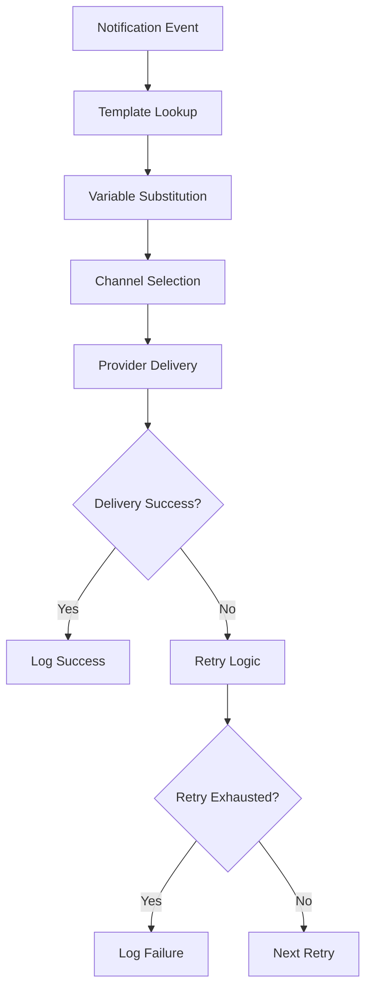

# Notification Template Management

> **Last updated**: 2026-05-12
> **Status**: Basic template system active, 8 built-in templates
> **Module**: `notification-module`

## Overview

The notification module provides a template-based system for generating and sending notifications across multiple channels (email, SMS, webhook). Templates are stored in the database and support variable substitution for dynamic content.

## Built-in Templates (8 Templates)

### 1. `RENDER_CREATED`
**Trigger:** `render.job.created` event
**Channel:** Email, Webhook
**Purpose:** Job submission confirmation

**Subject Template:**
```
Render Job Submitted - {jobId}
```

**Body Template:**
```
Your render job {jobId} has been created for project {projectId}.

Profile: {profile}
Timeline: {timelineSnapshotId}
Backend: {primaryBackend}

You will receive updates as the job progresses.
```

### 2. `RENDER_AI_PROCESSING`
**Trigger:** `render.job.ai_processing` event
**Channel:** Email
**Purpose:** AI script generation started

**Subject Template:**
```
AI Processing Started - {jobId}
```

**Body Template:**
```
Render job {jobId} is now in AI processing stage.

The AI is generating your video script from the provided prompt:
Prompt: {prompt}

Estimated time: 1-2 minutes
```

### 3. `RENDER_RENDERING`
**Trigger:** `render.job.rendering` event
**Channel:** Email
**Purpose:** Video rendering started

**Subject Template:**
```
Rendering Started - {jobId}
```

**Body Template:**
```
Render job {jobId} has started video rendering.

Profile: {profile}
Resolution: {resolution}
Duration: {duration}

Progress will be updated as rendering completes.
```

### 4. `RENDER_COMPLETED`
**Trigger:** `render.job.completed` event
**Channel:** Email, SMS, Webhook
**Purpose:** Job completion notification

**Subject Template:**
```
Render Job Completed - {jobId}
```

**Body Template:**
```
✅ Render job {jobId} has completed successfully!

Project: {projectId}
Artifact: {artifactId}
Storage: {storageUri}
Duration: {duration}
Resolution: {resolution}
Format: {format}

Download your video at: {downloadUrl}
```

### 5. `RENDER_FAILED`
**Trigger:** `render.job.failed` event
**Channel:** Email, SMS, Webhook
**Purpose:** Job failure notification

**Subject Template:**
```
Render Job Failed - {jobId}
```

**Body Template:**
```
❌ Render job {jobId} has failed.

Project: {projectId}
Error: {error}
Failed At: {failedAt}

Please check the job status and retry or contact support.
Job Link: {jobUrl}
```

### 6. `RENDER_FINISHED`
**Trigger:** `render.job.finished` event
**Channel:** Webhook
**Purpose:** Generic job completion webhook

**Subject Template:**
```
Job Finished - {jobId}
```

**Body Template:**
```
{
  "event": "render.job.finished",
  "jobId": "{jobId}",
  "projectId": "{projectId}",
  "status": "{status}",
  "timestamp": "{finishedAt}"
}
```

### 7. `ARTIFACT_CREATED`
**Trigger:** `artifact.created` event
**Channel:** Webhook
**Purpose:** Artifact storage notification

**Subject Template:**
```
Artifact Created - {artifactId}
```

**Body Template:**
```
{
  "event": "artifact.created",
  "artifactId": "{artifactId}",
  "jobId": "{jobId}",
  "projectId": "{projectId}",
  "storageUri": "{storageUri}",
  "format": "{format}",
  "resolution": "{resolution}",
  "createdAt": "{createdAt}"
}
```

### 8. `GENERIC_EVENT`
**Trigger:** Unknown/unmapped events
**Channel:** Webhook
**Purpose:** Fallback for unhandled events

**Subject Template:**
```
Event Received - {eventType}
```

**Body Template:**
```
{
  "event": "{eventType}",
  "data": {eventData}
}
```

## Template Variable Substitution

### Syntax
- **Variable Format:** `{variableName}`
- **Case Sensitive:** Yes
- **Missing Variables:** Replaced with empty string

### Available Variables by Template

| Variable | Description | Templates |
|----------|-------------|-----------|
| `{jobId}` | Render job identifier | All render templates |
| `{projectId}` | Project identifier | All templates |
| `{profile}` | Render profile name | RENDER_CREATED, RENDER_RENDERING |
| `{resolution}` | Video resolution | RENDER_RENDERING, RENDER_COMPLETED |
| `{duration}` | Video duration | RENDER_RENDERING, RENDER_COMPLETED |
| `{format}` | Video format | RENDER_COMPLETED, ARTIFACT_CREATED |
| `{artifactId}` | Artifact identifier | RENDER_COMPLETED, ARTIFACT_CREATED |
| `{storageUri}` | Storage location | RENDER_COMPLETED, ARTIFACT_CREATED |
| `{error}` | Error message | RENDER_FAILED |
| `{eventType}` | Event type string | GENERIC_EVENT |
| `{eventData}` | Raw event data | GENERIC_EVENT |

### Custom Variables

**Adding Custom Variables:**
```java
// In event publisher
Map<String, String> customVars = Map.of(
    "downloadUrl", generateDownloadUrl(artifactId),
    "jobUrl", generateJobUrl(jobId),
    "supportEmail", "support@media-platform.com"
);

notificationEventPublisher.publish(
    new NotificationEvent(templateCode, channel, to, customVars)
);
```

## Channel Support

### Email Provider
```java
@Component
public class EmailNotificationProvider implements NotificationProvider {
    @Override
    public DeliveryResult deliver(DeliveryCommand command) {
        // SMTP integration
        // Subject = template.subjectTemplate
        // Body = template.bodyTemplate (with substitution)
        // To = command.recipient()
    }
}
```

### SMS Provider
```java
@Component
public class SmsNotificationProvider implements NotificationProvider {
    @Override
    public DeliveryResult deliver(DeliveryCommand command) {
        // SMS gateway integration
        // Body = truncated(template.bodyTemplate)
        // To = phone number
    }
}
```

### Webhook Provider
```java
@Component
public class WebhookNotificationProvider implements NotificationProvider {
    @Override
    public DeliveryResult deliver(DeliveryCommand command) {
        // HTTP POST to webhook URL
        // Body = JSON template
        // Headers = signature, content-type
    }
}
```

### Mock Provider (Testing)
```java
@Component
@ConditionalOnProfile("test")
public class MockNotificationProvider implements NotificationProvider {
    @Override
    public DeliveryResult deliver(DeliveryCommand command) {
        // Log notification, return success
        return DeliveryResult.success();
    }
}
```

## Template Registration

### Bootstrapping Templates

```java
@Component
public class DataBootstrap {
    
    @PostConstruct
    public void bootstrapTemplates() {
        // Ensure all 8 templates exist in database
        ensureTemplate(NotificationTemplate.builder()
            .code(NotificationTemplateCode.RENDER_COMPLETED)
            .channel(NotificationTemplateChannel.EMAIL)
            .locale("en")
            .version("1.0")
            .subjectTemplate("Render Job Completed - {jobId}")
            .bodyTemplate("Your render job {jobId} has completed successfully!")
            .build());
        
        // ... repeat for all templates
    }
}
```

### Dynamic Registration API

```java
@Service
public class NotificationTemplateService {
    
    public void registerTemplate(NotificationTemplate template) {
        // Check for existing version
        // Insert if not exists
        // Update if version changed
    }
    
    public NotificationTemplate getTemplate(
        NotificationTemplateCode code, 
        NotificationTemplateChannel channel, 
        String locale) {
        // Fetch from database
    }
}
```

## Versioning Strategy

### Current: Simple Versioning
```sql
CREATE TABLE notification_template (
    template_code VARCHAR(50),
    channel VARCHAR(20),
    locale VARCHAR(10),
    version VARCHAR(20),
    subject_template TEXT,
    body_template TEXT,
    PRIMARY KEY (template_code, channel, locale, version)
);
```

### Future: Semantic Versioning
```
Major.Minor.Patch
1.0.0 → 1.0.1 (bug fix)
1.0.0 → 1.1.0 (new feature)
1.0.0 → 2.0.0 (breaking change)
```

### Version Selection Logic
```java
public NotificationTemplate selectTemplate(
    NotificationTemplateCode code,
    NotificationTemplateChannel channel,
    String locale,
    String version) {
    
    if (version == null) {
        // Return latest version
        return dsl.selectFrom(NOTIFICATION_TEMPLATE)
            .where(TEMPLATE_CODE.eq(code.name()))
            .and(CHANNEL.eq(channel.name()))
            .and(LOCALE.eq(locale))
            .orderBy(VERSION.desc())
            .fetchOne();
    } else {
        // Return specific version
        return dsl.selectFrom(NOTIFICATION_TEMPLATE)
            .where(TEMPLATE_CODE.eq(code.name()))
            .and(CHANNEL.eq(channel.name()))
            .and(LOCALE.eq(locale))
            .and(VERSION.eq(version))
            .fetchOne();
    }
}
```

## i18n Support

### Current: English Only
```java
// Templates stored with locale "en"
NotificationTemplate.builder()
    .locale("en")
    // ...
    .build();
```

### Future: Multi-Language Support

**Locale Fallback Chain:**
```java
public String getLocalizedTemplate(
    String baseTemplate, 
    String locale,
    Map<String, String> variables) {
    
    // Try exact locale (en-US)
    String template = loadTemplate(baseTemplate, locale);
    
    if (template == null) {
        // Try language only (en)
        template = loadTemplate(baseTemplate, locale.substring(0, 2));
    }
    
    if (template == null) {
        // Fallback to English
        template = loadTemplate(baseTemplate, "en");
    }
    
    // Substitute variables
    return substituteVariables(template, variables);
}
```

**Template Structure:**
```java
NotificationTemplate.builder()
    .code(NotificationTemplateCode.RENDER_COMPLETED)
    .channel(NotificationTemplateChannel.EMAIL)
    .locale("en")  // English
    .version("1.0")
    .subjectTemplate("Render Job Completed - {jobId}")
    .bodyTemplate("Your render job is complete!")
    .build();

NotificationTemplate.builder()
    .code(NotificationTemplateCode.RENDER_COMPLETED)
    .channel(NotificationTemplateChannel.EMAIL)
    .locale("zh")  // Chinese
    .version("1.0")
    .subjectTemplate("渲染任务完成 - {jobId}")
    .bodyTemplate("您的渲染任务已完成！")
    .build();
```

## Custom Template Registration

### API for Custom Templates

```http
POST /api/v1/notifications/templates
Content-Type: application/json

{
  "code": "CUSTOM_EVENT",
  "channel": "EMAIL",
  "locale": "en",
  "version": "1.0",
  "subjectTemplate": "Custom Event - {eventName}",
  "bodyTemplate": "Event {eventName} occurred at {timestamp}"
}
```

### Validation Rules
- Template code must be unique per channel/locale/version
- Subject template max 200 characters
- Body template max 4000 characters
- Must contain at least one variable
- Variables must match regex `\{[a-zA-Z0-9_]+\}`

### Programmatic Registration
```java
@Service
public class CustomTemplateRegistrar {
    
    public void registerCustomTemplates() {
        NotificationTemplate customTemplate = NotificationTemplate.builder()
            .code(NotificationTemplateCode.valueOf("CUSTOM_CODE"))
            .channel(NotificationTemplateChannel.EMAIL)
            .locale("en")
            .version("1.0")
            .subjectTemplate("Custom Subject - {variable}")
            .bodyTemplate("Custom body with {variable}")
            .build();
        
        templateService.registerTemplate(customTemplate);
    }
}
```

## Delivery and Failure Handling

### Delivery Flow



### Retry Strategy

**Exponential Backoff:**
```java
public class RetryDeliveryService {
    private static final int[] RETRY_DELAYS = {1, 5, 15, 60, 300}; // minutes
    
    public void deliverWithRetry(NotificationEvent event) {
        for (int attempt = 0; attempt < RETRY_DELAYS.length; attempt++) {
            try {
                deliver(event);
                return; // Success
            } catch (Exception e) {
                if (attempt == RETRY_DELAYS.length - 1) {
                    logFailure(event, e);
                    break;
                }
                wait(RETRY_DELAYS[attempt] * 60 * 1000); // Convert to ms
            }
        }
    }
}
```

### Failure Handling

**Failure Scenarios:**
- **Invalid template**: Log error, skip delivery
- **Missing variable**: Use empty string, deliver anyway
- **Provider timeout**: Retry with exponential backoff
- **Invalid recipient**: Log error, mark as permanent failure
- **Rate limited**: Queue for later delivery

**Failure Logging:**
```java
public record DeliveryFailure(
    String eventId,
    String templateCode,
    String channel,
    String recipient,
    String error,
    Instant failedAt,
    int attemptCount
) {}
```

## Outbox Event Module Integration

### Event Publishing Flow

```java
@Service
public class NotificationEventHandler {
    
    @EventListener
    public void handleRenderJobCompleted(RenderJobCompletedEvent event) {
        // Map domain event to notification template
        NotificationTemplateCode templateCode = 
            NotificationTemplateCode.fromEventType("render.job.completed");
        
        // Build notification event
        NotificationEvent notificationEvent = NotificationEvent.builder()
            .templateCode(templateCode)
            .channel(NotificationTemplateChannel.EMAIL)
            .recipient(getUserEmail(event.getProjectId()))
            .variables(Map.of(
                "jobId", event.getJobId(),
                "projectId", event.getProjectId(),
                "artifactId", event.getArtifactId(),
                "storageUri", event.getStorageUri()
            ))
            .build();
        
        // Publish via outbox pattern
        outboxEventPublisher.publish(notificationEvent);
    }
}
```

### Transactional Outbox Pattern

```java
@Transactional
public void publishNotification(NotificationEvent event) {
    // 1. Save notification to outbox table
    outboxRepository.save(OutboxEvent.from(event));
    
    // 2. Transaction commits
    // 3. Outbox dispatcher picks up event
    // 4. Event published to notification service
}
```

## Testing Templates

### Unit Testing
```java
@Test
void testTemplateSubstitution() {
    NotificationTemplate template = NotificationTemplate.builder()
        .subjectTemplate("Job {jobId} completed")
        .bodyTemplate("Project {projectId}")
        .build();
    
    Map<String, String> variables = Map.of(
        "jobId", "rj_123",
        "projectId", "proj_456"
    );
    
    String subject = templateService.substituteVariables(
        template.subjectTemplate(), variables);
    String body = templateService.substituteVariables(
        template.bodyTemplate(), variables);
    
    assertEquals("Job rj_123 completed", subject);
    assertEquals("Project proj_456", body);
}
```

### Integration Testing
```java
@Test
void testEndToEndDelivery() {
    // Create render completed event
    RenderJobCompletedEvent event = new RenderJobCompletedEvent(
        "rj_123", "proj_456", "art_789", "storage://video.mp4", Instant.now());
    
    // Publish event
    eventPublisher.publish(event);
    
    // Verify notification sent
    verify(mockNotificationProvider, timeout(5000)).deliver(any());
}
```

## Performance Considerations

### Template Caching
```java
@Service
public class CachedTemplateService {
    private final Cache<String, NotificationTemplate> templateCache = 
        CacheBuilder.newBuilder()
            .maximumSize(1000)
            .expireAfterWrite(Duration.ofHours(1))
            .build();
    
    public NotificationTemplate getTemplate(String cacheKey) {
        return templateCache.get(cacheKey, () -> loadFromDatabase(cacheKey));
    }
}
```

### Delivery Rate Limits
- **Email**: 100/minute per provider
- **SMS**: 10/minute per provider
- **Webhook**: 1000/minute per provider

## Security Considerations

### Template Injection Prevention
```java
public String sanitizeTemplate(String template) {
    // Remove potentially dangerous content
    return template.replaceAll("<script>", "")
                   .replaceAll("javascript:", "")
                   .replaceAll("onload=", "");
}
```

### Recipient Validation
```java
public void validateRecipient(String channel, String recipient) {
    switch (channel) {
        case "EMAIL":
            validateEmail(recipient);
            break;
        case "SMS":
            validatePhoneNumber(recipient);
            break;
        case "WEBHOOK":
            validateUrl(recipient);
            break;
    }
}
```

---

*This document reflects the current implementation as of 2026-05-12. The template system is functional but limited to English and basic variable substitution.*